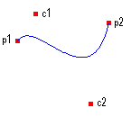
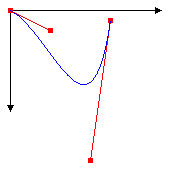

# B&#233;zier Splines in GDI+
A Bézier spline is a curve specified by four points: two end points (p1 and p2) and two control points (c1 and c2). The curve begins at p1 and ends at p2. The curve does not pass through the control points, but the control points act as magnets, pulling the curve in certain directions and influencing the way the curve bends. The following illustration shows a Bézier curve along with its endpoints and control points.  
  
   
  
 The curve starts at p1 and moves toward the control point c1. The tangent line to the curve at p1 is the line drawn from p1 to c1. The tangent line at the endpoint p2 is the line drawn from c2 to p2.  
  
## Drawing Bézier Splines  
 To draw a Bézier spline, you need an instance of the <xref:System.Drawing.Graphics> class and a <xref:System.Drawing.Pen>. The instance of the <xref:System.Drawing.Graphics> class provides the <xref:System.Drawing.Graphics.DrawBezier%2A> method, and the <xref:System.Drawing.Pen> stores attributes, such as width and color, of the line used to render the curve. The <xref:System.Drawing.Pen> is passed as one of the arguments to the <xref:System.Drawing.Graphics.DrawBezier%2A> method. The remaining arguments passed to the <xref:System.Drawing.Graphics.DrawBezier%2A> method are the endpoints and the control points. The following example draws a Bézier spline with starting point (0, 0), control points (40, 20) and (80, 150), and ending point (100, 10):  
  
 [!code-csharp[LinesCurvesAndShapes#71](~/samples/snippets/csharp/VS_Snippets_Winforms/LinesCurvesAndShapes/CS/Class1.cs#71)]
 [!code-vb[LinesCurvesAndShapes#71](~/samples/snippets/visualbasic/VS_Snippets_Winforms/LinesCurvesAndShapes/VB/Class1.vb#71)]  
  
 The following illustration shows the curve, the control points, and two tangent lines.  
  
   
  
 Bézier splines were originally developed by Pierre Bézier for design in the automotive industry. They have since proven to be useful in many types of computer-aided design and are also used to define the outlines of fonts. Bézier splines can yield a wide variety of shapes, some of which are shown in the following illustration.  
  
   
  
## See also

- <xref:System.Drawing.Graphics?displayProperty=nameWithType>
- <xref:System.Drawing.Pen?displayProperty=nameWithType>
- [Lines, Curves, and Shapes](lines-curves-and-shapes.md)
- [Constructing and Drawing Curves](constructing-and-drawing-curves.md)
- [How to: Create Graphics Objects for Drawing](how-to-create-graphics-objects-for-drawing.md)
- [How to: Create a Pen](how-to-create-a-pen.md)
