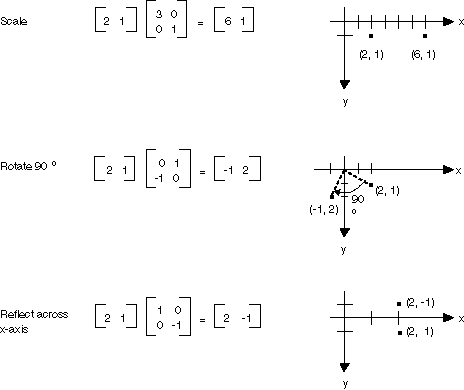
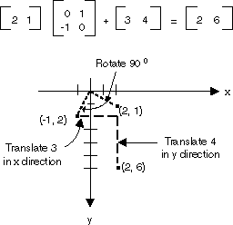
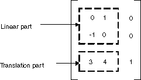

# Matrix Representation of Transformations

An m×n matrix is a set of numbers arranged in m rows and n columns. The following illustration shows several matrices.  
  
   
  
 You can add two matrices of the same size by adding individual elements. The following illustration shows two examples of matrix addition.  
  
   
  
 An m×n matrix can be multiplied by an n×p matrix, and the result is an m×p matrix. The number of columns in the first matrix must be the same as the number of rows in the second matrix. For example, a 4×2 matrix can be multiplied by a 2×3 matrix to produce a 4×3 matrix.  
  
 Points in the plane and rows and columns of a matrix can be thought of as vectors. For example, (2, 5) is a vector with two components, and (3, 7, 1) is a vector with three components. The dot product of two vectors is defined as follows:  
  
 (a, b) • (c, d) = ac + bd  
  
 (a, b, c) • (d, e, f) = ad + be + cf  
  
 For example, the dot product of (2, 3) and (5, 4) is (2)(5) + (3)(4) = 22. The dot product of (2, 5, 1) and (4, 3, 1) is (2)(4) + (5)(3) + (1)(1) = 24. Note that the dot product of two vectors is a number, not another vector. Also note that you can calculate the dot product only if the two vectors have the same number of components.  
  
 Let A(i, j) be the entry in matrix A in the ith row and the jth column. For example A(3, 2) is the entry in matrix A in the 3rd row and the 2nd column. Suppose A, B, and C are matrices, and AB = C. The entries of C are calculated as follows:  
  
 C(i, j) = (row i of A) • (column j of B)  
  
 The following illustration shows several examples of matrix multiplication.  
  
   
  
 If you think of a point in a plane as a 1×2 matrix, you can transform that point by multiplying it by a 2×2 matrix. The following illustration shows several transformations applied to the point (2, 1).  
  
   
  
 All of the transformations shown in the preceding figure are linear transformations. Certain other transformations, such as translation, are not linear, and cannot be expressed as multiplication by a 2×2 matrix. Suppose you want to start with the point (2, 1), rotate it 90 degrees, translate it 3 units in the x direction, and translate it 4 units in the y direction. You can accomplish this by using a matrix multiplication followed by a matrix addition.  
  
   
  
 A linear transformation (multiplication by a 2×2 matrix) followed by a translation (addition of a 1×2 matrix) is called an affine transformation. An alternative to storing an affine transformation in a pair of matrices (one for the linear part and one for the translation) is to store the entire transformation in a 3×3 matrix. To make this work, a point in the plane must be stored in a 1×3 matrix with a dummy 3rd coordinate. The usual technique is to make all 3rd coordinates equal to 1. For example, the point (2, 1) is represented by the matrix [2 1 1]. The following illustration shows an affine transformation (rotate 90 degrees; translate 3 units in the x direction, 4 units in the y direction) expressed as multiplication by a single 3×3 matrix.  
  
   
  
 In the preceding example, the point (2, 1) is mapped to the point (2, 6). Note that the third column of the 3×3 matrix contains the numbers 0, 0, 1. This will always be the case for the 3×3 matrix of an affine transformation. The important numbers are the six numbers in columns 1 and 2. The upper-left 2×2 portion of the matrix represents the linear part of the transformation, and the first two entries in the 3rd row represent the translation.  
  
   
  
 In GDI+ you can store an affine transformation in a <xref:System.Drawing.Drawing2D.Matrix> object. Because the third column of a matrix that represents an affine transformation is always (0, 0, 1), you specify only the six numbers in the first two columns when you construct a <xref:System.Drawing.Drawing2D.Matrix> object. The statement `Matrix myMatrix = new Matrix(0, 1, -1, 0, 3, 4)` constructs the matrix shown in the preceding figure.  
  
## Composite Transformations
  
 A composite transformation is a sequence of transformations, one followed by the other. Consider the matrices and transformations in the following list:  
  
|Name of Matrix|List of Composite Transformations|  
|-|-|  
|Matrix A|Rotate 90 degrees|  
|Matrix B|Scale by a factor of 2 in the x direction|  
|Matrix C|Translate 3 units in the y direction|  
  
 If we start with the point (2, 1) — represented by the matrix [2 1 1] — and multiply by A, then B, then C, the point (2, 1) will undergo the three transformations in the order listed.  
  
 [2 1 1]ABC = [-2 5 1]  
  
 Rather than store the three parts of the composite transformation in three separate matrices, you can multiply A, B, and C together to get a single 3×3 matrix that stores the entire composite transformation. Suppose ABC = D. Then a point multiplied by D gives the same result as a point multiplied by A, then B, then C.  
  
 [2 1 1]D = [-2 5 1]  
  
 The following illustration shows the matrices A, B, C, and D.  
  
   
  
 The fact that the matrix of a composite transformation can be formed by multiplying the individual transformation matrices means that any sequence of affine transformations can be stored in a single <xref:System.Drawing.Drawing2D.Matrix> object.  
  
> [!CAUTION]
> The order of a composite transformation is important. In general, rotate, then scale, then translate is not the same as scale, then rotate, then translate. Similarly, the order of matrix multiplication is important. In general, ABC is not the same as BAC.  
  
 The <xref:System.Drawing.Drawing2D.Matrix> class provides several methods for building a composite transformation: <xref:System.Drawing.Drawing2D.Matrix.Multiply%2A>, <xref:System.Drawing.Drawing2D.Matrix.Rotate%2A>, <xref:System.Drawing.Drawing2D.Matrix.RotateAt%2A>, <xref:System.Drawing.Drawing2D.Matrix.Scale%2A>, <xref:System.Drawing.Drawing2D.Matrix.Shear%2A>, and <xref:System.Drawing.Drawing2D.Matrix.Translate%2A>. The following example creates the matrix of a composite transformation that first rotates 30 degrees, then scales by a factor of 2 in the y direction, and then translates 5 units in the x direction:  
  
 [!code-csharp[System.Drawing.CoordinateSystems#11](~/samples/snippets/csharp/VS_Snippets_Winforms/System.Drawing.CoordinateSystems/CS/Class1.cs#11)]
 [!code-vb[System.Drawing.CoordinateSystems#11](~/samples/snippets/visualbasic/VS_Snippets_Winforms/System.Drawing.CoordinateSystems/VB/Class1.vb#11)]  
  
 The following illustration shows the matrix.  
  
   
  
## See also

- [Coordinate Systems and Transformations](coordinate-systems-and-transformations.md)
- [Using Transformations in Managed GDI+](using-transformations-in-managed-gdi.md)
