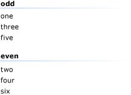

# How to: Group Items in a Windows Forms ListView Control Using the Designer

The grouping feature of the <xref:System.Windows.Forms.ListView> control enables you to display related sets of items in groups. These groups are separated on the screen by horizontal group headers that contain the group titles. You can use <xref:System.Windows.Forms.ListView> groups to make navigating large lists easier by grouping items alphabetically, by date, or by any other logical grouping. The following image shows some grouped items:

The following procedure requires a **Windows Application** project with a form containing a <xref:System.Windows.Forms.ListView> control. For information about setting up such a project, see [How to: Create a Windows Forms application project](/visualstudio/ide/step-1-create-a-windows-forms-application-project) and [How to: Add Controls to Windows Forms](how-to-add-controls-to-windows-forms.md).

To enable grouping, you must first create one or more <xref:System.Windows.Forms.ListViewGroup> objects either in the designer or programmatically. Once a group has been defined, you can assign items to it.

## To add or remove groups in the designer

1. In the **Properties** window, click the **Ellipsis** () button next to the <xref:System.Windows.Forms.ListView.Groups%2A> property.

     The **ListViewGroup Collection Editor** appears.

2. To add a group, click the **Add** button. You can then set properties of the new group, such as the <xref:System.Windows.Forms.ListViewGroup.Header%2A> and <xref:System.Windows.Forms.ListViewGroup.HeaderAlignment%2A> properties. To remove a group, select it and click the **Remove** button.

## To assign items to groups in the designer

1. In the **Properties** window, click the **Ellipsis** () button next to the <xref:System.Windows.Forms.ListView.Items%2A> property.

     The **ListViewItem Collection Editor** appears.

2. To add a new item, click the **Add** button. You can then set properties of the new item, such as the <xref:System.Windows.Forms.ListViewItem.Text%2A> and <xref:System.Windows.Forms.ListViewItem.ImageIndex%2A> properties.

3. Select the <xref:System.Windows.Forms.ListViewItem.Group%2A> property and choose a group from the drop-down list.

## See also

- <xref:System.Windows.Forms.ListView>
- <xref:System.Windows.Forms.ListView.Groups%2A>
- <xref:System.Windows.Forms.ListViewGroup>
- [ListView Control](listview-control-windows-forms.md)
- [ListView Control Overview](listview-control-overview-windows-forms.md)
- [How to: Add and Remove Items with the Windows Forms ListView Control](how-to-add-and-remove-items-with-the-windows-forms-listview-control.md)
