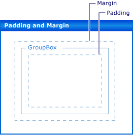

# Margin and Padding in Windows Forms Controls

Precise placement of controls on your form is a high priority for many applications. The <xref:System.Windows.Forms?displayProperty=nameWithType> namespace gives you many layout features to accomplish this. Two of the most important are the <xref:System.Windows.Forms.Control.Margin%2A> and <xref:System.Windows.Forms.Control.Padding%2A> properties.  
  
 The <xref:System.Windows.Forms.Control.Margin%2A> property defines the space around the control that keeps other controls a specified distance from the control's borders.  
  
 The <xref:System.Windows.Forms.Control.Padding%2A> property defines the space in the interior of a control that keeps the control's content (for example, the value of its <xref:System.Windows.Forms.Control.Text%2A> property) a specified distance from the control's borders.  
  
 The following illustration shows the <xref:System.Windows.Forms.Control.Padding%2A> and <xref:System.Windows.Forms.Control.Margin%2A> properties on a control.  
  
   
  
 There is design-time support for this feature in Visual Studio. Also see [Walkthrough: Laying Out Windows Forms Controls with Padding, Margins, and the AutoSize Property](windows-forms-controls-padding-autosize.md).  
  
## See also

- <xref:System.Windows.Forms.Control.AutoSize%2A>
- <xref:System.Windows.Forms.Control.Margin%2A>
- <xref:System.Windows.Forms.Control.Padding%2A>
- <xref:System.Windows.Forms.Control.LayoutEngine%2A>
- <xref:System.Windows.Forms.TableLayoutPanel>
- <xref:System.Windows.Forms.FlowLayoutPanel>
