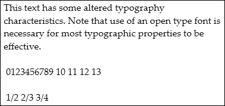

---
<<<<<<< HEAD
title: How-to Alter the Typography of Text
description: This topic shows an example how altered and default typographic properties of text render on screen and how to set typographic property of text programmatically. 
=======
title: How to Alter the Typography of Text

description: To alter the telegraphy of text, set the telegraphy attribute. You can set the typographic property of text programmatically. You can see how altered and default telegraphy properties of text render on screen each with an example.

>>>>>>> c37bd7c99bcd5b0a59d4f70aff94cab301d53a02
ms.date: "03/30/2017"
dev_langs: 
  - "csharp"
  - "vb"
helpviewer_keywords: 
  - "setting Typography attributes [WPF]"
  - "Typography attribute [WPF], setting"
ms.assetid: 19a3b49b-60a2-4c11-a786-e26b4c965588
---
# How-to: Alter the Typography of Text

The following example shows how to set the <xref:System.Windows.Documents.TextElement.Typography%2A> attribute, using <xref:System.Windows.Documents.Paragraph> as the example element.
  
<<<<<<< HEAD
## Example to show how altered and default typographic properties of text render on screen
=======
## Example 1: To show how altered and default typographic properties of text render on screen
>>>>>>> c37bd7c99bcd5b0a59d4f70aff94cab301d53a02

 [!code-xaml[TextElementSnippets#_TextElement_TypogXAML](~/samples/snippets/csharp/VS_Snippets_Wpf/TextElementSnippets/CSharp/Window1.xaml#_textelement_typogxaml)]
  
 The following figure shows how this example renders.
  
 
  
 In contrast, the following figure shows how a similar example with default typographic properties renders.
  
 
  
<<<<<<< HEAD
## Example to show how to set typographic property of text programmatically
=======
## Example 2: To show how to set typographic property of text programmatically
>>>>>>> c37bd7c99bcd5b0a59d4f70aff94cab301d53a02

 The following example shows how to set the <xref:System.Windows.Controls.TextBox.Typography%2A> property programmatically.
  
 [!code-csharp[TextElementSnippets#_TextElement_Typog](~/samples/snippets/csharp/VS_Snippets_Wpf/TextElementSnippets/CSharp/Window1.xaml.cs#_textelement_typog)]
 [!code-vb[TextElementSnippets#_TextElement_Typog](~/samples/snippets/visualbasic/VS_Snippets_Wpf/TextElementSnippets/visualbasic/window1.xaml.vb#_textelement_typog)]
  
## See also

- [Flow Document Overview](flow-document-overview.md)
