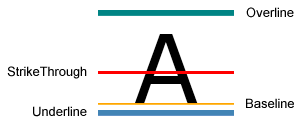

# How to: Create a Text Decoration

A <xref:System.Windows.TextDecoration> object is a visual ornamentation you can add to text. There are four types of text decorations: underline, baseline, strikethrough, and overline. The following example shows the locations of the text decorations relative to the text.  
  
   
  
 To add a text decoration to text, create a <xref:System.Windows.TextDecoration> object and modify its properties. Use the <xref:System.Windows.TextDecoration.Location%2A> property to specify where the text decoration appears, such as underline. Use the <xref:System.Windows.TextDecoration.Pen%2A> property to specify the appearance of the text decoration, such as a solid fill or gradient color. If you do not specify a value for the <xref:System.Windows.TextDecoration.Pen%2A> property, the decorations defaults to the same color as the text. Once you have defined a <xref:System.Windows.TextDecoration> object, add it to the <xref:System.Windows.TextDecorations> collection of the desired text object.  
  
 The following example shows a text decoration that has been styled with a linear gradient brush and a dashed pen.  
  
   
  
 The <xref:System.Windows.Documents.Hyperlink> object is an inline-level flow content element that allows you to host hyperlinks within the flow content. By default, <xref:System.Windows.Documents.Hyperlink> uses a <xref:System.Windows.TextDecoration> object to display an underline. <xref:System.Windows.TextDecoration> objects can be performance intensive to instantiate, particularly if you have many <xref:System.Windows.Documents.Hyperlink> objects. If you make extensive use of <xref:System.Windows.Documents.Hyperlink> elements, you may want to consider showing an underline only when triggering an event, such as the <xref:System.Windows.ContentElement.MouseEnter> event.  
  
 In the following example, the underline for the "My MSN" link is dynamic—it only appears when the <xref:System.Windows.ContentElement.MouseEnter> event is triggered.  
  
   

 For more information, see [Specify Whether a Hyperlink is Underlined](how-to-specify-whether-a-hyperlink-is-underlined.md).  
  
## Example  

 In the following code example, an underline text decoration uses the default font value.  
  
 [!code-csharp[TextDecorationSnippets#TextDecorationSnippets1](~/samples/snippets/csharp/VS_Snippets_Wpf/TextDecorationSnippets/CSharp/Window1.xaml.cs#textdecorationsnippets1)]
 [!code-vb[TextDecorationSnippets#TextDecorationSnippets1](~/samples/snippets/visualbasic/VS_Snippets_Wpf/TextDecorationSnippets/visualbasic/window1.xaml.vb#textdecorationsnippets1)]
 [!code-xaml[TextDecorationSnippets#TextDecorationSnippets1](~/samples/snippets/csharp/VS_Snippets_Wpf/TextDecorationSnippets/CSharp/Window1.xaml#textdecorationsnippets1)]  
  
 In the following code example, an underline text decoration is created with a solid color brush for the pen.  
  
 [!code-csharp[TextDecorationSnippets#TextDecorationSnippets2](~/samples/snippets/csharp/VS_Snippets_Wpf/TextDecorationSnippets/CSharp/Window1.xaml.cs#textdecorationsnippets2)]
 [!code-vb[TextDecorationSnippets#TextDecorationSnippets2](~/samples/snippets/visualbasic/VS_Snippets_Wpf/TextDecorationSnippets/visualbasic/window1.xaml.vb#textdecorationsnippets2)]
 [!code-xaml[TextDecorationSnippets#TextDecorationSnippets2](~/samples/snippets/csharp/VS_Snippets_Wpf/TextDecorationSnippets/CSharp/Window1.xaml#textdecorationsnippets2)]  
  
 In the following code example, an underline text decoration is created with a linear gradient brush for the dashed pen.  
  
 [!code-csharp[TextDecorationSnippets#TextDecorationSnippets3](~/samples/snippets/csharp/VS_Snippets_Wpf/TextDecorationSnippets/CSharp/Window1.xaml.cs#textdecorationsnippets3)]
 [!code-vb[TextDecorationSnippets#TextDecorationSnippets3](~/samples/snippets/visualbasic/VS_Snippets_Wpf/TextDecorationSnippets/visualbasic/window1.xaml.vb#textdecorationsnippets3)]
 [!code-xaml[TextDecorationSnippets#TextDecorationSnippets3](~/samples/snippets/csharp/VS_Snippets_Wpf/TextDecorationSnippets/CSharp/Window1.xaml#textdecorationsnippets3)]  
  
## See also

- <xref:System.Windows.TextDecoration>
- <xref:System.Windows.Documents.Hyperlink>
- [Specify Whether a Hyperlink is Underlined](how-to-specify-whether-a-hyperlink-is-underlined.md)
