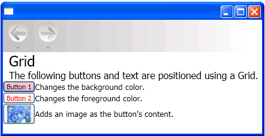

# How to: Use a Grid for Automatic Layout

This example describes how to use a grid in the automatic layout approach to creating a localizable application.  
  
 Localization of a UI was adapted for required adjustment. Now with the capabilities of Windows Presentation Foundation (WPF) you can design elements that reduce the need for adjustment. The approach to writing applications that can be more easily re-sized and repositioned is called `auto layout`.  
  
 The following Extensible Application Markup Language (XAML) example demonstrates using a grid to position some buttons and text. Notice that the height and width of the cells are set to `Auto`; therefore the cell that contains the button with an image adjusts to fit the image. Because the <xref:System.Windows.Controls.Grid> element can adjust to its content it can be useful when taking the automatic layout approach to designing applications that can be localized.  
  
## Example  

 The following example shows how to use a grid.  
  
 [!code-xaml[LocalizationGrid#1](~/samples/snippets/csharp/VS_Snippets_Wpf/LocalizationGrid/CS/Pane1.xaml#1)]  
  
 The following graphic shows the output of the code sample.  
  
   
Grid  
  
## See also

- [Use Automatic Layout Overview](use-automatic-layout-overview.md)
- [Use Automatic Layout to Create a Button](how-to-use-automatic-layout-to-create-a-button.md)
