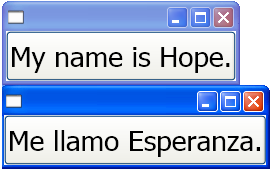

# How to: Use Automatic Layout to Create a Button

This example describes how to use the automatic layout approach to create a button in a localizable application.  
  
 Localization of a UI was adapted for required adjustment. Now with the capabilities of Windows Presentation Foundation (WPF) you can design elements that reduce the need for adjustment. The approach to writing applications that can be more easily resized and repositioned is called `automatic layout`.  
  
## Example  

The following two Extensible Application Markup Language (XAML) examples create applications that instantiate a button; one with English text and one with Spanish text. Notice that the code is the same except for the text; the button adjusts to fit the text.

[!code-xaml[LocalizationBtn_snip#1](~/samples/snippets/csharp/VS_Snippets_Wpf/LocalizationBtn_snip/CS/Pane1.xaml#1)]  
  
[!code-xaml[LocalizationBtn#1](~/samples/snippets/csharp/VS_Snippets_Wpf/LocalizationBtn/CS/Pane1.xaml#1)]  
  
 The following graphic shows the output of the code samples with auto-resizable buttons:
  
   
  
## See also

- [Use Automatic Layout Overview](use-automatic-layout-overview.md)
- [Use a Grid for Automatic Layout](how-to-use-a-grid-for-automatic-layout.md)
