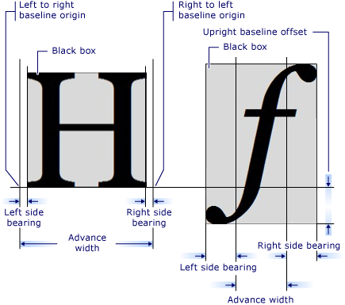

# Introduction to the GlyphRun Object and Glyphs Element
This topic describes the <xref:System.Windows.Media.GlyphRun> object and the <xref:System.Windows.Documents.Glyphs> element.  

## Introduction to GlyphRun  
 [!INCLUDE[TLA#tla_winclient](../../../includes/tlasharptla-winclient-md.md)] provides advanced text support including glyph-level markup with direct access to <xref:System.Windows.Documents.Glyphs> for customers who want to intercept and persist text after formatting. These features provide critical support for the different text rendering requirements in each of the following scenarios.  
  
1. Screen display of fixed-format documents.  
  
2. Print scenarios.  
  
    - [!INCLUDE[TLA#tla_xaml](../../../includes/tlasharptla-xaml-md.md)] as a device printer language.  
  
    - Microsoft XPS Document Writer.  
  
    - Previous printer drivers, output from Win32 applications to the fixed format.  
  
    - Print spool format.  
  
3. Fixed-format document representation, including clients for previous versions of Windows and other computing devices.  
  
> [!NOTE]
> <xref:System.Windows.Documents.Glyphs> and <xref:System.Windows.Media.GlyphRun> are designed for fixed-format document presentation and print scenarios. UI scenarios, see the [Typography in WPF](typography-in-wpf.md).  
  

## The GlyphRun Object  
 The <xref:System.Windows.Media.GlyphRun> object represents a sequence of glyphs from a single face of a single font at a single size, and with a single rendering style.  
  
 <xref:System.Windows.Media.GlyphRun> includes both font details such as glyph <xref:System.Windows.Documents.Glyphs.Indices%2A> and individual glyph positions. It also includes the original Unicode code points the run was generated from, character-to-glyph buffer offset mapping information, and per-character and per-glyph flags.  
  
 <xref:System.Windows.Media.GlyphRun> has a corresponding high-level <xref:System.Windows.FrameworkElement>, <xref:System.Windows.Documents.Glyphs>. <xref:System.Windows.Documents.Glyphs> can be used in the element tree and in [!INCLUDE[TLA2#tla_xaml](../../../includes/tla2sharptla-xaml-md.md)] markup to represent <xref:System.Windows.Media.GlyphRun> output.  
  

## The Glyphs Element  
 The <xref:System.Windows.Documents.Glyphs> element represents the output of a <xref:System.Windows.Media.GlyphRun> in [!INCLUDE[TLA2#tla_xaml](../../../includes/tla2sharptla-xaml-md.md)]. The following markup syntax is used to describe the <xref:System.Windows.Documents.Glyphs> element.  
  
 [!code-xaml[GlyphsOvwSample1#1](~/samples/snippets/csharp/VS_Snippets_Wpf/GlyphsOvwSample1/CS/default.xaml#1)]  
  
 The following property definitions correspond to the first four attributes in the sample markup.  
  
|Property|Description|  
|--------------|-----------------|  
|<xref:System.Windows.Documents.Glyphs.FontUri%2A>|Specifies a resource identifier: file name, Web uniform resource identifier (URI), or resource reference in the application .exe or container.|  
|<xref:System.Windows.Documents.Glyphs.FontRenderingEmSize%2A>|Specifies the font size in drawing surface units (default is .96 inches).|  
|<xref:System.Windows.Documents.Glyphs.StyleSimulations%2A>|Specifies flags for bold and Italic styles.|  
|<xref:System.Windows.Documents.Glyphs.BidiLevel%2A>|Specifies the bidirectional layout level. Even-numbered and zero values imply left-to-right layout; odd-numbered values imply right-to-left layout.|  
  

### Indices property  
 The <xref:System.Windows.Documents.Glyphs.Indices%2A> property is a string of glyph specifications. Where a sequence of glyphs forms a single cluster, the specification of the first glyph in the cluster is preceded by a specification of how many glyphs and how many code points combine to form the cluster. The <xref:System.Windows.Documents.Glyphs.Indices%2A> property collects in one string the following properties.  
  
- Glyph indices  
  
- Glyph advance widths  
  
- Combining glyph attachment vectors  
  
- Cluster mapping from code points to glyphs  
  
- Glyph flags  
  
 Each glyph specification has the following form.  
  
 `[GlyphIndex][,[Advance][,[uOffset][,[vOffset][,[Flags]]]]]`  
  

## Glyph Metrics  
 Each glyph defines metrics that specify how it aligns with other <xref:System.Windows.Documents.Glyphs>. The following graphic defines the various typographic qualities of two different glyph characters.  
  
   
  

## Glyphs Markup  
 The following code example shows how to use various properties of the <xref:System.Windows.Documents.Glyphs> element in [!INCLUDE[TLA2#tla_xaml](../../../includes/tla2sharptla-xaml-md.md)].  
  
 [!code-xaml[GlyphsOvwSamp2#1](~/samples/snippets/csharp/VS_Snippets_Wpf/GlyphsOvwSamp2/CS/default.xaml#1)]  
  
## See also

- [Typography in WPF](typography-in-wpf.md)
- [Documents in WPF](documents-in-wpf.md)
- [Text](optimizing-performance-text.md)
