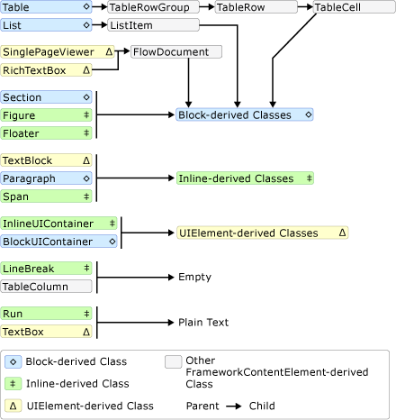

# TextElement Content Model Overview
This content model overview describes the supported content for a <xref:System.Windows.Documents.TextElement>. The <xref:System.Windows.Documents.Paragraph> class is a type of <xref:System.Windows.Documents.TextElement>. A content model describes what objects/elements can be contained in others. This overview summarizes the content model used for objects derived from <xref:System.Windows.Documents.TextElement>. For more information, see [Flow Document Overview](flow-document-overview.md).  

## Content Model Diagram  
 The following diagram summarizes the content model for classes derived from <xref:System.Windows.Documents.TextElement> as well as how other non- `TextElement` classes fit into this model.  
  
   
  
 As can be seen from the preceding diagram, the children allowed for an element are not necessarily determined by whether a class is derived from the <xref:System.Windows.Documents.Block> class or an <xref:System.Windows.Documents.Inline> class. For example, a <xref:System.Windows.Documents.Span> (an <xref:System.Windows.Documents.Inline>-derived class) can only have <xref:System.Windows.Documents.Inline> child elements, but a <xref:System.Windows.Documents.Figure> (also an <xref:System.Windows.Documents.Inline>-derived class) can only have <xref:System.Windows.Documents.Block> child elements. Therefore, a diagram is useful for quickly determining what element can be contained in another. As an example, let's use the diagram to determine how to construct the flow content of a <xref:System.Windows.Controls.RichTextBox>.  
  
1. A <xref:System.Windows.Controls.RichTextBox> must contain a <xref:System.Windows.Documents.FlowDocument> which in turn must contain a <xref:System.Windows.Documents.Block>-derived object. The following is the corresponding segment from the preceding diagram.  
  
       
  
     Thus far, this is what the markup might look like.  
  
     [!code-xaml[FlowOvwSnippets_snip#SchemaWalkThrough1](~/samples/snippets/csharp/VS_Snippets_Wpf/FlowOvwSnippets_snip/CS/MiscSnippets.xaml#schemawalkthrough1)]  
  
2. According to the diagram, there are several <xref:System.Windows.Documents.Block> elements to choose from including <xref:System.Windows.Documents.Paragraph>, <xref:System.Windows.Documents.Section>, <xref:System.Windows.Documents.Table>, <xref:System.Windows.Documents.List>, and <xref:System.Windows.Documents.BlockUIContainer> (see Block-derived classes in the preceding diagram). Let's say we want a <xref:System.Windows.Documents.Table>. According to the preceding diagram, a <xref:System.Windows.Documents.Table> contains a <xref:System.Windows.Documents.TableRowGroup> containing <xref:System.Windows.Documents.TableRow> elements, which contain <xref:System.Windows.Documents.TableCell> elements which contain a <xref:System.Windows.Documents.Block>-derived object. The following is the corresponding segment for <xref:System.Windows.Documents.Table> taken from the preceding diagram.  
  
       
  
     The following is the corresponding markup.  
  
     [!code-xaml[FlowOvwSnippets_snip#SchemaWalkThrough2](~/samples/snippets/csharp/VS_Snippets_Wpf/FlowOvwSnippets_snip/CS/MiscSnippets.xaml#schemawalkthrough2)]  
  
3. Again, one or more <xref:System.Windows.Documents.Block> elements are required underneath a <xref:System.Windows.Documents.TableCell>. To make it simple, let's place some text inside the cell. We can do this using a <xref:System.Windows.Documents.Paragraph> with a <xref:System.Windows.Documents.Run> element. The following is the corresponding segments from the diagram showing that a <xref:System.Windows.Documents.Paragraph> can take an <xref:System.Windows.Documents.Inline> element and that a <xref:System.Windows.Documents.Run> (an <xref:System.Windows.Documents.Inline> element) can only take plain text.  
  
       
  
       
  
 The following is the entire example in markup.  
  
 [!code-xaml[FlowOvwSnippets_snip#SchemaExampleWholePage](~/samples/snippets/csharp/VS_Snippets_Wpf/FlowOvwSnippets_snip/CS/SchemaExample.xaml#schemaexamplewholepage)]  
  

## Working with TextElement Content Programmatically  
 The contents of a <xref:System.Windows.Documents.TextElement> is made up by collections and so programmatically manipulating the contents of <xref:System.Windows.Documents.TextElement> objects is done by working with these collections. There are three different collections used by <xref:System.Windows.Documents.TextElement> -derived classes:  
  
- <xref:System.Windows.Documents.InlineCollection>: Represents a collection of <xref:System.Windows.Documents.Inline> elements. <xref:System.Windows.Documents.InlineCollection> defines the allowable child content of the <xref:System.Windows.Documents.Paragraph>, <xref:System.Windows.Documents.Span>, and <xref:System.Windows.Controls.TextBlock> elements.  
  
- <xref:System.Windows.Documents.BlockCollection>: Represents a collection of <xref:System.Windows.Documents.Block> elements. <xref:System.Windows.Documents.BlockCollection> defines the allowable child content of the <xref:System.Windows.Documents.FlowDocument>, <xref:System.Windows.Documents.Section>, <xref:System.Windows.Documents.ListItem>, <xref:System.Windows.Documents.TableCell>, <xref:System.Windows.Documents.Floater>, and <xref:System.Windows.Documents.Figure> elements.  
  
- <xref:System.Windows.Documents.ListItemCollection>: A flow content element that represents a particular content item in an ordered or unordered <xref:System.Windows.Documents.List>.  
  
 You can manipulate (add or remove items) from these collections using the respective properties of **Inlines**, **Blocks**, and **ListItems**. The following examples show how to manipulate the contents of a Span using the **Inlines** property.  
  
> [!NOTE]
> Table uses several collections to manipulate its contents, but they are not covered here. For more information, see [Table Overview](table-overview.md).  
  
 The following example creates a new <xref:System.Windows.Documents.Span> object, and then uses the `Add` method to add two text runs as content children of the <xref:System.Windows.Documents.Span>.  
  
 [!code-csharp[SpanSnippets#_SpanInlinesAdd](~/samples/snippets/csharp/VS_Snippets_Wpf/SpanSnippets/CSharp/Window1.xaml.cs#_spaninlinesadd)]
 [!code-vb[SpanSnippets#_SpanInlinesAdd](~/samples/snippets/visualbasic/VS_Snippets_Wpf/SpanSnippets/visualbasic/window1.xaml.vb#_spaninlinesadd)]  
  
 The following example creates a new <xref:System.Windows.Documents.Run> element and inserts it at the beginning of the <xref:System.Windows.Documents.Span>.  
  
 [!code-csharp[SpanSnippets#_SpanInlinesInsert](~/samples/snippets/csharp/VS_Snippets_Wpf/SpanSnippets/CSharp/Window1.xaml.cs#_spaninlinesinsert)]
 [!code-vb[SpanSnippets#_SpanInlinesInsert](~/samples/snippets/visualbasic/VS_Snippets_Wpf/SpanSnippets/visualbasic/window1.xaml.vb#_spaninlinesinsert)]  
  
 The following example deletes the last <xref:System.Windows.Documents.Inline> element in the <xref:System.Windows.Documents.Span>.  
  
 [!code-csharp[SpanSnippets#_SpanInlinesRemoveLast](~/samples/snippets/csharp/VS_Snippets_Wpf/SpanSnippets/CSharp/Window1.xaml.cs#_spaninlinesremovelast)]
 [!code-vb[SpanSnippets#_SpanInlinesRemoveLast](~/samples/snippets/visualbasic/VS_Snippets_Wpf/SpanSnippets/visualbasic/window1.xaml.vb#_spaninlinesremovelast)]  
  
 The following example clears all of the contents (<xref:System.Windows.Documents.Inline> elements) from the <xref:System.Windows.Documents.Span>.  
  
 [!code-csharp[SpanSnippets#_SpanInlinesClear](~/samples/snippets/csharp/VS_Snippets_Wpf/SpanSnippets/CSharp/Window1.xaml.cs#_spaninlinesclear)]
 [!code-vb[SpanSnippets#_SpanInlinesClear](~/samples/snippets/visualbasic/VS_Snippets_Wpf/SpanSnippets/visualbasic/window1.xaml.vb#_spaninlinesclear)]  
  

## Types That Share This Content Model  
 The following types inherit from the <xref:System.Windows.Documents.TextElement> class and may be used to display the content described in this overview.  
  
 <xref:System.Windows.Documents.Bold>, <xref:System.Windows.Documents.Figure>, <xref:System.Windows.Documents.Floater>, <xref:System.Windows.Documents.Hyperlink>, <xref:System.Windows.Documents.InlineUIContainer>, <xref:System.Windows.Documents.Italic>, <xref:System.Windows.Documents.LineBreak>, <xref:System.Windows.Documents.List>, <xref:System.Windows.Documents.ListItem>, <xref:System.Windows.Documents.Paragraph>, <xref:System.Windows.Documents.Run>, <xref:System.Windows.Documents.Section>, <xref:System.Windows.Documents.Span>, <xref:System.Windows.Documents.Table>, <xref:System.Windows.Documents.Underline>.  
  
 Note that this list only includes nonabstract types distributed with the Windows SDK. You may use other types that inherit from <xref:System.Windows.Documents.TextElement>.  
  

## Types That Can Contain TextElement Objects  
 See [WPF Content Model](../controls/wpf-content-model.md).  
  
## See also

- [Manipulate a FlowDocument through the Blocks Property](how-to-manipulate-a-flowdocument-through-the-blocks-property.md)
- [Manipulate Flow Content Elements through the Blocks Property](how-to-manipulate-flow-content-elements-through-the-blocks-property.md)
- [Manipulate a FlowDocument through the Blocks Property](how-to-manipulate-a-flowdocument-through-the-blocks-property.md)
- [Manipulate a Table's Columns through the Columns Property](how-to-manipulate-table-columns-through-the-columns-property.md)
- [Manipulate a Table's Row Groups through the RowGroups Property](how-to-manipulate-table-row-groups-through-the-rowgroups-property.md)
