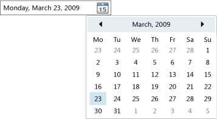

# DatePicker
The <xref:System.Windows.Controls.DatePicker> control allows the user to select a date by either typing it into a text field or by using a drop-down <xref:System.Windows.Controls.Calendar> control.  
  
 The following illustration shows a <xref:System.Windows.Controls.DatePicker>.  
  
   
DatePicker Control  
  
 Many of a <xref:System.Windows.Controls.DatePicker> control's properties are for managing its built-in <xref:System.Windows.Controls.Calendar>, and function identically to the equivalent property in <xref:System.Windows.Controls.Calendar>. In particular, the <xref:System.Windows.Controls.DatePicker.IsTodayHighlighted%2A?displayProperty=nameWithType>, <xref:System.Windows.Controls.DatePicker.FirstDayOfWeek%2A?displayProperty=nameWithType>, <xref:System.Windows.Controls.DatePicker.BlackoutDates%2A?displayProperty=nameWithType>, <xref:System.Windows.Controls.DatePicker.DisplayDateStart%2A?displayProperty=nameWithType>, <xref:System.Windows.Controls.DatePicker.DisplayDateEnd%2A?displayProperty=nameWithType>, <xref:System.Windows.Controls.DatePicker.DisplayDate%2A?displayProperty=nameWithType>, and <xref:System.Windows.Controls.DatePicker.SelectedDate%2A?displayProperty=nameWithType> properties function identically to their <xref:System.Windows.Controls.Calendar> counterparts. For more information, see <xref:System.Windows.Controls.Calendar>.  
  
 Users can type a date directly into a text field, which sets the <xref:System.Windows.Controls.DatePicker.Text%2A> property. If the <xref:System.Windows.Controls.DatePicker> cannot convert the entered string to a valid date, the <xref:System.Windows.Controls.DatePicker.DateValidationError> event will be raised. By default, this causes an exception, but an event handler for <xref:System.Windows.Controls.DatePicker.DateValidationError> can set the <xref:System.Windows.Controls.DatePickerDateValidationErrorEventArgs.ThrowException%2A> property to `false` and prevent an exception from being raised.  
  
## See also

- [Controls](index.md)
- [Styling and Templating](styles-templates-overview.md)
