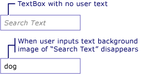

# How to: Add a Watermark to a TextBox

The following example shows how to aid usability of a <xref:System.Windows.Controls.TextBox> by displaying an explanatory background image inside of the <xref:System.Windows.Controls.TextBox> until the user inputs text, at which point the image is removed. In addition, the background image is restored again if the user removes their input. See illustration below.  
  
   
  
> [!NOTE]
> The reason a background image is used in this example rather then simply manipulating the <xref:System.Windows.Controls.TextBox.Text%2A> property of <xref:System.Windows.Controls.TextBox>, is that a background image will not interfere with data binding.  

## Example

The following XAML demonstrates the following:

- Declaring the `watermark` resource. Download the image from [GitHub](https://github.com/dotnet/docs-desktop/blob/main/dotnet-desktop-guide/framework/wpf/controls/snippets/how-to-add-a-watermark-to-a-textbox/csharp/textboxbackground.gif).
- Setting the [`TextBox.Background`](xref:System.Windows.Controls.Control.Background) property to the resources.
- Setting the [`TextBox.TextChanged`](xref:System.Windows.Controls.Primitives.TextBoxBase.TextChanged) event.

:::code language="xaml" source="./snippets/how-to-add-a-watermark-to-a-textbox/csharp/MainWindow.xaml" :::

The following code handles the [`TextBox.TextChanged`](xref:System.Windows.Controls.Primitives.TextBoxBase.TextChanged) event:

:::code language="csharp" source="./snippets/how-to-add-a-watermark-to-a-textbox/csharp/MainWindow.xaml.cs" id="code" :::
:::code language="vb" source="./snippets/how-to-add-a-watermark-to-a-textbox/vb/MainWindow.xaml.vb" id="code" :::

## See also

- [TextBox Overview](textbox-overview.md)
- [RichTextBox Overview](richtextbox-overview.md)
