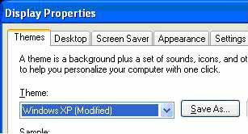

# Label

<xref:System.Windows.Controls.Label> controls usually provide information in the user interface (UI).  Historically, a <xref:System.Windows.Controls.Label> has contained only text, but because the <xref:System.Windows.Controls.Label> that ships with Windows Presentation Foundation (WPF) is a <xref:System.Windows.Controls.ContentControl>, it can contain either text or a <xref:System.Windows.UIElement>.  
  
 A <xref:System.Windows.Controls.Label> provides both functional and visual support for access keys. It is frequently used to enable quick keyboard access to controls such as a <xref:System.Windows.Controls.TextBox>. To assign a <xref:System.Windows.Controls.Label> to a <xref:System.Windows.Controls.Control>, set the <xref:System.Windows.Controls.Label.Target%2A?displayProperty=nameWithType> property to the control that should get focus when the user presses the access key.  
  
 The following image shows a <xref:System.Windows.Controls.Label> "Theme" that targets a <xref:System.Windows.Controls.ComboBox>.  When the user presses <kbd>T</kbd>, the <xref:System.Windows.Controls.ComboBox> receives focus.  For more information, see [How to: Set the Target Property of a Label](/previous-versions/dotnet/netframework-3.5/ms752101(v=vs.90)).  
  
   
  
## In This Section  

 [How to: Create a Control That Has an Access Key and Text Wrapping](how-to-create-a-control-that-has-an-access-key-and-text-wrapping.md)  
  
## Reference  

 <xref:System.Windows.Controls.Label>
