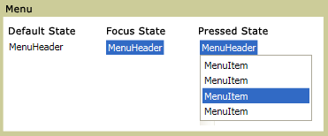

# Menu

A <xref:System.Windows.Controls.Menu> is a control that allows hierarchical organization of elements associated with commands or event handlers. Each <xref:System.Windows.Controls.Menu> can contain multiple <xref:System.Windows.Controls.MenuItem> controls. Each <xref:System.Windows.Controls.MenuItem> can invoke a command or invoke a `Click` event handler. A <xref:System.Windows.Controls.MenuItem> can also have multiple <xref:System.Windows.Controls.MenuItem> elements as children, forming a submenu.  
  
 The following illustration shows the three different states of a menu control. The default state is when no device such as a mouse pointer is resting on the <xref:System.Windows.Controls.Menu>. The focus state occurs when the mouse pointer is hovering over the <xref:System.Windows.Controls.Menu> and pressed state occurs when a mouse button is clicked over the <xref:System.Windows.Controls.Menu>.  
  
   
Menus in different states  
  
## In This Section  

 [Menu Overview](menu-overview.md)  
  
## Reference  

 <xref:System.Windows.Controls.Menu>  
  <xref:System.Windows.Controls.MenuItem>  
  <xref:System.Windows.Controls.Primitives.MenuBase>  
  <xref:System.Windows.Controls.ContextMenu>  
  
## Related Sections
