# Walkthrough: Create a Button by Using Microsoft Expression Blend

This walkthrough steps you through the process of creating a WPF customized button using Microsoft Expression Blend.

> [!IMPORTANT]
> Microsoft Expression Blend works by generating [!INCLUDE[TLA#tla_xaml](../../../includes/tlasharptla-xaml-md.md)] that is then compiled to make the executable program. If you would rather work with XAML directly, there is another walkthrough that creates the same application as this one using XAML with Visual Studio rather than Blend. See [Create a Button by Using XAML](walkthrough-create-a-button-by-using-xaml.md) for more information.

The following illustration shows the customized button that you will create.

## Convert a Shape to a Button

In the first part of this walkthrough you create the custom look of the custom button. To do this, you first convert a rectangle to a button. You then add additional shapes to the template of the button, creating a more complex looking button. Why not start with a regular button and customize it? Because a button has built-in functionality that you do not need; for custom buttons, it is easier to start with a rectangle.

### To create a new project in Expression Blend

1. Start Expression Blend. (Click **Start**, point to **All Programs**, point to **Microsoft Expression**, and then click **Microsoft Expression Blend**.)

2. Maximize the application if needed.

3. On the **File** menu, click **New Project**.

4. Select **Standard Application (.exe)**.

5. Name the project `CustomButton` and press **OK**.

At this point you have a blank WPF project. You can press F5 to run the application. As you might expect, the application consists of only a blank window. Next, you create a rounded rectangle and convert it into a button.

### To convert a Rectangle to a Button

1. **Set the Window Background property to black:** Select the Window, click the **Properties Tab**, and set the <xref:System.Windows.Controls.Control.Background%2A> property to `Black`.

    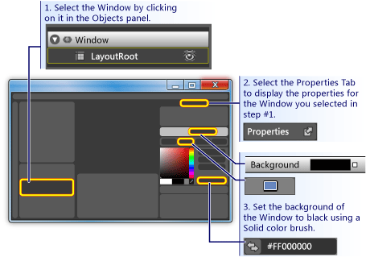

2. **Draw a rectangle approximately the size of a button on the Window:** Select the rectangle tool on the left-hand tool panel and drag the rectangle onto the Window.

    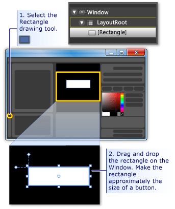

3. **Round out the corners of the rectangle:** Either drag the control points of the rectangle or directly set the <xref:System.Windows.Shapes.Rectangle.RadiusX%2A> and <xref:System.Windows.Shapes.Rectangle.RadiusY%2A> properties. Set the values of <xref:System.Windows.Shapes.Rectangle.RadiusX%2A> and <xref:System.Windows.Shapes.Rectangle.RadiusY%2A> to 20.

    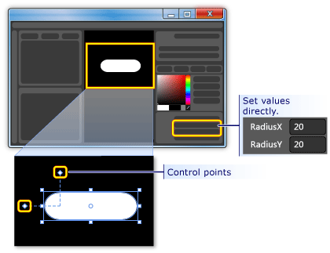

4. **Change the rectangle into a button:** Select the rectangle. On the **Tools** menu, click **Make Button**.

    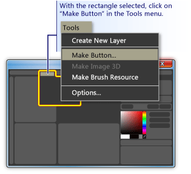

5. **Specify the scope of the style/template:** A dialog box like the following appears.

    

    For **Resource name (Key)**, select **Apply to all**.  This will make the resulting style and button template apply to all objects that are buttons. For **Define in**, select **Application**. This will make the resulting style and button template have scope over the entire application. When you set the values in these two boxes, the button style and template apply to all buttons within the entire application and any button you create in the application will, by default, use this template.

## Edit the Button Template

You now have a rectangle that has been changed to a button. In this section, you'll modify the template of the button and further customize how it looks.

### To edit the button template to change the button appearance

1. **Go into edit template view:** To further customize the look of our button, we need to edit the button template. This template was created when we converted the rectangle into a button. To edit the button template, right-click the button and select **Edit Control Parts (Template)** and then **Edit Template**.

    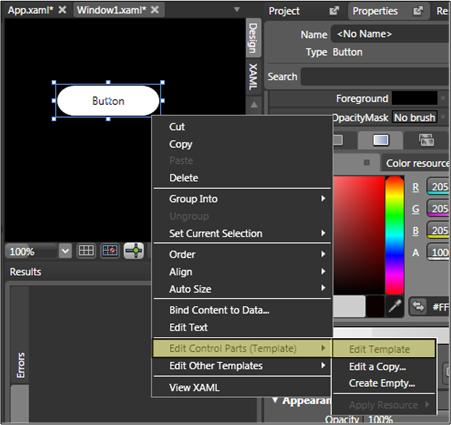

    In the template editor, notice that the button is now separated into a <xref:System.Windows.Shapes.Rectangle> and the <xref:System.Windows.Controls.ContentPresenter>. The <xref:System.Windows.Controls.ContentPresenter> is used to present content within the button (for example, the string "Button"). Both the rectangle and <xref:System.Windows.Controls.ContentPresenter> are laid out inside of a <xref:System.Windows.Controls.Grid>.

    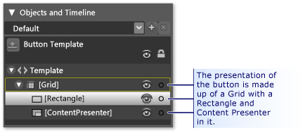

2. **Change the names of the template components:** Right-click the rectangle in the template inventory, change the <xref:System.Windows.Shapes.Rectangle> name from "[Rectangle]" to "outerRectangle", and change "[ContentPresenter]" to "myContentPresenter".

    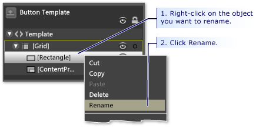

3. **Alter the rectangle so that it is empty inside (like a donut):** Select **outerRectangle** and set <xref:System.Windows.Shapes.Shape.Fill%2A> to "Transparent" and <xref:System.Windows.Shapes.Shape.StrokeThickness%2A> to 5.

    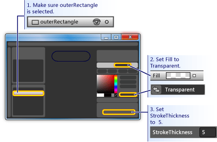

    Then set the <xref:System.Windows.Shapes.Shape.Stroke%2A> to the color of whatever the template will be. To do this, click the small white box next to **Stroke**, select **CustomExpression**, and type "{TemplateBinding Background}" in the dialog box.

    

4. **Create an inner rectangle:** Now, create another rectangle (name it "innerRectangle") and position it symmetrically on the inside of **outerRectangle** . For this kind of work, you will probably want to zoom to make the button larger in the editing area.

    > [!NOTE]
    > Your rectangle might look different than the one in the figure (for example, it might have rounded corners).

    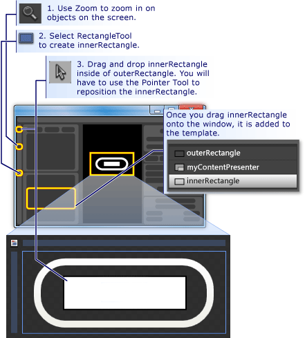

5. **Move ContentPresenter to the top:** At this point, it is possible that the text "Button" will not be visible any longer. If this is so, this is because **innerRectangle** is on top of the **myContentPresenter**. To fix this, drag **myContentPresenter** below **innerRectangle**. Reposition rectangles and **myContentPresenter** to look similar to below.

    > [!NOTE]
    > Alternatively, you can also position **myContentPresenter** on top by right-clicking it and pressing **Send Forward**.

    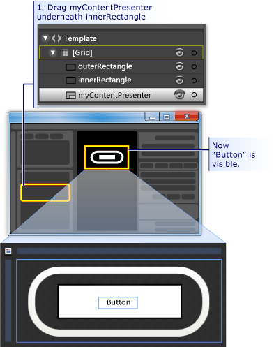

6. **Change the look of innerRectangle:** Set the <xref:System.Windows.Shapes.Rectangle.RadiusX%2A>, <xref:System.Windows.Shapes.Rectangle.RadiusY%2A>, and <xref:System.Windows.Shapes.Shape.StrokeThickness%2A> values to 20. In addition, set the <xref:System.Windows.Shapes.Shape.Fill%2A> to the background of the template using the custom expression "{TemplateBinding Background}" ) and set <xref:System.Windows.Shapes.Shape.Stroke%2A> to "transparent". Notice that the settings for the <xref:System.Windows.Shapes.Shape.Fill%2A> and <xref:System.Windows.Shapes.Shape.Stroke%2A> of **innerRectangle** are the opposite of those for **outerRectangle**.

    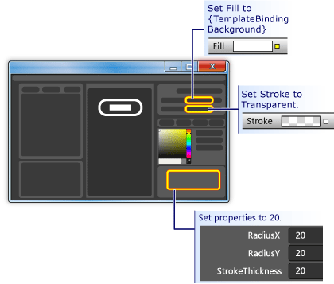

7. **Add a glass layer on top:** The final piece of customizing the look of the button is to add a glass layer on top. This glass layer consists of a third rectangle. Because the glass will cover the entire button, the glass rectangle is similar in dimensions to the **outerRectangle**. Therefore, create the rectangle by simply making a copy of the **outerRectangle**. Highlight **outerRectangle** and use CTRL+C and CTRL+V to make a copy. Name this new rectangle "glassCube".

8. **Reposition glassCube if necessary:** If **glassCube** is not already positioned so that it covers the entire button, drag it into position.

9. **Give glassCube a slightly different shape than outerRectangle:** Change the properties of **glassCube**. Start off by changing the <xref:System.Windows.Shapes.Rectangle.RadiusX%2A> and <xref:System.Windows.Shapes.Rectangle.RadiusY%2A> properties to 10 and the <xref:System.Windows.Shapes.Shape.StrokeThickness%2A> to 2.

    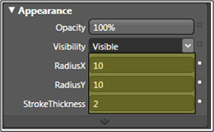

10. **Make glassCube look like glass:** Set the <xref:System.Windows.Shapes.Shape.Fill%2A> to a glassy look by  using a linear gradient that is 75% opaque and alternates between the color White and Transparent over 6 approximately evenly spaced intervals. This is what to set the gradient stops to:

    - Gradient Stop 1: White with Alpha value of 75%

    - Gradient Stop 2: Transparent

    - Gradient Stop 3: White with Alpha value of 75%

    - Gradient Stop 4: Transparent

    - Gradient Stop 5: White with Alpha value of 75%

    - Gradient Stop 6: Transparent

    This creates a "wavy" glass look.

    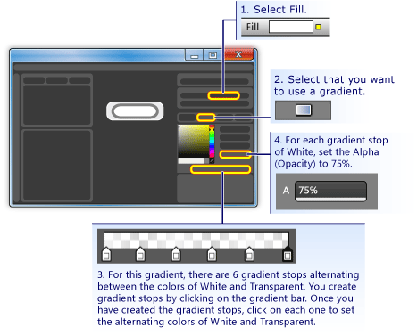

11. **Hide the glass layer:** Now that you see what the glassy layer looks like, go into the **Appearance pane** of the **Properties panel** and set the Opacity to 0% to hide it. In the sections ahead, we'll use property triggers and events to show and manipulate the glass layer.

    

## Customize the Button Behavior

At this point, you have customized the presentation of the button by editing its template, but the button does not react to user actions as typical buttons do (for example, changing appearance upon mouse-over, receiving focus, and clicking.) The next two procedures show how to build behaviors like these into the custom button. We'll start with simple property triggers, and then add event triggers and animations.

### To set property triggers

1. **Create a new property trigger:** With **glassCube** selected, click **+ Property** in the **Triggers** panel (see the figure that follows the next step). This creates a property trigger with a default property trigger.

2. **Make IsMouseOver the property used by the trigger:** Change the property to <xref:System.Windows.UIElement.IsMouseOver%2A>. This makes the property trigger activate when the <xref:System.Windows.UIElement.IsMouseOver%2A> property is `true` (when the user points to the button with the mouse).

    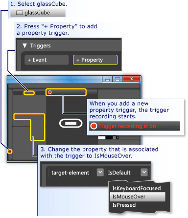

3. **IsMouseOver triggers opacity of 100% for glassCube:** Notice that the **Trigger recording is on** (see the preceding figure). This means that any changes you make to the property values of **glassCube** while recording is on will become an action that takes place when <xref:System.Windows.UIElement.IsMouseOver%2A> is `true`. While recording, change the <xref:System.Windows.UIElement.Opacity%2A> of **glassCube** to 100%.

    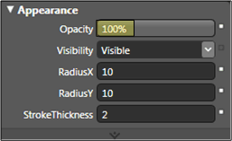

    You have now created your first property trigger. Notice that the **Triggers panel** of the editor has recorded the <xref:System.Windows.UIElement.Opacity%2A> being changed to 100%.

    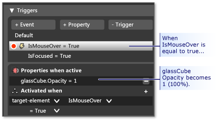

    Press F5 to run the application, and move the mouse pointer over and off the button. You should see the glass layer appear when you mouse-over the button and disappear when the pointer leaves.

4. **IsMouseOver triggers stroke value change:** Let's associate some other actions with the <xref:System.Windows.UIElement.IsMouseOver%2A> trigger. While recording continues, switch your selection from **glassCube** to **outerRectangle**. Then set the <xref:System.Windows.Shapes.Shape.Stroke%2A> of **outerRectangle** to the custom expression of "{DynamicResource {x:Static SystemColors.HighlightBrushKey}}". This sets the <xref:System.Windows.Shapes.Shape.Stroke%2A> to the typical highlight color used by buttons. Press F5 to see the effect when you mouse over the button.

    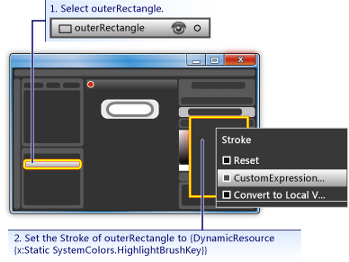

5. **IsMouseOver triggers blurry text:** Let's associate one more action to the <xref:System.Windows.UIElement.IsMouseOver%2A> property trigger. Make the content of the button appear a little blurry when the glass appears over it. To do this, we can apply a blur <xref:System.Windows.Media.Effects.BitmapEffect> to the <xref:System.Windows.Controls.ContentPresenter> (**myContentPresenter**).

    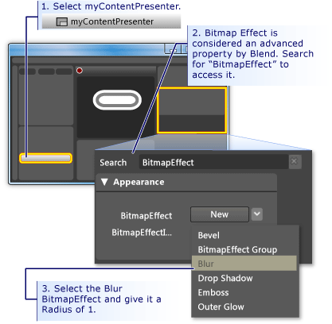

    > [!NOTE]
    > To return the **Properties panel** back to what it was before you did the search for <xref:System.Windows.Media.Effects.BitmapEffect>, clear the text from the **Search box**.

    At this point, we have used a property trigger with several associated actions to create highlighting behavior for when the mouse pointer enters and leaves the button area. Another typical behavior for a button is to highlight when it has focus (as after it is clicked). We can add such behavior by adding another property trigger for the <xref:System.Windows.UIElement.IsFocused%2A> property.

6. **Create property trigger for IsFocused:** Using the same procedure as for <xref:System.Windows.UIElement.IsMouseOver%2A> (see the first step of this section), create another property trigger for the <xref:System.Windows.UIElement.IsFocused%2A> property. While **Trigger recording is on**, add the following actions to the trigger:

    - **glassCube** gets an <xref:System.Windows.UIElement.Opacity%2A> of 100%.

    - **outerRectangle** gets a <xref:System.Windows.Shapes.Shape.Stroke%2A> custom expression value of "{DynamicResource {x:Static SystemColors.HighlightBrushKey}}".

As the final step in this walkthrough, we will add animations to the button. These animations will be triggered by events—specifically, the <xref:System.Windows.UIElement.MouseEnter> and <xref:System.Windows.Controls.Primitives.ButtonBase.Click> events.

### To use event triggers and animations to add interactivity

1. **Create a MouseEnter Event Trigger:** Add a new event trigger and select <xref:System.Windows.UIElement.MouseEnter> as the event to use in the trigger.

     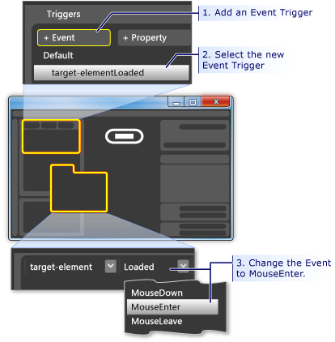

2. **Create an animation timeline:** Next, associate an animation timeline to the <xref:System.Windows.UIElement.MouseEnter> event.

    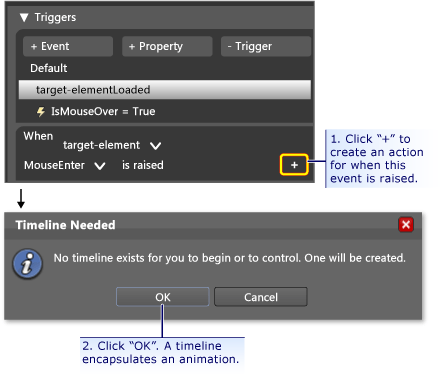

    After you press **OK** to create a new timeline, a **Timeline Panel** appears and "Timeline recording is on" is visible in the design panel. This means we can start recording property changes in the timeline (animate property changes).

    > [!NOTE]
    > You may need to resize your window and/or panels to see the display.

    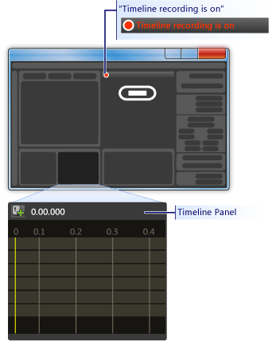

3. **Create a keyframe:** To create an animation, select the object you want to animate, create two or more keyframes on the timeline, and for those keyframes, set the property values you want the animation to interpolate between. The following figure guides you through the creation of a keyframe.

    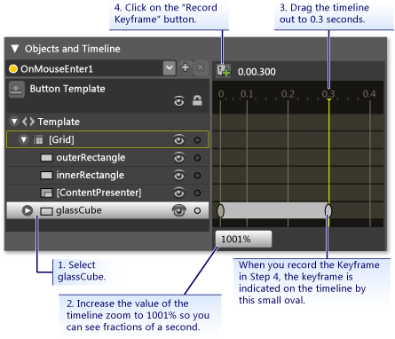

4. **Shrink glassCube at this keyframe:** With the second keyframe selected, shrink the size of the **glassCube** to 90% of its full size using the **Size Transform**.

    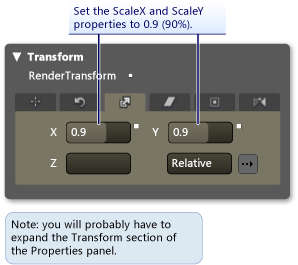

    Press F5 to run the application. Move the mouse pointer over the button. Notice that the glass layer shrinks on top of the button.

5. **Create another Event Trigger and associate a different animation with it:** Let's add one more animation. Use a similar procedure to what you used to create the previous event trigger animation:

    1. Create a new event trigger using the <xref:System.Windows.Controls.Primitives.ButtonBase.Click> event.

    2. Associate a new timeline with the <xref:System.Windows.Controls.Primitives.ButtonBase.Click> event.

        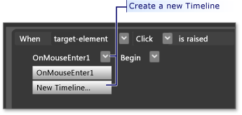

    3. For this timeline, create two keyframes, one at 0.0 seconds and the second one at 0.3 seconds.

    4. With the keyframe at 0.3 seconds highlighted, set the **Rotate Transform Angle** to 360 degrees.

        

    5. Press F5 to run the application. Click the button. Notice that the glass layer spins around.

## Conclusion

You have completed a customized button. You did this using a button template that was applied to all buttons in the application. If you leave the template editing mode (see the following figure) and create more buttons, you will see that they look and behave like your custom button rather than like the default button.

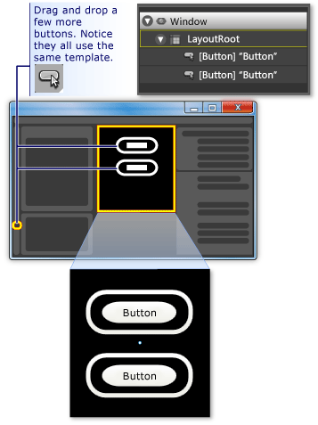

Press F5 to run the application. Click the buttons and notice how they all behave the same.

Remember that while you were customizing the template, you set the <xref:System.Windows.Shapes.Shape.Fill%2A> property of **innerRectangle** and the <xref:System.Windows.Shapes.Shape.Stroke%2A> property **outerRectangle** to the template background ({TemplateBinding Background}). Because of this, when you set the background color of the individual buttons, the background you set will be used for those respective properties. Try changing the backgrounds now. In the following figure, different gradients are used. Therefore, although a template is useful for overall customization of controls like button, controls with templates can still be modified to look different from each other.

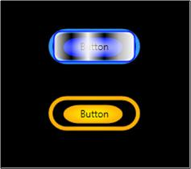

In conclusion, in the process of customizing a button template you have learned how to do the following in Microsoft Expression Blend:

- Customize the look of a control.

- Set property triggers. Property triggers are very useful because they can be used on most objects, not just controls.

- Set event triggers. Event triggers are very useful because they can be used on most objects, not just controls.

- Create animations.

- Miscellaneous: create gradients, add BitmapEffects, use transforms, and set basic properties of objects.

## See also

- [Create a Button by Using XAML](walkthrough-create-a-button-by-using-xaml.md)
- [Styling and Templating](styles-templates-overview.md)
- [Animation Overview](../graphics-multimedia/animation-overview.md)
- [Painting with Solid Colors and Gradients Overview](../graphics-multimedia/painting-with-solid-colors-and-gradients-overview.md)
- [Bitmap Effects Overview](../graphics-multimedia/bitmap-effects-overview.md)
