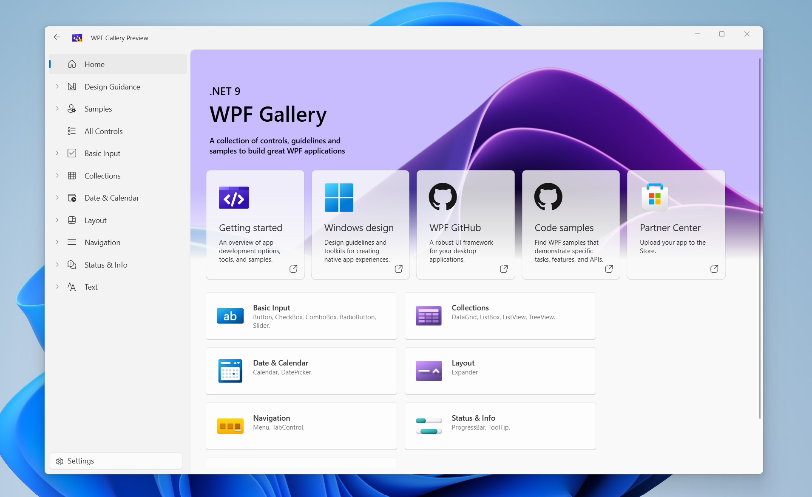
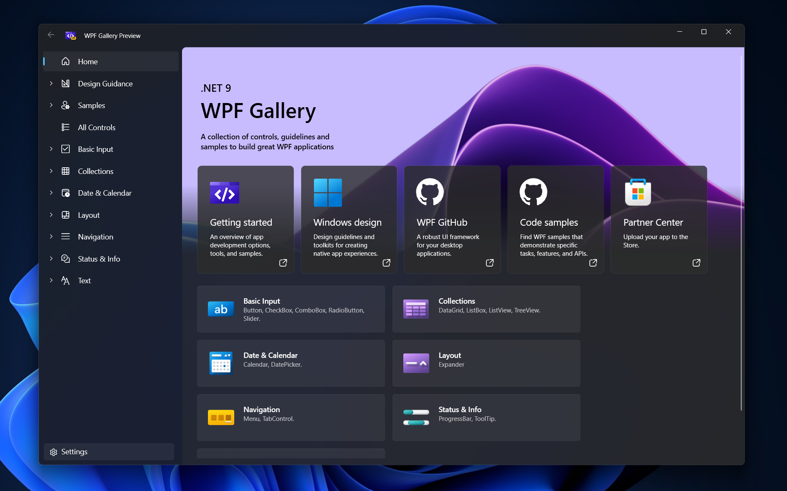

# What's new for .NET 8 (WPF .NET)

As part of the ongoing modernization of Windows Presentation Foundation (WPF), applications built on WPF and running on Windows 10 or later can now take advantage of cutting-edge design elements and behaviors. Key enhancements include:

- Support for light and dark themes
- Rounded corners for controls
- Compliance with Windows 11 design guidelines
- Accent color support for controls

The introduction of the new Fluent theme delivers a fresh, modern Windows 11 aesthetic to WPF applications. With integrated Light/Dark mode and system accent color support, this update is set to enhance user engagement by giving WPF applications a contemporary, polished appearance.

First showcased at Build 2024, the Fluent theme is now generally available as part of the official .NET 9 release for Windows 10, Windows 11, and also Windows Server 2019.

WPF Gallery App is a sample tool that demonstrates WPF controls and styles to a WPF application in .NET 9 and onwards. The source code for this app is available on [GitHub](https://github.com/microsoft/WPF-Samples).





## ThemeMode API

This experimental API enables easy switching between Fluent Themes in WPF applications, improving user experience and accessibility. This experimental API, available at both the Application and Window level, allows developers to dynamically toggle between Light, Dark, System, or None (Default) themes, offering greater flexibility in adapting app visuals.

### Setting Application ThemeMode from XAML

In App.xaml include the ThemeMode property as shown below.

```xml
<Application 
    x:Class="YourSampleApplication.App"
    xmlns="http://schemas.microsoft.com/winfx/2006/xaml/presentation"
    xmlns:x="http://schemas.microsoft.com/winfx/2006/xaml"
    xmlns:local="clr-namespace:YourSampleApplication"
    ThemeMode="Dark">
    <Application.Resources>
    
    </Application.Resources>
</Application>
```

### Setting Window ThemeMode from XAML

Similar to Application ThemeMode, set the ThemeMode at the desired window's xaml as shown below.

```xml
<Window
    x:Class="YourSampleApplication.MainWindow"
    xmlns="http://schemas.microsoft.com/winfx/2006/xaml/presentation"
    xmlns:x="http://schemas.microsoft.com/winfx/2006/xaml"
    xmlns:d="http://schemas.microsoft.com/expression/blend/2008"
    xmlns:mc="http://schemas.openxmlformats.org/markup-compatibility/2006"
    xmlns:local="clr-namespace:YourSampleApplication"
    mc:Ignorable="d"
    Title="MainWindow" Height="450" Width="800" ThemeMode="Dark">
    <Grid>

    </Grid>
</Window>
```

### Setting ThemeMode from Code-Behind

Since the API is experimental, the usage of ThemeMode from code-behind is a bit restricted. To use ThemeMode from code-behind, the developer either needs to configurethe project to ignore the WPF0001 warning for the project or suppress the warning where needed.

**To configure the Project to ignore the warning:** In your project's .csproj, set the following tag:

```xml
<PropertyGroup>
    <NoWarn>WPF0001<NoWarn>
</PropertyGroup>
```

Use the property from code-behind:

```cs
Application.Current.ThemeMode = ThemeMode.Light;
```

or, to apply it to the current window

```cs
this.ThemeMode = ThemeMode.Light;
```

**To suppress the warning:** Disable and enable the pragma warning as shown below

```cs
#pragma warning disable WPF0001
    Application.Current.ThemeMode = ThemeMode.Light;
#pragma warning restore WPF0001
```

### Expected behavior of the API

1. When the `ThemeMode` is set to Light or Dark or System, the Fluent Themes are applied to the respective Application or Window.
2. The `ThemeMode` when set to System respects the current operating system's theme settings. This involves detecting whether the user is utilizing a light or dark theme as their App Mode.
3. When the `ThemeMode` is set to None, the Fluent Themes are not applied and the default `Aero2` theme is used.
4. Accent color changes will be adhered to whenever the Fluent Theme is applied irrespective of `ThemeMode`.
5. When the `ThemeMode` is set to a Window, it will take precedence over the Application's `ThemeMode`. In case Window `ThemeMode` is set to None, the window will adhere to Application's `ThemeMode`, even if Application uses Fluent Theme.
6. The default value of `ThemeMod`e is None.

In addition to these behaviors, the ThemeMode is also designed to respect the Fluent Theme Dictionary added to the Application or Window. AFluent Themes can also be loaded by including the respective Fluent Dictionary. If the given application or window is loaded with a given Fluent Dictionary, let's say Light, then the ThemeMode will be synced to Light Mode as well and vice-versa.

This can be enabled by adding the following to your App.xaml:

```xml
<Application.Resources>
    <ResourceDictionary>
        <ResourceDictionary.MergedDictionaries>
            <ResourceDictionary Source="pack://application:,,,/PresentationFramework.Fluent;component/Themes/Fluent.xaml" />
        </ResourceDictionary.MergedDictionaries>
    </ResourceDictionary>
</Application.Resources>
```

## AccentColors as SystemColors

Since Windows 10, Accent Color became a cornerstone for visual styling, enhancing consistency across apps by aligning with the system theme. The latest introduction of AccentColors and corresponding brushes in SystemColors simplifies this process for WPF developers, offering them direct access to system accent colors and their variations.

This streamlines the workflow, ensuring apps can seamlessly integrate system-defined aesthetics, ultimately improving the user experience without extra coding overhead. The new API offers a more reliable and efficient way to deliver visually cohesive applications.

1. **Colors**: The following System.Windows.Media.Color are being introduced corresponding to the current accent color of the system and its primary, secondary and tertiary variations in both Light and Dark mode.

    ```cs
    AccentColor
    AccentColorLight1
    AccentColorLight2
    AccentColorLight3
    AccentColorDark1
    AccentColorDark2
    AccentColorDark3
    ```

2. **ResourceKey**: Similary, the following System.Windows.ResourceKey are being introduced.

    ```cs
    AccentColorKey
    AccentColorLight1Key
    AccentColorLight2Key
    AccentColorLight3Key
    AccentColorDark1Key
    AccentColorDark2Key
    AccentColorDark3Key
    ```

3. **SolidColorBrush**: Similary, the following System.Windows.Media.SolidColorBrush are being introduced.

    ```cs
    AccentColorBrush
    AccentColorLight1Brush
    AccentColorLight2Brush
    AccentColorLight3Brush
    AccentColorDark1Brush
    AccentColorDark2Brush
    AccentColorDark3Brush
    ```

### Usage of the `AccentColor` APIs

Usage of the AccentColor APIs, update the applicable properties as below:

```xml
<Button Content="Sample WPF Button" Background="{x:Static SystemColors.AccentColorBrush}" />
```

## Hyphen based ligature support

Based on the WPF community feedback, we have now fixed the issue with Hyphen based ligatures not working in WPF. Summary: A call to LsTxtFmt (Text Formatter) is made when a line is being created. Previously, in LsTxtFmt, glyphing was only performed for regular characters. However, after the fix, glyphing will also be performed for special characters, such as hyphens.
