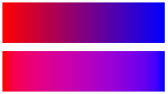

# How to: Apply Gamma Correction to a Gradient

You can enable gamma correction for a linear gradient brush by setting the brush's <xref:System.Drawing.Drawing2D.LinearGradientBrush.GammaCorrection%2A> property to `true`. You can disable gamma correction by setting the <xref:System.Drawing.Drawing2D.LinearGradientBrush.GammaCorrection%2A> property to `false`. Gamma correction is disabled by default.

## Example

The following example is a method that is called from a control's <xref:System.Windows.Forms.Control.Paint> event handler. The example creates a linear gradient brush and uses that brush to fill two rectangles. The first rectangle is filled without gamma correction, and the second rectangle is filled with gamma correction.

The following illustration shows the two filled rectangles. The top rectangle, which does not have gamma correction, appears dark in the middle. The bottom rectangle, which has gamma correction, appears to have more uniform intensity.

[!code-csharp[System.Drawing.UsingaGradientBrush#31](~/samples/snippets/csharp/VS_Snippets_Winforms/System.Drawing.UsingaGradientBrush/CS/Class1.cs#31)]
[!code-vb[System.Drawing.UsingaGradientBrush#31](~/samples/snippets/visualbasic/VS_Snippets_Winforms/System.Drawing.UsingaGradientBrush/VB/Class1.vb#31)]

## Compiling the Code

The preceding example is designed for use with Windows Forms, and it requires <xref:System.Windows.Forms.PaintEventArgs> `e`, which is a parameter of the <xref:System.Windows.Forms.Control.Paint> event handler.

## See also

- <xref:System.Drawing.Drawing2D.LinearGradientBrush?displayProperty=nameWithType>
- [Using a Gradient Brush to Fill Shapes](using-a-gradient-brush-to-fill-shapes.md)
