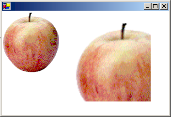

# How to: Crop and Scale Images

The <xref:System.Drawing.Graphics> class provides several <xref:System.Drawing.Graphics.DrawImage%2A> methods, some of which have source and destination rectangle parameters that you can use to crop and scale images.  
  
## Example  

 The following example constructs an <xref:System.Drawing.Image> object from the disk file Apple.gif. The code draws the entire apple image in its original size. The code then calls the <xref:System.Drawing.Graphics.DrawImage%2A> method of a <xref:System.Drawing.Graphics> object to draw a portion of the apple image in a destination rectangle that is larger than the original apple image.  
  
 The <xref:System.Drawing.Graphics.DrawImage%2A> method determines which portion of the apple to draw by looking at the source rectangle, which is specified by the third, fourth, fifth, and sixth arguments. In this case, the apple is cropped to 75 percent of its width and 75 percent of its height.  
  
 The <xref:System.Drawing.Graphics.DrawImage%2A> method determines where to draw the cropped apple and how big to make the cropped apple by looking at the destination rectangle, which is specified by the second argument. In this case, the destination rectangle is 30 percent wider and 30 percent taller than the original image.  
  
 The following illustration shows the original apple and the scaled, cropped apple.  
  
   
  
 [!code-csharp[System.Drawing.WorkingWithImages#11](~/samples/snippets/csharp/VS_Snippets_Winforms/System.Drawing.WorkingWithImages/CS/Class1.cs#11)]
 [!code-vb[System.Drawing.WorkingWithImages#11](~/samples/snippets/visualbasic/VS_Snippets_Winforms/System.Drawing.WorkingWithImages/VB/Class1.vb#11)]  
  
## Compiling the Code  

 The preceding example is designed for use with Windows Forms, and it requires <xref:System.Windows.Forms.PaintEventArgs> `e`, which is a parameter of the <xref:System.Windows.Forms.Control.Paint> event handler. Make sure to replace `Apple.gif` with an image file name and path that are valid on your system.  
  
## See also

- [Images, Bitmaps, and Metafiles](images-bitmaps-and-metafiles.md)
- [Working with Images, Bitmaps, Icons, and Metafiles](working-with-images-bitmaps-icons-and-metafiles.md)
