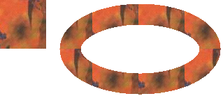

# How to: Draw a Line Filled with a Texture

Instead of drawing a line with a solid color, you can draw a line with a texture. To draw lines and curves with a texture, create a <xref:System.Drawing.TextureBrush> object, and pass that <xref:System.Drawing.TextureBrush> object to a <xref:System.Drawing.Pen.%23ctor%2A> constructor. The bitmap associated with the texture brush is used to tile the plane (invisibly), and when the pen draws a line or curve, the stroke of the pen uncovers certain pixels of the tiled texture.  
  
## Example  

The following example creates a <xref:System.Drawing.Bitmap> object from the file `Texture1.jpg`. That bitmap is used to construct a <xref:System.Drawing.TextureBrush> object, and the <xref:System.Drawing.TextureBrush> object is used to construct a <xref:System.Drawing.Pen> object. The call to <xref:System.Drawing.Graphics.DrawImage%2A> draws the bitmap with its upper-left corner at (0, 0). The call to <xref:System.Drawing.Graphics.DrawEllipse%2A> uses the <xref:System.Drawing.Pen> object to draw a textured ellipse.  
  
The following illustration shows the bitmap and the textured ellipse:  
  
  
  
[!code-csharp[System.Drawing.UsingAPen#61](~/samples/snippets/csharp/VS_Snippets_Winforms/System.Drawing.UsingAPen/CS/Class1.cs#61)]
[!code-vb[System.Drawing.UsingAPen#61](~/samples/snippets/visualbasic/VS_Snippets_Winforms/System.Drawing.UsingAPen/VB/Class1.vb#61)]  
  
## Compiling the Code  

Create a Windows Form and handle the form's <xref:System.Windows.Forms.Control.Paint> event. Paste the preceding code into the <xref:System.Windows.Forms.Control.Paint> event handler. Replace `Texture.jpg` with an image valid on your system.  
  
## See also

- [Using a Pen to Draw Lines and Shapes](using-a-pen-to-draw-lines-and-shapes.md)
- [Graphics and Drawing in Windows Forms](graphics-and-drawing-in-windows-forms.md)
