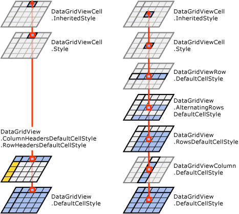
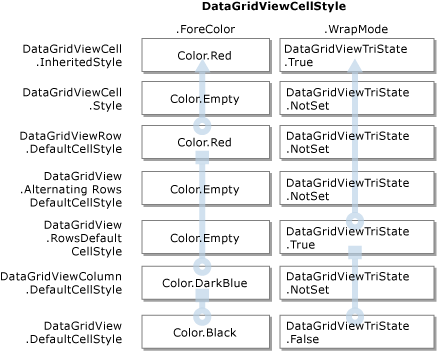

# Cell Styles in the Windows Forms DataGridView Control

Each cell within the <xref:System.Windows.Forms.DataGridView> control can have its own style, such as text format, background color, foreground color, and font. Typically, however, multiple cells will share particular style characteristics.  
  
Groups of cells that share styles may include all cells within particular rows or columns, all cells that contain particular values, or all cells in the control. Because these groups overlap, each cell may get its styling information from more than one place. For example, you may want every cell in a <xref:System.Windows.Forms.DataGridView> control to use the same font, but only cells in currency columns to use currency format, and only currency cells with negative numbers to use a red foreground color.  
  
## The DataGridViewCellStyle Class  

The <xref:System.Windows.Forms.DataGridViewCellStyle> class contains the following properties related to visual style:  
  
- <xref:System.Windows.Forms.DataGridViewCellStyle.BackColor%2A> and <xref:System.Windows.Forms.DataGridViewCellStyle.ForeColor%2A>  
  
- <xref:System.Windows.Forms.DataGridViewCellStyle.SelectionBackColor%2A> and <xref:System.Windows.Forms.DataGridViewCellStyle.SelectionForeColor%2A>  
  
- <xref:System.Windows.Forms.DataGridViewCellStyle.Font%2A>  
  
This class also contains the following properties related to formatting:  
  
- <xref:System.Windows.Forms.DataGridViewCellStyle.Format%2A> and <xref:System.Windows.Forms.DataGridViewCellStyle.FormatProvider%2A>  
  
- <xref:System.Windows.Forms.DataGridViewCellStyle.NullValue%2A> and <xref:System.Windows.Forms.DataGridViewCellStyle.DataSourceNullValue%2A>  
  
- <xref:System.Windows.Forms.DataGridViewCellStyle.WrapMode%2A>  
  
- <xref:System.Windows.Forms.DataGridViewCellStyle.Alignment%2A>  
  
- <xref:System.Windows.Forms.DataGridViewCellStyle.Padding%2A>  
  
For more information on these properties and other cell-style properties, see the <xref:System.Windows.Forms.DataGridViewCellStyle> reference documentation and the topics listed in the See Also section below.  
  
## Using DataGridViewCellStyle Objects  

You can retrieve <xref:System.Windows.Forms.DataGridViewCellStyle> objects from various properties of the <xref:System.Windows.Forms.DataGridView>, <xref:System.Windows.Forms.DataGridViewColumn>, <xref:System.Windows.Forms.DataGridViewRow>, and <xref:System.Windows.Forms.DataGridViewCell> classes and their derived classes. If one of these properties has not yet been set, retrieving its value will create a new <xref:System.Windows.Forms.DataGridViewCellStyle> object. You can also instantiate your own <xref:System.Windows.Forms.DataGridViewCellStyle> objects and assign them to these properties.  
  
You can avoid unnecessary duplication of style information by sharing <xref:System.Windows.Forms.DataGridViewCellStyle> objects among multiple <xref:System.Windows.Forms.DataGridView> elements. Because the styles set at the control, column, and row levels filter down through each level to the cell level, you can also avoid style duplication by setting only those style properties at each level that differ from the levels above. This is described in more detail in the Style Inheritance section that follows.  
  
The following table lists the primary properties that get or set <xref:System.Windows.Forms.DataGridViewCellStyle> objects.  
  
|Property|Classes|Description|  
|--------------|-------------|-----------------|  
|`DefaultCellStyle`|<xref:System.Windows.Forms.DataGridView>, <xref:System.Windows.Forms.DataGridViewColumn>, <xref:System.Windows.Forms.DataGridViewRow>, and derived classes|Gets or sets default styles used by all cells in the entire control (including header cells), in a column, or in a row.|  
|<xref:System.Windows.Forms.DataGridView.RowsDefaultCellStyle%2A>|<xref:System.Windows.Forms.DataGridView>|Gets or sets default cell styles used by all rows in the control. This does not include header cells.|  
|<xref:System.Windows.Forms.DataGridView.AlternatingRowsDefaultCellStyle%2A>|<xref:System.Windows.Forms.DataGridView>|Gets or sets default cell styles used by alternating rows in the control. Used to create a ledger-like effect.|  
|<xref:System.Windows.Forms.DataGridView.RowHeadersDefaultCellStyle%2A>|<xref:System.Windows.Forms.DataGridView>|Gets or sets default cell styles used by the control's row headers. Overridden by the current theme if visual styles are enabled.|  
|<xref:System.Windows.Forms.DataGridView.ColumnHeadersDefaultCellStyle%2A>|<xref:System.Windows.Forms.DataGridView>|Gets or sets default cell styles used by the control's column headers. Overridden by the current theme if visual styles are enabled.|  
|<xref:System.Windows.Forms.DataGridViewCell.Style%2A>|<xref:System.Windows.Forms.DataGridViewCell> and derived classes|Gets or sets styles specified at the cell level. These styles override those inherited from higher levels.|  
|`InheritedStyle`|<xref:System.Windows.Forms.DataGridViewCell>, <xref:System.Windows.Forms.DataGridViewRow>, <xref:System.Windows.Forms.DataGridViewColumn>, and derived classes|Gets all the styles currently applied to the cell, row, or column, including styles inherited from higher levels.|  
  
As mentioned above, getting the value of a style property automatically instantiates a new <xref:System.Windows.Forms.DataGridViewCellStyle> object if the property has not been previously set. To avoid creating these objects unnecessarily, the row and column classes have a <xref:System.Windows.Forms.DataGridViewBand.HasDefaultCellStyle%2A> property that you can check to determine whether the <xref:System.Windows.Forms.DataGridViewBand.DefaultCellStyle%2A> property has been set. Similarly, the cell classes have a <xref:System.Windows.Forms.DataGridViewCell.HasStyle%2A> property that indicates whether the <xref:System.Windows.Forms.DataGridViewCell.Style%2A> property has been set.  
  
Each of the style properties has a corresponding *PropertyName*`Changed` event on the <xref:System.Windows.Forms.DataGridView> control. For row, column, and cell properties, the name of the event begins with "`Row`", "`Column`", or "`Cell`" (for example, <xref:System.Windows.Forms.DataGridView.RowDefaultCellStyleChanged>). Each of these events occurs when the corresponding style property is set to a different <xref:System.Windows.Forms.DataGridViewCellStyle> object. These events do not occur when you retrieve a <xref:System.Windows.Forms.DataGridViewCellStyle> object from a style property and modify its property values. To respond to changes to the cell style objects themselves, handle the <xref:System.Windows.Forms.DataGridView.CellStyleContentChanged> event.  
  
## Style Inheritance  

Each <xref:System.Windows.Forms.DataGridViewCell> gets its appearance from its <xref:System.Windows.Forms.DataGridViewCell.InheritedStyle%2A> property. The <xref:System.Windows.Forms.DataGridViewCellStyle> object returned by this property inherits its values from a hierarchy of properties of type <xref:System.Windows.Forms.DataGridViewCellStyle>. These properties are listed below in the order in which the <xref:System.Windows.Forms.DataGridViewCell.InheritedStyle%2A> for non-header cells obtains its values.  
  
1. <xref:System.Windows.Forms.DataGridViewCell.Style%2A?displayProperty=nameWithType>  
  
2. <xref:System.Windows.Forms.DataGridViewRow.DefaultCellStyle%2A?displayProperty=nameWithType>  
  
3. <xref:System.Windows.Forms.DataGridView.AlternatingRowsDefaultCellStyle%2A?displayProperty=nameWithType> (only for cells in rows with odd index numbers)  
  
4. <xref:System.Windows.Forms.DataGridView.RowsDefaultCellStyle%2A?displayProperty=nameWithType>  
  
5. <xref:System.Windows.Forms.DataGridViewColumn.DefaultCellStyle%2A?displayProperty=nameWithType>  
  
6. <xref:System.Windows.Forms.DataGridView.DefaultCellStyle%2A?displayProperty=nameWithType>  
  
For row and column header cells, the <xref:System.Windows.Forms.DataGridViewCell.InheritedStyle%2A> property is populated by values from the following list of source properties in the given order.  
  
1. <xref:System.Windows.Forms.DataGridViewCell.Style%2A?displayProperty=nameWithType>  
  
2. <xref:System.Windows.Forms.DataGridView.ColumnHeadersDefaultCellStyle%2A?displayProperty=nameWithType> or <xref:System.Windows.Forms.DataGridView.RowHeadersDefaultCellStyle%2A?displayProperty=nameWithType>  
  
3. <xref:System.Windows.Forms.DataGridView.DefaultCellStyle%2A?displayProperty=nameWithType>  
  
The following diagram illustrates this process.  
  
  
  
You can also access the styles inherited by specific rows and columns. The column <xref:System.Windows.Forms.DataGridViewColumn.InheritedStyle%2A> property inherits its values from the following properties.  
  
1. <xref:System.Windows.Forms.DataGridViewColumn.DefaultCellStyle%2A?displayProperty=nameWithType>  
  
2. <xref:System.Windows.Forms.DataGridView.DefaultCellStyle%2A?displayProperty=nameWithType>  
  
The row <xref:System.Windows.Forms.DataGridViewRow.InheritedStyle%2A> property inherits its values from the following properties.  
  
1. <xref:System.Windows.Forms.DataGridViewRow.DefaultCellStyle%2A?displayProperty=nameWithType>  
  
2. <xref:System.Windows.Forms.DataGridView.AlternatingRowsDefaultCellStyle%2A?displayProperty=nameWithType> (only for cells in rows with odd index numbers)  
  
3. <xref:System.Windows.Forms.DataGridView.RowsDefaultCellStyle%2A?displayProperty=nameWithType>  
  
4. <xref:System.Windows.Forms.DataGridView.DefaultCellStyle%2A?displayProperty=nameWithType>  
  
For each property in a <xref:System.Windows.Forms.DataGridViewCellStyle> object returned by an `InheritedStyle` property, the property value is obtained from the first cell style in the appropriate list that has the corresponding property set to a value other than the <xref:System.Windows.Forms.DataGridViewCellStyle> class defaults.  
  
The following table illustrates how the <xref:System.Windows.Forms.DataGridViewCellStyle.ForeColor%2A> property value for an example cell is inherited from its containing column.  
  
|Property of type `DataGridViewCellStyle`|Example `ForeColor` value for retrieved object|  
|----------------------------------------------|----------------------------------------------------|  
|<xref:System.Windows.Forms.DataGridViewCell.Style%2A?displayProperty=nameWithType>|<xref:System.Drawing.Color.Empty?displayProperty=nameWithType>|  
|<xref:System.Windows.Forms.DataGridViewRow.DefaultCellStyle%2A?displayProperty=nameWithType>|<xref:System.Drawing.Color.Red%2A?displayProperty=nameWithType>|  
|<xref:System.Windows.Forms.DataGridView.AlternatingRowsDefaultCellStyle%2A?displayProperty=nameWithType>|<xref:System.Drawing.Color.Empty?displayProperty=nameWithType>|  
|<xref:System.Windows.Forms.DataGridView.RowsDefaultCellStyle%2A?displayProperty=nameWithType>|<xref:System.Drawing.Color.Empty?displayProperty=nameWithType>|  
|<xref:System.Windows.Forms.DataGridViewColumn.DefaultCellStyle%2A?displayProperty=nameWithType>|<xref:System.Drawing.Color.DarkBlue%2A?displayProperty=nameWithType>|  
|<xref:System.Windows.Forms.DataGridView.DefaultCellStyle%2A?displayProperty=nameWithType>|<xref:System.Drawing.Color.Black%2A?displayProperty=nameWithType>|  
  
In this case, the <xref:System.Drawing.Color.Red%2A?displayProperty=nameWithType> value from the cell's row is the first real value on the list. This becomes the <xref:System.Windows.Forms.DataGridViewCellStyle.ForeColor%2A> property value of the cell's <xref:System.Windows.Forms.DataGridViewCell.InheritedStyle%2A>.  
  
The following diagram illustrates how different <xref:System.Windows.Forms.DataGridViewCellStyle> properties can inherit their values from different places.  
  
  
  
By taking advantage of style inheritance, you can provide appropriate styles for the entire control without having to specify the same information in multiple places.  
  
Although header cells participate in style inheritance as described, the objects returned by the <xref:System.Windows.Forms.DataGridView.ColumnHeadersDefaultCellStyle%2A> and <xref:System.Windows.Forms.DataGridView.RowHeadersDefaultCellStyle%2A> properties of the <xref:System.Windows.Forms.DataGridView> control have initial property values that override the property values of the object returned by the <xref:System.Windows.Forms.DataGridView.DefaultCellStyle%2A> property. If you want the properties set for the object returned by the <xref:System.Windows.Forms.DataGridView.DefaultCellStyle%2A> property to apply to row and column headers, you must set the corresponding properties of the objects returned by the <xref:System.Windows.Forms.DataGridView.ColumnHeadersDefaultCellStyle%2A> and <xref:System.Windows.Forms.DataGridView.RowHeadersDefaultCellStyle%2A> properties to the defaults indicated for the <xref:System.Windows.Forms.DataGridViewCellStyle> class.  
  
> [!NOTE]
> If visual styles are enabled, the row and column headers (except for the <xref:System.Windows.Forms.DataGridView.TopLeftHeaderCell%2A>) are automatically styled by the current theme, overriding any styles specified by these properties.  
  
The <xref:System.Windows.Forms.DataGridViewButtonColumn>, <xref:System.Windows.Forms.DataGridViewImageColumn>, and <xref:System.Windows.Forms.DataGridViewCheckBoxColumn> types also initialize some values of the object returned by the column <xref:System.Windows.Forms.DataGridViewColumn.DefaultCellStyle%2A> property. For more information, see the reference documentation for these types.  
  
## Setting Styles Dynamically  

To customize the styles of cells with particular values, implement a handler for the <xref:System.Windows.Forms.DataGridView.CellFormatting?displayProperty=nameWithType> event. Handlers for this event receive an argument of the <xref:System.Windows.Forms.DataGridViewCellFormattingEventArgs> type. This object contains properties that let you determine the value of the cell being formatted along with its location in the <xref:System.Windows.Forms.DataGridView> control. This object also contains a <xref:System.Windows.Forms.DataGridViewCellFormattingEventArgs.CellStyle%2A> property that is initialized to the value of the <xref:System.Windows.Forms.DataGridViewCell.InheritedStyle%2A> property of the cell being formatted. You can modify the cell style properties to specify style information appropriate to the cell value and location.  
  
> [!NOTE]
> The <xref:System.Windows.Forms.DataGridView.RowPrePaint> and <xref:System.Windows.Forms.DataGridView.RowPostPaint> events also receive a <xref:System.Windows.Forms.DataGridViewCellStyle> object in the event data, but in their case, it is a copy of the row <xref:System.Windows.Forms.DataGridViewRow.InheritedStyle%2A> property for read-only purposes, and changes to it do not affect the control.  
  
You can also dynamically modify the styles of individual cells in response to events such as the <xref:System.Windows.Forms.DataGridView.CellMouseEnter?displayProperty=nameWithType> and <xref:System.Windows.Forms.DataGridView.CellMouseLeave> events. For example, in a handler for the <xref:System.Windows.Forms.DataGridView.CellMouseEnter> event, you could store the current value of the cell background color (retrieved through the cell's <xref:System.Windows.Forms.DataGridViewCell.Style%2A> property), then set it to a new color that will highlight the cell when the mouse hovers over it. In a handler for the <xref:System.Windows.Forms.DataGridView.CellMouseLeave> event, you can then restore the background color to the original value.  
  
> [!NOTE]
> Caching the values stored in the cell's <xref:System.Windows.Forms.DataGridViewCell.Style%2A> property is important regardless of whether a particular style value is set. If you temporarily replace a style setting, restoring it to its original "not set" state ensures that the cell will go back to inheriting the style setting from a higher level. If you need to determine the actual style in effect for a cell regardless of whether the style is inherited, use the cell's <xref:System.Windows.Forms.DataGridViewCell.InheritedStyle%2A> property.  
  
## See also

- <xref:System.Windows.Forms.DataGridView>
- <xref:System.Windows.Forms.DataGridViewCellStyle>
- <xref:System.Windows.Forms.DataGridView.AlternatingRowsDefaultCellStyle%2A?displayProperty=nameWithType>
- <xref:System.Windows.Forms.DataGridView.ColumnHeadersDefaultCellStyle%2A?displayProperty=nameWithType>
- <xref:System.Windows.Forms.DataGridView.DefaultCellStyle%2A?displayProperty=nameWithType>
- <xref:System.Windows.Forms.DataGridView.RowHeadersDefaultCellStyle%2A?displayProperty=nameWithType>
- <xref:System.Windows.Forms.DataGridView.RowsDefaultCellStyle%2A?displayProperty=nameWithType>
- <xref:System.Windows.Forms.DataGridViewBand.InheritedStyle%2A?displayProperty=nameWithType>
- <xref:System.Windows.Forms.DataGridViewRow.InheritedStyle%2A?displayProperty=nameWithType>
- <xref:System.Windows.Forms.DataGridViewColumn.InheritedStyle%2A?displayProperty=nameWithType>
- <xref:System.Windows.Forms.DataGridViewBand.DefaultCellStyle%2A?displayProperty=nameWithType>
- <xref:System.Windows.Forms.DataGridViewCell.InheritedStyle%2A?displayProperty=nameWithType>
- <xref:System.Windows.Forms.DataGridViewCell.Style%2A?displayProperty=nameWithType>
- <xref:System.Windows.Forms.DataGridView.CellFormatting?displayProperty=nameWithType>
- <xref:System.Windows.Forms.DataGridView.CellStyleContentChanged?displayProperty=nameWithType>
- <xref:System.Windows.Forms.DataGridView.RowPrePaint?displayProperty=nameWithType>
- <xref:System.Windows.Forms.DataGridView.RowPostPaint?displayProperty=nameWithType>
- [Basic Formatting and Styling in the Windows Forms DataGridView Control](basic-formatting-and-styling-in-the-windows-forms-datagridview-control.md)
- [How to: Set Default Cell Styles for the Windows Forms DataGridView Control](how-to-set-default-cell-styles-for-the-windows-forms-datagridview-control.md)
- [Data Formatting in the Windows Forms DataGridView Control](data-formatting-in-the-windows-forms-datagridview-control.md)
