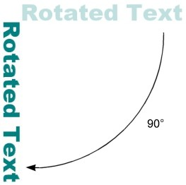

# How to: Apply Transforms to Text

Transforms can alter the display of text in your application. The following examples use different types of rendering transforms to affect the display of text in a <xref:System.Windows.Controls.TextBlock> control.

## Example

The following example shows text rotated about a specified point in the two-dimensional x-y plane.

The following code example uses a <xref:System.Windows.Media.RotateTransform> to rotate text. An <xref:System.Windows.Media.RotateTransform.Angle%2A> value of 90 rotates the element 90 degrees clockwise.

[!code-xaml[TextTransformSample#TextTransformSample1](~/samples/snippets/csharp/VS_Snippets_Wpf/TextTransformSample/CS/Window1.xaml#texttransformsample1)]

The following example shows the second line of text scaled by 150% along the x-axis, and the third line of text scaled by 150% along the y-axis.

The following code example uses a <xref:System.Windows.Media.ScaleTransform> to scale text from its original size.

[!code-xaml[TextTransformSample#TextTransformSample2](~/samples/snippets/csharp/VS_Snippets_Wpf/TextTransformSample/CS/Window1.xaml#texttransformsample2)]

> [!NOTE]
> Scaling text is not the same as increasing the font size of text. Font sizes are calculated independently of each other in order to provide the best resolution at different sizes. Scaled text, on the other hand, preserves the proportions of the original-sized text.

The following example shows text skewed along the x-axis.

The following code example uses a <xref:System.Windows.Media.SkewTransform> to skew text. A skew, also known as a shear, is a transformation that stretches the coordinate space in a non-uniform manner. In this example, the two text strings are skewed -30° and 30° along the x-coordinate.

[!code-xaml[TextTransformSample#TextTransformSample3](~/samples/snippets/csharp/VS_Snippets_Wpf/TextTransformSample/CS/Window1.xaml#texttransformsample3)]

The following example shows text translated, or moved, along the x- and y-axis.

The following code example uses a <xref:System.Windows.Media.TranslateTransform> to offset text. In this example, a slightly offset copy of text below the primary text creates a shadow effect.

[!code-xaml[TextTransformSample#TextTransformSample4](~/samples/snippets/csharp/VS_Snippets_Wpf/TextTransformSample/CS/Window1.xaml#texttransformsample4)]

> [!NOTE]
> The <xref:System.Windows.Media.Effects.DropShadowBitmapEffect> provides a rich set of features for providing shadow effects. For more information, see [Create Text with a Shadow](how-to-create-text-with-a-shadow.md).

## See also

- [Apply Animations to Text](how-to-apply-animations-to-text.md)
