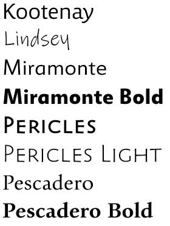
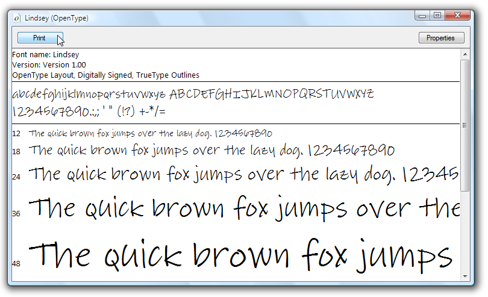

# Sample OpenType Font Pack

This topic provides an overview of the sample OpenType fonts that are distributed with the Windows SDK. The sample fonts support extended OpenType features that can be used by Windows Presentation Foundation (WPF) applications.

## Fonts in the OpenType Font Pack

The Windows SDK provides a set of sample OpenType fonts that you can use in creating Windows Presentation Foundation (WPF) applications. The sample fonts are supplied under license from Ascender Corporation. These fonts implement only a subset of the total features defined by the OpenType format. The following table lists the names of the sample OpenType fonts.

|**Name**|**File**|
|--------------|--------------|
|Kootenay|Kooten.ttf|
|Lindsey|Linds.ttf|
|Miramonte|Miramo.ttf|
|Miramonte Bold|Miramob.ttf|
|Pericles|Peric.ttf|
|Pericles Light|Pericl.ttf|
|Pescadero|Pesca.ttf|
|Pescadero Bold|Pescab.ttf|

The following illustration shows what the sample OpenType fonts look like.

The sample fonts are supplied under license from Ascender Corporation. Ascender is a provider of advanced font products. To license extended or custom versions of the sample fonts, see [Ascender Corporation's Web site](https://www.monotype.com/).

> [!NOTE]
> As a developer it is your responsibility to ensure that you have the required license rights for any font you embed within an application or otherwise redistribute.

## Installing the Fonts

You have the option of installing the sample OpenType fonts to the default Windows Fonts directory, **\WINDOWS\Fonts**. Use the Fonts control panel to install the fonts. Once these fonts are on your computer, they are accessible to all applications that reference default Windows fonts. You can display a representative set of characters in several font sizes by doubling-clicking the font file. The following screenshot shows the Lindsey font file, Linds.ttf.

\
Displaying the Lindsey font

## Using the Fonts

There are two ways that you can use fonts in your application. You can add fonts to your application as project content items that are not embedded as resources within an assembly. Alternatively, you can add fonts to your application as project resource items that are embedded within the application's assembly files. For more information, see [Packaging Fonts with Applications](packaging-fonts-with-applications.md).

## See also

- <xref:System.Windows.Documents.Typography>
- [OpenType Font Features](opentype-font-features.md)
- [Packaging Fonts with Applications](packaging-fonts-with-applications.md)
