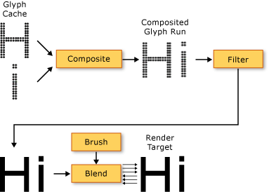
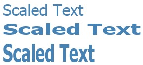
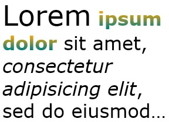

# Typography in WPF

This topic introduces the major typographic features of WPF. These features include improved quality and performance of text rendering, OpenType typography support, enhanced international text, enhanced font support, and new text application programming interfaces (APIs).  
  

## Improved Quality and Performance of Text  

Text in WPF is rendered using Microsoft ClearType, which enhances the clarity and readability of text. ClearType is a software technology developed by Microsoft that improves the readability of text on existing LCDs (Liquid Crystal Displays), such as laptop screens, Pocket PC screens and flat panel monitors. ClearType uses sub-pixel rendering which allows text to be displayed with a greater fidelity to its true shape by aligning characters on a fractional part of a pixel. The extra resolution increases the sharpness of the tiny details in text display, making it much easier to read over long durations. Another improvement of ClearType in WPF is y-direction anti-aliasing, which smoothes the tops and bottoms of shallow curves in text characters. For more details on ClearType features, see [ClearType Overview](cleartype-overview.md).  
  
\
Text with ClearType y-direction antialiasing  
  
The entire text rendering pipeline can be hardware-accelerated in WPF provided your machine meets the minimum level of hardware required. Rendering that cannot be performed using hardware falls back to software rendering. Hardware-acceleration affects all phases of the text rendering pipeline—from storing individual glyphs, compositing glyphs into glyph runs, applying effects, to applying the ClearType blending algorithm to the final displayed output. For more information on hardware acceleration, see [Graphics Rendering Tiers](graphics-rendering-tiers.md).  
  
  
  
In addition, animated text, whether by character or glyph, takes full advantage of the graphics hardware capability enabled by WPF. This results in smooth text animation.  
  

## Rich Typography  

The OpenType font format is an extension of the TrueType® font format. The OpenType font format was developed jointly by Microsoft and Adobe, and provides a rich assortment of advanced typographic features. The <xref:System.Windows.Documents.Typography> object exposes many of the advanced features of OpenType fonts, such as stylistic alternates and swashes. The Windows SDK provides a set of sample OpenType fonts that are designed with rich features, such as the Pericles and Pescadero fonts. For more information, see [Sample OpenType Font Pack](sample-opentype-font-pack.md).  
  
The Pericles OpenType font contains additional glyphs that provide stylistic alternates to the standard set of glyphs. The following text displays stylistic alternate glyphs.  
  
  
  
Swashes are decorative glyphs that use elaborate ornamentation often associated with calligraphy. The following text displays standard and swash glyphs for the Pescadero font.  
  
  
  
For more details on OpenType features, see [OpenType Font Features](opentype-font-features.md).  
  

## Enhanced International Text Support  

WPF provides enhanced international text support by providing the following features:  
  
- Automatic line-spacing in all writing systems, using adaptive measurement.  
  
- Broad support for international text. For more information, see [Globalization for WPF](globalization-for-wpf.md).  
  
- Language-guided line breaking, hyphenation, and justification.  
  

## Enhanced Font Support  

WPF provides enhanced font support by providing the following features:  
  
- Unicode for all text. Font behavior and selection no longer require charset or codepage.  
  
- Font behavior independent of global settings, such as system locale.  
  
- Separate <xref:System.Windows.FontWeight>, <xref:System.Windows.FontStretch>, and <xref:System.Windows.FontStyle> types for defining a <xref:System.Windows.Media.FontFamily>. This provides greater flexibility than in Win32 programming, in which Boolean combinations of italic and bold are used to define a font family.  
  
- Writing direction (horizontal versus vertical) handled independent of font name.  
  
- Font linking and font fallback in a portable XML file, using composite font technology. Composite fonts allow for the construction of full range multilingual fonts. Composite fonts also provide a mechanism that avoids displaying missing glyphs. For more information, see the remarks in the <xref:System.Windows.Media.FontFamily> class.  
  
- International fonts built from composite fonts, using a group of single-language fonts. This saves on resource costs when developing fonts for multiple languages.  
  
- Composite fonts embedded in a document, thereby providing document portability. For more information, see the remarks in the <xref:System.Windows.Media.FontFamily> class.  
  

## New Text Application Programming Interfaces (APIs)  

WPF provides several text APIs for developers to use when including text in their applications. These APIs are grouped into three categories:  
  
- **Layout and user interface**. The common text controls for the graphical user interface (GUI).  
  
- **Lightweight text drawing**. Allows you to draw text directly to objects.  
  
- **Advanced text formatting**. Allows you to implement a custom text engine.  
  
### Layout and User Interface  

At the highest level of functionality, the text APIs provide common UI controls such as <xref:System.Windows.Controls.Label>, <xref:System.Windows.Controls.TextBlock>, and <xref:System.Windows.Controls.TextBox>. These controls provide the basic UI elements within an application, and offer an easy way to present and interact with text. Controls such as <xref:System.Windows.Controls.RichTextBox> and <xref:System.Windows.Controls.PasswordBox> enable more advanced or specialized text-handling. And classes such as <xref:System.Windows.Documents.TextRange>, <xref:System.Windows.Documents.TextSelection>, and <xref:System.Windows.Documents.TextPointer> enable useful text manipulation. These UI controls provide properties such as <xref:System.Windows.Controls.Control.FontFamily%2A>, <xref:System.Windows.Controls.Control.FontSize%2A>, and <xref:System.Windows.Controls.Control.FontStyle%2A>, which enable you to control the font that is used to render the text.  
  
#### Using Bitmap Effects, Transforms, and Text Effects  

WPF allows you to create visually interesting uses of text by uses features such as bitmap effects, transforms, and text effects. The following example shows a typical type of a drop shadow effect applied to text.  
  

  
The following example shows a drop shadow effect and noise applied to text.  
  

  
The following example shows an outer glow effect applied to text.  
  

  
The following example shows a blur effect applied to text.  
  
  

The following example shows the second line of text scaled by 150% along the x-axis, and the third line of text scaled by 150% along the y-axis.  
  

  
The following example shows text skewed along the x-axis.  
  

  
A <xref:System.Windows.Media.TextEffect> object is a helper object that allows you to treat text as one or more groups of characters in a text string. The following example shows an individual character being rotated. Each character is rotated independently at 1-second intervals.  
  

  
#### Using Flow Documents  

In addition to the common UI controls, WPF offers a layout control for text presentation—the <xref:System.Windows.Documents.FlowDocument> element. The <xref:System.Windows.Documents.FlowDocument> element, in conjunction with the <xref:System.Windows.Controls.DocumentViewer> element, provides a control for large amounts of text with varying layout requirements. Layout controls provide access to advanced typography through the <xref:System.Windows.Documents.Typography> object and font-related properties of other UI controls.  
  
The following example shows text content hosted in a <xref:System.Windows.Controls.FlowDocumentReader>, which provides search, navigation, pagination, and content scaling support.  
  

  
For more information, see [Documents in WPF](documents-in-wpf.md).  
  
### Lightweight Text Drawing  

You can draw text directly to WPF objects by using the <xref:System.Windows.Media.DrawingContext.DrawText%2A> method of the <xref:System.Windows.Media.DrawingContext> object. To use this method, you create a <xref:System.Windows.Media.FormattedText> object. This object allows you to draw multi-line text, in which each character in the text can be individually formatted. The functionality of the <xref:System.Windows.Media.FormattedText> object contains much of the functionality of the DrawText flags in the Windows API. In addition, the <xref:System.Windows.Media.FormattedText> object contains functionality such as ellipsis support, in which an ellipsis is displayed when text exceeds its bounds. The following example shows text that has several formats applied to it, including a linear gradient on the second and third words.  
  

  
You can convert formatted text into <xref:System.Windows.Media.Geometry> objects, allowing you to create other types of visually interesting text. For example, you could create a <xref:System.Windows.Media.Geometry> object based on the outline of a text string.  
  
  
  
The following examples illustrate several ways of creating interesting visual effects by modifying the stroke, fill, and highlight of converted text.  
  
  
  

  

  
For more information on the <xref:System.Windows.Media.FormattedText> object, see [Drawing Formatted Text](drawing-formatted-text.md).  
  
### Advanced Text Formatting  

At the most advanced level of the text APIs, WPF offers you the ability to create custom text layout by using the <xref:System.Windows.Media.TextFormatting.TextFormatter> object and other types in the <xref:System.Windows.Media.TextFormatting> namespace. The <xref:System.Windows.Media.TextFormatting.TextFormatter> and associated classes allow you to implement custom text layout that supports your own definition of character formats, paragraph styles, line breaking rules, and other layout features for international text. There are very few cases in which you would want to override the default implementation of the WPF text layout support. However, if you were creating a text editing control or application, you might require a different implementation than the default WPF implementation.  
  
Unlike a traditional text API, the <xref:System.Windows.Media.TextFormatting.TextFormatter> interacts with a text layout client through a set of callback methods. It requires the client to provide these methods in an implementation of the <xref:System.Windows.Media.TextFormatting.TextSource> class. The following diagram illustrates the text layout interaction between the client application and <xref:System.Windows.Media.TextFormatting.TextFormatter>.  
  
  
  
For more details on creating custom text layout, see [Advanced Text Formatting](advanced-text-formatting.md).  
  
## See also

- <xref:System.Windows.Media.FormattedText>
- <xref:System.Windows.Media.TextFormatting.TextFormatter>
- [ClearType Overview](cleartype-overview.md)
- [OpenType Font Features](opentype-font-features.md)
- [Drawing Formatted Text](drawing-formatted-text.md)
- [Advanced Text Formatting](advanced-text-formatting.md)
- [Text](optimizing-performance-text.md)
- [Microsoft Typography](/typography/)
