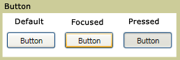

# Button

A <xref:System.Windows.Controls.Button> control reacts to user input from a mouse, keyboard, stylus, or other input device and raises a <xref:System.Windows.Controls.Primitives.ButtonBase.Click> event. A <xref:System.Windows.Controls.Button> is a basic user interface (UI) component that can contain simple content, such as text, and can also contain complex content, such as images and <xref:System.Windows.Controls.Panel> controls.

## In This Section

[Create a Button That Has an Image](how-to-create-a-button-that-has-an-image.md)

## Styles and templates

This section describes the styles and templates for the <xref:System.Windows.Controls.Button> control. You can modify the default <xref:System.Windows.Controls.ControlTemplate> to give the control a unique appearance. For more information, see [What are styles and templates?](styles-templates-overview.md) and [How to create a template for a control](how-to-create-apply-template.md).

### Parts

The <xref:System.Windows.Controls.Button> control doesn't have any named parts.

### Visual states

The following table lists the visual states for the <xref:System.Windows.Controls.Button> control.

|VisualState Name|VisualStateGroup Name|Description|
|-|-|-|
|Normal|CommonStates|The default state.|
|MouseOver|CommonStates|The mouse pointer is positioned over the control.|
|Pressed|CommonStates|The control is pressed.|
|Disabled|CommonStates|The control is disabled.|
|Focused|FocusStates|The control has focus.|
|Unfocused|FocusStates|The control doesn't have focus.|
|Valid|ValidationStates|The control uses the <xref:System.Windows.Controls.Validation> class and the <xref:System.Windows.Controls.Validation.HasError%2A?displayProperty=nameWithType> attached property is `false`.|
|InvalidFocused|ValidationStates|The <xref:System.Windows.Controls.Validation.HasError%2A?displayProperty=nameWithType> attached property is `true` and the control has focus.|
|InvalidUnfocused|ValidationStates|The <xref:System.Windows.Controls.Validation.HasError%2A?displayProperty=nameWithType> attached property is `true` and the control doesn't have focus.|

### ControlTemplate example

The following example shows how to define a <xref:System.Windows.Controls.ControlTemplate> for the <xref:System.Windows.Controls.Button> control.

[!code-xaml[ControlTemplateExamples#Button](~/samples/snippets/csharp/VS_Snippets_Wpf/ControlTemplateExamples/CS/resources/button.xaml#button)]

The preceding example uses one or more of the following resources.

[!code-xaml[ControlTemplateExamples#Resources](~/samples/snippets/csharp/VS_Snippets_Wpf/ControlTemplateExamples/CS/resources/shared.xaml#resources)]

For the complete sample, see [Styling with ControlTemplates Sample](https://github.com/Microsoft/WPF-Samples/tree/master/Styles%20&%20Templates/IntroToStylingAndTemplating).

## Reference

<xref:System.Windows.Controls.Button>
<xref:System.Windows.Controls.Primitives.ButtonBase>
<xref:System.Windows.Controls.RadioButton>
<xref:System.Windows.Controls.Primitives.RepeatButton>
