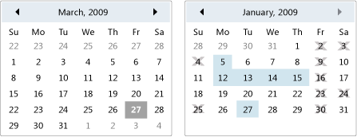

# Calendar

A calendar enables a user to select a date by using a visual calendar display.

A <xref:System.Windows.Controls.Calendar> control can be used on its own, or as a drop-down part of a <xref:System.Windows.Controls.DatePicker> control. For more information, see <xref:System.Windows.Controls.DatePicker>.

The following illustration shows two <xref:System.Windows.Controls.Calendar> controls, one with selections and blackout dates and one without.

\
Calendar controls

The following table provides information about tasks that are typically associated with the <xref:System.Windows.Controls.Calendar>.

|Task|Implementation|
|----------|--------------------|
|Specify dates that cannot be selected.|Use the <xref:System.Windows.Controls.Calendar.BlackoutDates%2A> property.|
|Have the <xref:System.Windows.Controls.Calendar> display a month, an entire year, or a decade.|Set the <xref:System.Windows.Controls.Calendar.DisplayMode%2A> property to Month, Year, or Decade.|
|Specify whether the user can select a date, a range of dates, or multiple ranges of dates.|Use the <xref:System.Windows.Controls.Calendar.SelectionMode%2A>.|
|Specify the range of dates that the <xref:System.Windows.Controls.Calendar> displays.|Use the <xref:System.Windows.Controls.Calendar.DisplayDateStart%2A> and <xref:System.Windows.Controls.Calendar.DisplayDateEnd%2A> properties.|
|Specify whether the current date is highlighted.|Use the <xref:System.Windows.Controls.Calendar.IsTodayHighlighted%2A> property. By default, <xref:System.Windows.Controls.Calendar.IsTodayHighlighted%2A> is `true`.|
|Change the size of the <xref:System.Windows.Controls.Calendar>.|Use a <xref:System.Windows.Controls.Viewbox> or set the <xref:System.Windows.FrameworkElement.LayoutTransform%2A> property to a <xref:System.Windows.Media.ScaleTransform>. Note that if you set the <xref:System.Windows.FrameworkElement.Width%2A> and <xref:System.Windows.FrameworkElement.Height%2A> properties of a <xref:System.Windows.Controls.Calendar>, the actual calendar does not change its size.|

The <xref:System.Windows.Controls.Calendar> control provides basic navigation using either the mouse or keyboard. The following table summarizes keyboard navigation.

|Key Combination|<xref:System.Windows.Controls.Calendar.DisplayMode%2A>|Action|
|---------------------|-----------------------------------------------------------------------------------------------------------------------------------------------------------|------------|
|ARROW|<xref:System.Windows.Controls.CalendarMode.Month>|Changes the <xref:System.Windows.Controls.Calendar.SelectedDate%2A> property if the <xref:System.Windows.Controls.Calendar.SelectionMode%2A> property is not set to <xref:System.Windows.Controls.CalendarSelectionMode.None>.|
|ARROW|<xref:System.Windows.Controls.CalendarMode.Year>|Changes the month of the <xref:System.Windows.Controls.Calendar.DisplayDate%2A> property. Note that the <xref:System.Windows.Controls.Calendar.SelectedDate%2A> does not change.|
|ARROW|<xref:System.Windows.Controls.CalendarMode.Decade>|Changes the year of the <xref:System.Windows.Controls.Calendar.DisplayDate%2A>. Note that the <xref:System.Windows.Controls.Calendar.SelectedDate%2A> does not change.|
|SHIFT+ARROW|<xref:System.Windows.Controls.CalendarMode.Month>|If <xref:System.Windows.Controls.Calendar.SelectionMode%2A> is not set to <xref:System.Windows.Controls.CalendarSelectionMode.SingleDate> or <xref:System.Windows.Controls.CalendarSelectionMode.None>, extends the range of selected dates.|
|HOME|<xref:System.Windows.Controls.CalendarMode.Month>|Changes the <xref:System.Windows.Controls.Calendar.SelectedDate%2A> to the first day of the current month.|
|HOME|<xref:System.Windows.Controls.CalendarMode.Year>|Changes the month of the <xref:System.Windows.Controls.Calendar.DisplayDate%2A> to the first month of the year. The <xref:System.Windows.Controls.Calendar.SelectedDate%2A> does not change.|
|HOME|<xref:System.Windows.Controls.CalendarMode.Decade>|Changes the year of the <xref:System.Windows.Controls.Calendar.DisplayDate%2A> to the first year of the decade. The <xref:System.Windows.Controls.Calendar.SelectedDate%2A> does not change.|
|END|<xref:System.Windows.Controls.CalendarMode.Month>|Changes the <xref:System.Windows.Controls.Calendar.SelectedDate%2A> to the last day of the current month.|
|END|<xref:System.Windows.Controls.CalendarMode.Year>|Changes the month of the <xref:System.Windows.Controls.Calendar.DisplayDate%2A> to the last month of the year. The <xref:System.Windows.Controls.Calendar.SelectedDate%2A> does not change.|
|END|<xref:System.Windows.Controls.CalendarMode.Decade>|Changes the year of the <xref:System.Windows.Controls.Calendar.DisplayDate%2A> to the last year of the decade. The <xref:System.Windows.Controls.Calendar.SelectedDate%2A> does not change.|
|CTRL+UP ARROW|Any|Switches to the next larger <xref:System.Windows.Controls.Calendar.DisplayMode%2A>. If <xref:System.Windows.Controls.Calendar.DisplayMode%2A> is already <xref:System.Windows.Controls.CalendarMode.Decade>, no action.|
|CTRL+DOWN ARROW|Any|Switches to the next smaller <xref:System.Windows.Controls.Calendar.DisplayMode%2A>. If <xref:System.Windows.Controls.Calendar.DisplayMode%2A> is already <xref:System.Windows.Controls.CalendarMode.Month>, no action.|
|SPACEBAR or ENTER|<xref:System.Windows.Controls.CalendarMode.Year> or <xref:System.Windows.Controls.CalendarMode.Decade>|Switches <xref:System.Windows.Controls.Calendar.DisplayMode%2A> to the <xref:System.Windows.Controls.CalendarMode.Month> or <xref:System.Windows.Controls.CalendarMode.Year> represented by focused item.|

## Styles and templates

This topic describes the styles and templates for the <xref:System.Windows.Controls.Calendar> control. You can modify the default <xref:System.Windows.Controls.ControlTemplate> to give the control a unique appearance. For more information, see [What are styles and templates?](styles-templates-overview.md) and [How to create a template for a control](how-to-create-apply-template.md).

### Parts

The following table lists the named parts for the <xref:System.Windows.Controls.Calendar> control.

|Part|Type|Description|
|-|-|-|
|PART_CalendarItem|<xref:System.Windows.Controls.Primitives.CalendarItem>|The currently displayed month or year on the <xref:System.Windows.Controls.Calendar>.|
|PART_Root|<xref:System.Windows.Controls.Panel>|The panel that contains the <xref:System.Windows.Controls.Primitives.CalendarItem>.|

### Visual states

The following table lists the visual states for the <xref:System.Windows.Controls.Calendar> control.

|VisualState Name|VisualStateGroup Name|Description|
|----------------------|---------------------------|-----------------|
|Valid|ValidationStates|The control uses the <xref:System.Windows.Controls.Validation> class and the <xref:System.Windows.Controls.Validation.HasError%2A?displayProperty=nameWithType> attached property is `false`.|
|InvalidFocused|ValidationStates|The <xref:System.Windows.Controls.Validation.HasError%2A?displayProperty=nameWithType> attached property is `true` has the control has focus.|
|InvalidUnfocused|ValidationStates|The <xref:System.Windows.Controls.Validation.HasError%2A?displayProperty=nameWithType> attached property is `true` has the control does not have focus.|

#### CalendarItem Parts

The following table lists the named parts for the <xref:System.Windows.Controls.Primitives.CalendarItem> control.

|Part|Type|Description|
|-|-|-|
|PART_Root|<xref:System.Windows.FrameworkElement>|The root of the control.|
|PART_PreviousButton|<xref:System.Windows.Controls.Button>|The button that displays the previous page of the calendar when it is clicked.|
|PART_NextButton|<xref:System.Windows.Controls.Button>|The button that displays the next page of the calendar when it is clicked.|
|PART_HeaderButton|<xref:System.Windows.Controls.Button>|The button that allows switching between month mode, year mode, and decade mode.|
|PART_MonthView|<xref:System.Windows.Controls.Grid>|Hosts the content when in month mode.|
|PART_YearView|<xref:System.Windows.Controls.Grid>|Hosts the content when in year or decade mode.|
|PART_DisabledVisual|<xref:System.Windows.FrameworkElement>|The overlay for the disabled state.|
|DayTitleTemplate|<xref:System.Windows.DataTemplate>|The <xref:System.Windows.DataTemplate> that describes the visual structure.|

#### CalendarItem States

The following table lists the visual states for the <xref:System.Windows.Controls.Primitives.CalendarItem> control.

|VisualState Name|VisualStateGroup Name|Description|
|-|-|-|
|Normal State|CommonStates|The default state.|
|Disabled State|CommonStates|The state of the calendar when the <xref:System.Windows.UIElement.IsEnabled%2A> property is `false`.|
|Valid|ValidationStates|The control uses the <xref:System.Windows.Controls.Validation> class and the <xref:System.Windows.Controls.Validation.HasError%2A?displayProperty=nameWithType> attached property is `false`.|
|InvalidFocused|ValidationStates|The <xref:System.Windows.Controls.Validation.HasError%2A?displayProperty=nameWithType> attached property is `true` has the control has focus.|
|InvalidUnfocused|ValidationStates|The <xref:System.Windows.Controls.Validation.HasError%2A?displayProperty=nameWithType> attached property is `true` has the control does not have focus.|
|Valid|ValidationStates|The control uses the <xref:System.Windows.Controls.Validation> class and the <xref:System.Windows.Controls.Validation.HasError%2A?displayProperty=nameWithType> attached property is `false`.|
|InvalidFocused|ValidationStates|The <xref:System.Windows.Controls.Validation.HasError%2A?displayProperty=nameWithType> attached property is `true` has the control has focus.|
|InvalidUnfocused|ValidationStates|The <xref:System.Windows.Controls.Validation.HasError%2A?displayProperty=nameWithType> attached property is `true` has the control does not have focus.|

#### CalendarDayButton Parts

The <xref:System.Windows.Controls.Primitives.CalendarDayButton> control does not have any named parts.

#### CalendarDayButton States

The following table lists the visual states for the <xref:System.Windows.Controls.Primitives.CalendarDayButton> control.

|VisualState Name|VisualStateGroup Name|Description|
|-|-|-|
|Normal|CommonStates|The default state.|
|Disabled|CommonStates|The <xref:System.Windows.Controls.Primitives.CalendarDayButton> is disabled.|
|MouseOver|CommonStates|The mouse pointer is positioned over the <xref:System.Windows.Controls.Primitives.CalendarDayButton>.|
|Pressed|CommonStates|The <xref:System.Windows.Controls.Primitives.CalendarDayButton> is pressed.|
|Selected|SelectionStates|The button is selected.|
|Unselected|SelectionStates|The button is not selected.|
|CalendarButtonFocused|CalendarButtonFocusStates|The button has focus.|
|CalendarButtonUnfocused|CalendarButtonFocusStates|The button does not have focus.|
|Focused|FocusStates|The button has focus.|
|Unfocused|FocusStates|The button does not have focus.|
|Active|ActiveStates|The button is active.|
|Inactive|ActiveStates|The button is inactive.|
|RegularDay|DayStates|The button does not represent <xref:System.DateTime.Today%2A?displayProperty=nameWithType>.|
|Today|DayStates|The button represents <xref:System.DateTime.Today%2A?displayProperty=nameWithType>.|
|NormalDay|BlackoutDayStates|The button represents a day that can be selected.|
|BlackoutDay|BlackoutDayStates|The button represents a day that cannot be selected.|
|Valid|ValidationStates|The control uses the <xref:System.Windows.Controls.Validation> class and the <xref:System.Windows.Controls.Validation.HasError%2A?displayProperty=nameWithType> attached property is `false`.|
|InvalidFocused|ValidationStates|The <xref:System.Windows.Controls.Validation.HasError%2A?displayProperty=nameWithType> attached property is `true` has the control has focus.|
|InvalidUnfocused|ValidationStates|The <xref:System.Windows.Controls.Validation.HasError%2A?displayProperty=nameWithType> attached property is `true` has the control does not have focus.|

#### CalendarButton Parts

The <xref:System.Windows.Controls.Primitives.CalendarButton> control does not have any named parts.

#### CalendarButton States

The following table lists the visual states for the <xref:System.Windows.Controls.Primitives.CalendarButton> control.

|VisualState Name|VisualStateGroup Name|Description|
|-|-|-|
|Normal|CommonStates|The default state.|
|Disabled|CommonStates|The <xref:System.Windows.Controls.Primitives.CalendarButton> is disabled.|
|MouseOver|CommonStates|The mouse pointer is positioned over the <xref:System.Windows.Controls.Primitives.CalendarButton>.|
|Pressed|CommonStates|The <xref:System.Windows.Controls.Primitives.CalendarButton> is pressed.|
|Selected|SelectionStates|The button is selected.|
|Unselected|SelectionStates|The button is not selected.|
|CalendarButtonFocused|CalendarButtonFocusStates|The button has focus.|
|CalendarButtonUnfocused|CalendarButtonFocusStates|The button does not have focus.|
|Focused|FocusStates|The button has focus.|
|Unfocused|FocusStates|The button does not have focus.|
|Active|ActiveStates|The button is active.|
|Inactive|ActiveStates|The button is inactive.|
|Valid|ValidationStates|The control uses the <xref:System.Windows.Controls.Validation> class and the <xref:System.Windows.Controls.Validation.HasError%2A?displayProperty=nameWithType> attached property is `false`.|
|InvalidFocused|ValidationStates|The <xref:System.Windows.Controls.Validation.HasError%2A?displayProperty=nameWithType> attached property is `true` has the control has focus.|
|InvalidUnfocused|ValidationStates|The <xref:System.Windows.Controls.Validation.HasError%2A?displayProperty=nameWithType> attached property is `true` has the control does not have focus.|

### Calendar ControlTemplate Example

The following example shows how to define a <xref:System.Windows.Controls.ControlTemplate> for the <xref:System.Windows.Controls.Calendar> control and associated types.

[!code-xaml[ControlTemplateExamples#Calendar](~/samples/snippets/csharp/VS_Snippets_Wpf/ControlTemplateExamples/CS/resources/calendar.xaml#calendar)]

The preceding example uses one or more of the following resources.

[!code-xaml[ControlTemplateExamples#Resources](~/samples/snippets/csharp/VS_Snippets_Wpf/ControlTemplateExamples/CS/resources/shared.xaml#resources)]

For the complete sample, see [Styling with ControlTemplates Sample](https://github.com/Microsoft/WPF-Samples/tree/master/Styles%20&%20Templates/IntroToStylingAndTemplating).

## See also

- [Controls](index.md)
- [Styling and Templating](styles-templates-overview.md)
