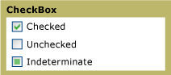

# CheckBox

You can use a <xref:System.Windows.Controls.CheckBox> in the user interface (UI) of your application to represent options that a user can select or clear. You can use a single check box or you can group two or more check boxes.

The following graphic shows the different states of a <xref:System.Windows.Controls.CheckBox>.

\
CheckBox controls in different states

## Styles and templates

You can modify the default <xref:System.Windows.Controls.ControlTemplate> to give the <xref:System.Windows.Controls.CheckBox> control a unique appearance. For more information, see [What are styles and templates?](styles-templates-overview.md) and [How to create a template for a control](how-to-create-apply-template.md).

### Parts

The <xref:System.Windows.Controls.CheckBox> control doesn't have any named parts.

### Visual states

The following table lists the visual states for the <xref:System.Windows.Controls.CheckBox> control.

|VisualState Name|VisualStateGroup Name|Description|
|----------------------|---------------------------|-----------------|
|Normal|CommonStates|The default state.|
|MouseOver|CommonStates|The mouse pointer is positioned over the control.|
|Pressed|CommonStates|The control is pressed.|
|Disabled|CommonStates|The control is disabled.|
|Focused|FocusStates|The control has focus.|
|Unfocused|FocusStates|The control doesn't have focus.|
|Checked|CheckStates|<xref:System.Windows.Controls.Primitives.ToggleButton.IsChecked%2A> is `true`.|
|Unchecked|CheckStates|<xref:System.Windows.Controls.Primitives.ToggleButton.IsChecked%2A> is `false`.|
|Indeterminate|CheckStates|<xref:System.Windows.Controls.Primitives.ToggleButton.IsThreeState%2A> is `true`, and <xref:System.Windows.Controls.Primitives.ToggleButton.IsChecked%2A> is `null`.|
|Valid|ValidationStates|The control uses the <xref:System.Windows.Controls.Validation> class and the <xref:System.Windows.Controls.Validation.HasError%2A?displayProperty=nameWithType> attached property is `false`.|
|InvalidUnfocused|ValidationStates|The <xref:System.Windows.Controls.Validation.HasError%2A?displayProperty=nameWithType> attached property is `true` has the control has focus.|
|InvalidFocused|ValidationStates|The <xref:System.Windows.Controls.Validation.HasError%2A?displayProperty=nameWithType> attached property is `true` has the control doesn't have focus.|

### CheckBox ControlTemplate example

The following example shows how to define a <xref:System.Windows.Controls.ControlTemplate> for the <xref:System.Windows.Controls.CheckBox> control.

[!code-xaml[ControlTemplateExamples#CheckBox](~/samples/snippets/csharp/VS_Snippets_Wpf/ControlTemplateExamples/CS/resources/checkbox.xaml#checkbox)]

The preceding example uses one or more of the following resources.

[!code-xaml[ControlTemplateExamples#Resources](~/samples/snippets/csharp/VS_Snippets_Wpf/ControlTemplateExamples/CS/resources/shared.xaml#resources)]

For the complete sample, see [Styling with ControlTemplates Sample](https://github.com/Microsoft/WPF-Samples/tree/master/Styles%20&%20Templates/IntroToStylingAndTemplating).

## Reference

<xref:System.Windows.Controls.CheckBox>
  <xref:System.Windows.Controls.RadioButton>
  <xref:System.Windows.Controls.Primitives.ButtonBase>
  <xref:System.Windows.Controls.Primitives.RepeatButton>
