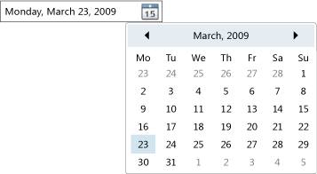

# DatePicker

The <xref:System.Windows.Controls.DatePicker> control allows the user to select a date by either typing it into a text field or by using a drop-down <xref:System.Windows.Controls.Calendar> control.

The following illustration shows a <xref:System.Windows.Controls.DatePicker>.

\
DatePicker Control

Many of a <xref:System.Windows.Controls.DatePicker> control's properties are for managing its built-in <xref:System.Windows.Controls.Calendar>, and function identically to the equivalent property in <xref:System.Windows.Controls.Calendar>. In particular, the <xref:System.Windows.Controls.DatePicker.IsTodayHighlighted%2A?displayProperty=nameWithType>, <xref:System.Windows.Controls.DatePicker.FirstDayOfWeek%2A?displayProperty=nameWithType>, <xref:System.Windows.Controls.DatePicker.BlackoutDates%2A?displayProperty=nameWithType>, <xref:System.Windows.Controls.DatePicker.DisplayDateStart%2A?displayProperty=nameWithType>, <xref:System.Windows.Controls.DatePicker.DisplayDateEnd%2A?displayProperty=nameWithType>, <xref:System.Windows.Controls.DatePicker.DisplayDate%2A?displayProperty=nameWithType>, and <xref:System.Windows.Controls.DatePicker.SelectedDate%2A?displayProperty=nameWithType> properties function identically to their <xref:System.Windows.Controls.Calendar> counterparts. For more information, see <xref:System.Windows.Controls.Calendar>.

Users can type a date directly into a text field, which sets the <xref:System.Windows.Controls.DatePicker.Text%2A> property. If the <xref:System.Windows.Controls.DatePicker> cannot convert the entered string to a valid date, the <xref:System.Windows.Controls.DatePicker.DateValidationError> event will be raised. By default, this causes an exception, but an event handler for <xref:System.Windows.Controls.DatePicker.DateValidationError> can set the <xref:System.Windows.Controls.DatePickerDateValidationErrorEventArgs.ThrowException%2A> property to `false` and prevent an exception from being raised.

## Styles and templates

You can modify the default <xref:System.Windows.Controls.ControlTemplate> to give the <xref:System.Windows.Controls.DatePicker> control a unique appearance. For more information, see [What are styles and templates?](styles-templates-overview.md) and [How to create a template for a control](how-to-create-apply-template.md).

### Parts

The following table lists the named parts for the <xref:System.Windows.Controls.DatePicker> control.

|Part|Type|Description|
|-|-|-|
|PART_Root|<xref:System.Windows.Controls.Grid>|The root of the control.|
|PART_Button|<xref:System.Windows.Controls.Button>|The button that opens and closes the <xref:System.Windows.Controls.Calendar>.|
|PART_TextBox|<xref:System.Windows.Controls.Primitives.DatePickerTextBox>|The text box that allows you to input a date.|
|PART_Popup|<xref:System.Windows.Controls.Primitives.Popup>|The popup for the <xref:System.Windows.Controls.DatePicker> control.|

### Visual states

The following table lists the visual states for the <xref:System.Windows.Controls.DatePicker> control.

|VisualState Name|VisualStateGroup Name|Description|
|-|-|-|
|Normal|CommonStates|The default state.|
|Disabled|CommonStates|The <xref:System.Windows.Controls.DatePicker> is disabled.|
|Valid|ValidationStates|The control uses the <xref:System.Windows.Controls.Validation> class and the <xref:System.Windows.Controls.Validation.HasError%2A?displayProperty=nameWithType> attached property is `false`.|
|InvalidFocused|ValidationStates|The <xref:System.Windows.Controls.Validation.HasError%2A?displayProperty=nameWithType> attached property is `true` has the control has focus.|
|InvalidUnfocused|ValidationStates|The <xref:System.Windows.Controls.Validation.HasError%2A?displayProperty=nameWithType> attached property is `true` has the control does not have focus.|

#### DatePickerTextBox Parts

The following table lists the named parts for the <xref:System.Windows.Controls.Primitives.DatePickerTextBox> control.

|Part|Type|Description|
|-|-|-|
|PART_Watermark|<xref:System.Windows.Controls.ContentControl>|The element that contains the initial text in the <xref:System.Windows.Controls.DatePicker>.|
|PART_ContentElement|<xref:System.Windows.FrameworkElement>|A visual element that can contain a <xref:System.Windows.FrameworkElement>. The text of the <xref:System.Windows.Controls.TextBox> is displayed in this element.|

#### DatePickerTextBox States

The following table lists the visual states for the <xref:System.Windows.Controls.Primitives.DatePickerTextBox> control.

|VisualState Name|VisualStateGroup Name|Description|
|-|-|-|
|Normal|CommonStates|The default state.|
|Disabled|CommonStates|The <xref:System.Windows.Controls.Primitives.DatePickerTextBox> is disabled.|
|MouseOver|CommonStates|The mouse pointer is positioned over the <xref:System.Windows.Controls.Primitives.DatePickerTextBox>.|
|ReadOnly|CommonStates|The user cannot change the text in the <xref:System.Windows.Controls.Primitives.DatePickerTextBox>.|
|Focused|FocusStates|The control has focus.|
|Unfocused|FocusStates|The control does not have focus.|
|Watermarked|WatermarkStates|The control displays its initial text.  The <xref:System.Windows.Controls.Primitives.DatePickerTextBox> is in the state when the user has not entered text or selected a date.|
|Unwatermarked|WatermarkStates|The user has entered text into the <xref:System.Windows.Controls.Primitives.DatePickerTextBox> or selected a date in the <xref:System.Windows.Controls.DatePicker>.|
|Valid|ValidationStates|The control uses the <xref:System.Windows.Controls.Validation> class and the <xref:System.Windows.Controls.Validation.HasError%2A?displayProperty=nameWithType> attached property is `false`.|
|InvalidFocused|ValidationStates|The <xref:System.Windows.Controls.Validation.HasError%2A?displayProperty=nameWithType> attached property is `true` and the control has focus.|
|InvalidUnfocused|ValidationStates|The <xref:System.Windows.Controls.Validation.HasError%2A?displayProperty=nameWithType> attached property is `true` and the control does not have focus.|

### DatePicker ControlTemplate Example

The following example shows how to define a <xref:System.Windows.Controls.ControlTemplate> for the <xref:System.Windows.Controls.DatePicker> control.

[!code-xaml[ControlTemplateExamples#DatePicker](~/samples/snippets/csharp/VS_Snippets_Wpf/ControlTemplateExamples/CS/resources/datepicker.xaml#datepicker)]

The preceding example uses one or more of the following resources.

[!code-xaml[ControlTemplateExamples#Resources](~/samples/snippets/csharp/VS_Snippets_Wpf/ControlTemplateExamples/CS/resources/shared.xaml#resources)]

For the complete sample, see [Styling with ControlTemplates Sample](https://github.com/Microsoft/WPF-Samples/tree/master/Styles%20&%20Templates/IntroToStylingAndTemplating).

## See also

- [Controls](index.md)
- [Styling and Templating](styles-templates-overview.md)
