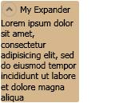

# Expander

An <xref:System.Windows.Controls.Expander> allows a user to view a header and expand that header to see further details, or to collapse a section up to a header.

The following illustration provides an example of this control in its expanded position.

## In This Section

[Expander Overview](expander-overview.md)
[How-to Topics](expander-how-to-topics.md)

## Styles and templates

You can modify the styles and templates for the <xref:System.Windows.Controls.Expander> control to give the control a unique appearance. For more information, see [What are styles and templates?](styles-templates-overview.md) and [How to create a template for a control](how-to-create-apply-template.md).

### Parts

The <xref:System.Windows.Controls.Expander> control does not have any named parts.

### Visual states

The following table lists the visual states for the <xref:System.Windows.Controls.Expander> control.

|VisualState Name|VisualStateGroup Name|Description|
|-|-|-|
|Normal|CommonStates|The default state.|
|MouseOver|CommonStates|The mouse pointer is positioned over the control.|
|Disabled|CommonStates|The control is disabled.|
|Focused|FocusStates|The control has focus.|
|Unfocused|FocusStates|The control does not have focus.|
|Expanded|ExpansionStates|The control is expanded.|
|Collapsed|ExpansionStates|The control is not expanded.|
|ExpandDown|ExpandDirectionStates|The control expands down.|
|ExpandUp|ExpandDirectionStates|The control expands up.|
|ExpandLeft|ExpandDirectionStates|The control expands left.|
|ExpandRight|ExpandDirectionStates|The control expands right.|
|Valid|ValidationStates|The control uses the <xref:System.Windows.Controls.Validation> class and the <xref:System.Windows.Controls.Validation.HasError%2A?displayProperty=nameWithType> attached property is `false`.|
|InvalidFocused|ValidationStates|The <xref:System.Windows.Controls.Validation.HasError%2A?displayProperty=nameWithType> attached property is `true` has the control has focus.|
|InvalidUnfocused|ValidationStates|The <xref:System.Windows.Controls.Validation.HasError%2A?displayProperty=nameWithType> attached property is `true` has the control does not have focus.|

### Expander ControlTemplate

The following example is a copy of the default template for a <xref:System.Windows.Controls.Expander> control:

:::code language="xaml" source="./snippets/shared/templates/ExpanderTemplate.xaml":::

## Reference

<xref:System.Windows.Controls.Expander>
