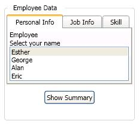

# GroupBox

The <xref:System.Windows.Controls.GroupBox> control is a <xref:System.Windows.Controls.HeaderedContentControl> that provides a titled container for graphical user interface (GUI) content.

The following illustration shows a <xref:System.Windows.Controls.GroupBox> that contains a <xref:System.Windows.Controls.TabControl> and a <xref:System.Windows.Controls.Button> that are enclosed in a <xref:System.Windows.Controls.StackPanel>.

## In This Section

[Define a GroupBox Template](how-to-define-a-groupbox-template.md)

## Styles and templates

This topic describes the styles and templates for the <xref:System.Windows.Controls.GroupBox> control. You can modify the default <xref:System.Windows.Controls.ControlTemplate> to give the control a unique appearance. For more information, see [What are styles and templates?](styles-templates-overview.md) and [How to create a template for a control](how-to-create-apply-template.md).

### Parts

The <xref:System.Windows.Controls.GroupBox> control does not have any named parts.

### Visual states

The following table lists the visual states for the <xref:System.Windows.Controls.GroupBox> control.

|VisualState Name|VisualStateGroup Name|Description|
|-|-|-|
|Valid|ValidationStates|The control uses the <xref:System.Windows.Controls.Validation> class and the <xref:System.Windows.Controls.Validation.HasError%2A?displayProperty=nameWithType> attached property is `false`.|
|InvalidFocused|ValidationStates|The <xref:System.Windows.Controls.Validation.HasError%2A?displayProperty=nameWithType> attached property is `true` has the control has focus.|
|InvalidUnfocused|ValidationStates|The <xref:System.Windows.Controls.Validation.HasError%2A?displayProperty=nameWithType> attached property is `true` has the control does not have focus.|

### GroupBox ControlTemplate Example

The following example shows how to define a <xref:System.Windows.Controls.ControlTemplate> for the <xref:System.Windows.Controls.GroupBox> control.

[!code-xaml[ControlTemplateExamples#GroupBox](~/samples/snippets/csharp/VS_Snippets_Wpf/ControlTemplateExamples/CS/resources/groupbox.xaml#groupbox)]

The <xref:System.Windows.Controls.ControlTemplate> uses one or more of the following resources.

[!code-xaml[ControlTemplateExamples#Resources](~/samples/snippets/csharp/VS_Snippets_Wpf/ControlTemplateExamples/CS/resources/shared.xaml#resources)]

For the complete sample, see [Styling with ControlTemplates Sample](https://github.com/Microsoft/WPF-Samples/tree/master/Styles%20&%20Templates/IntroToStylingAndTemplating).

## Reference

<xref:System.Windows.Controls.GroupBox>
