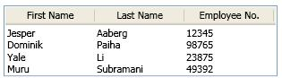

# ListView

The <xref:System.Windows.Controls.ListView> control provides the infrastructure to display a set of data items in different layouts or views.

The following illustration shows a <xref:System.Windows.Controls.ListView>.

## In This Section

[Overviews](listview-overviews.md)
[How-to Topics](listview-how-to-topics.md)

## Reference

<xref:System.Windows.Controls.ListView>
  <xref:System.Windows.Controls.ListViewItem>
  <xref:System.Windows.Controls.GridView>

## Styles and templates

This section describes the styles and templates for the <xref:System.Windows.Controls.ListView> control. You can modify the default <xref:System.Windows.Controls.ControlTemplate> to give the control a unique appearance. For more information, see [What are styles and templates?](styles-templates-overview.md) and [How to create a template for a control](how-to-create-apply-template.md).

### Parts

The <xref:System.Windows.Controls.ListView> control does not have any named parts.

When you create a <xref:System.Windows.Controls.ControlTemplate> for a <xref:System.Windows.Controls.ListView>, your template might contain an <xref:System.Windows.Controls.ItemsPresenter> within a <xref:System.Windows.Controls.ScrollViewer>. (The <xref:System.Windows.Controls.ItemsPresenter> displays each item in the <xref:System.Windows.Controls.ListView>; the <xref:System.Windows.Controls.ScrollViewer> enables scrolling within the control).  If the <xref:System.Windows.Controls.ItemsPresenter> is not the direct child of the <xref:System.Windows.Controls.ScrollViewer>, you must give the <xref:System.Windows.Controls.ItemsPresenter> the name, `ItemsPresenter`.

### Visual states

The following table lists the visual states for the <xref:System.Windows.Controls.ListView> control.

|VisualState Name|VisualStateGroup Name|Description|
|-|-|-|
|Valid|ValidationStates|The control uses the <xref:System.Windows.Controls.Validation> class and the <xref:System.Windows.Controls.Validation.HasError%2A?displayProperty=nameWithType> attached property is `false`.|
|InvalidFocused|ValidationStates|The <xref:System.Windows.Controls.Validation.HasError%2A?displayProperty=nameWithType> attached property is `true` has the control has focus.|
|InvalidUnfocused|ValidationStates|The <xref:System.Windows.Controls.Validation.HasError%2A?displayProperty=nameWithType> attached property is `true` has the control does not have focus.|

The following table lists the states for the <xref:System.Windows.Controls.ListViewItem> control.

|VisualState Name|VisualStateGroup Name|Description|
|-|-|-|
|Normal|CommonStates|The default state.|
|Disabled|CommonStates|The control is disabled.|
|MouseOver|CommonStates|The mouse pointer is over the <xref:System.Windows.Controls.ComboBox> control.|
|Focused|FocusStates|The control has focus.|
|Unfocused|FocusStates|The control does not have focus.|
|Selected|SelectionStates|The item is currently selected.|
|Unselected|SelectionStates|The item is not selected.|
|SelectedUnfocused|SelectionStates|The item is selected, but does not have focus.|
|Valid|ValidationStates|The control uses the <xref:System.Windows.Controls.Validation> class and the <xref:System.Windows.Controls.Validation.HasError%2A?displayProperty=nameWithType> attached property is `false`.|
|InvalidFocused|ValidationStates|The <xref:System.Windows.Controls.Validation.HasError%2A?displayProperty=nameWithType> attached property is `true` has the control has focus.|
|InvalidUnfocused|ValidationStates|The <xref:System.Windows.Controls.Validation.HasError%2A?displayProperty=nameWithType> attached property is `true` has the control does not have focus.|

### ListView ControlTemplate examples

The following example shows how to define a <xref:System.Windows.Controls.ControlTemplate> for the <xref:System.Windows.Controls.ListView> control and its associated types.

[!code-xaml[ControlTemplateExamples#ListView](~/samples/snippets/csharp/VS_Snippets_Wpf/ControlTemplateExamples/CS/resources/listview.xaml#listview)]

The <xref:System.Windows.Controls.ControlTemplate> examples use one or more of the following resources.

[!code-xaml[ControlTemplateExamples#Resources](~/samples/snippets/csharp/VS_Snippets_Wpf/ControlTemplateExamples/CS/resources/shared.xaml#resources)]

For the complete sample, see [Styling with ControlTemplates Sample](https://github.com/Microsoft/WPF-Samples/tree/master/Styles%20&%20Templates/IntroToStylingAndTemplating).

## Related Sections

[Data Binding Overview](../data/index.md)
  [Data Templating Overview](../data/data-templating-overview.md)
