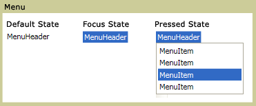

# Menu

A <xref:System.Windows.Controls.Menu> is a control that allows hierarchical organization of elements associated with commands or event handlers. Each <xref:System.Windows.Controls.Menu> can contain multiple <xref:System.Windows.Controls.MenuItem> controls. Each <xref:System.Windows.Controls.MenuItem> can invoke a command or invoke a `Click` event handler. A <xref:System.Windows.Controls.MenuItem> can also have multiple <xref:System.Windows.Controls.MenuItem> elements as children, forming a submenu.

The following illustration shows the three different states of a menu control. The default state is when no device such as a mouse pointer is resting on the <xref:System.Windows.Controls.Menu>. The focus state occurs when the mouse pointer is hovering over the <xref:System.Windows.Controls.Menu> and pressed state occurs when a mouse button is clicked over the <xref:System.Windows.Controls.Menu>.

\
Menus in different states

## In This Section

[Menu Overview](menu-overview.md)

## Styles and templates

You can modify the default <xref:System.Windows.Controls.ControlTemplate> to give the <xref:System.Windows.Controls.Menu> control a unique appearance. For more information, see [What are styles and templates?](styles-templates-overview.md) and [How to create a template for a control](how-to-create-apply-template.md).

### Parts

The <xref:System.Windows.Controls.Menu> control doesn't have any named parts.

When you create a <xref:System.Windows.Controls.ControlTemplate> for a <xref:System.Windows.Controls.Menu>, your template might contain an <xref:System.Windows.Controls.ItemsPresenter> within a <xref:System.Windows.Controls.ScrollViewer>. The <xref:System.Windows.Controls.ItemsPresenter> displays each item in the <xref:System.Windows.Controls.Menu>; the <xref:System.Windows.Controls.ScrollViewer> enables scrolling within the control. If the <xref:System.Windows.Controls.ItemsPresenter> isn't the direct child of the <xref:System.Windows.Controls.ScrollViewer>, you must give the <xref:System.Windows.Controls.ItemsPresenter> the name, `ItemsPresenter`.

### Visual states

The following table lists the visual states for the <xref:System.Windows.Controls.Menu> control.

|VisualState Name|VisualStateGroup Name|Description|
|-|-|-|
|Valid|ValidationStates|The control uses the <xref:System.Windows.Controls.Validation> class and the <xref:System.Windows.Controls.Validation.HasError%2A?displayProperty=nameWithType> attached property is `false`.|
|InvalidFocused|ValidationStates|The <xref:System.Windows.Controls.Validation.HasError%2A?displayProperty=nameWithType> attached property is `true` has the control has focus.|
|InvalidUnfocused|ValidationStates|The <xref:System.Windows.Controls.Validation.HasError%2A?displayProperty=nameWithType> attached property is `true` has the control doesn't have focus.|

### Menu ControlTemplate

The following example is a copy of the default template for a <xref:System.Windows.Controls.Menu> control:

:::code language="xaml" source="./snippets/shared/templates/MenuTemplate.xaml":::

### MenuItem Parts

The following table lists the named parts for the <xref:System.Windows.Controls.MenuItem> control.

|Part|Type|Description|
|-|-|-|
|PART_Popup|<xref:System.Windows.Controls.Primitives.Popup>|The area for the submenu.|

When you create a <xref:System.Windows.Controls.ControlTemplate> for a <xref:System.Windows.Controls.MenuItem>, your template might contain an <xref:System.Windows.Controls.ItemsPresenter> within a <xref:System.Windows.Controls.ScrollViewer>. The <xref:System.Windows.Controls.ItemsPresenter> displays each item in the <xref:System.Windows.Controls.MenuItem>; the <xref:System.Windows.Controls.ScrollViewer> enables scrolling within the control. If the <xref:System.Windows.Controls.ItemsPresenter> isn't the direct child of the <xref:System.Windows.Controls.ScrollViewer>, you must give the <xref:System.Windows.Controls.ItemsPresenter> the name, `ItemsPresenter`.

### MenuItem States

The following table lists the visual states for the <xref:System.Windows.Controls.MenuItem> control.

|VisualState Name|VisualStateGroup Name|Description|
|-|-|-|
|Valid|ValidationStates|The control uses the <xref:System.Windows.Controls.Validation> class and the <xref:System.Windows.Controls.Validation.HasError%2A?displayProperty=nameWithType> attached property is `false`.|
|InvalidFocused|ValidationStates|The <xref:System.Windows.Controls.Validation.HasError%2A?displayProperty=nameWithType> attached property is `true` has the control has focus.|
|InvalidUnfocused|ValidationStates|The <xref:System.Windows.Controls.Validation.HasError%2A?displayProperty=nameWithType> attached property is `true` has the control doesn't have focus.|

### MenuItem ControlTemplate

The following example is a copy of the default template for a <xref:System.Windows.Controls.MenuItem> control:

:::code language="xaml" source="./snippets/shared/templates/MenuItemTemplate.xaml":::

## Reference

<xref:System.Windows.Controls.Menu>
  <xref:System.Windows.Controls.MenuItem>
  <xref:System.Windows.Controls.Primitives.MenuBase>
  <xref:System.Windows.Controls.ContextMenu>
