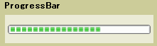

# ProgressBar

A <xref:System.Windows.Controls.ProgressBar> indicates the progress of an operation. The <xref:System.Windows.Controls.ProgressBar> control consists of a window that is filled with the system highlight color as an operation progresses.

The following illustration shows a typical <xref:System.Windows.Controls.ProgressBar>.

## Styles and templates

This topic describes the styles and templates for the <xref:System.Windows.Controls.ProgressBar> control. You can modify the default <xref:System.Windows.Controls.ControlTemplate> to give the control a unique appearance. For more information, see [What are styles and templates?](styles-templates-overview.md) and [How to create a template for a control](how-to-create-apply-template.md).

### Parts

The following table lists the named parts for the <xref:System.Windows.Controls.ProgressBar> control.

|Part|Type|Description|
|-|-|-|
|PART_Indicator|<xref:System.Windows.FrameworkElement>|The object that indicates progress.|
|PART_Track|<xref:System.Windows.FrameworkElement>|The object that defines the path of the progress indicator.|
|PART_GlowRect|<xref:System.Windows.FrameworkElement>|An object that embellishes the progress bar.|

### Visual states

The following table lists the visual states for the <xref:System.Windows.Controls.ProgressBar> control.

|VisualState Name|VisualStateGroup Name|Description|
|----------------------|---------------------------|-----------------|
|Determinate|CommonStates|<xref:System.Windows.Controls.ProgressBar> reports progress based on the <xref:System.Windows.Controls.Primitives.RangeBase.Value%2A> property.|
|Indeterminate|CommonStates|<xref:System.Windows.Controls.ProgressBar> reports generic progress with a repeating pattern.|
|Valid|ValidationStates|The control uses the <xref:System.Windows.Controls.Validation> class and the <xref:System.Windows.Controls.Validation.HasError%2A?displayProperty=nameWithType> attached property is `false`.|
|InvalidFocused|ValidationStates|The <xref:System.Windows.Controls.Validation.HasError%2A?displayProperty=nameWithType> attached property is `true` has the control has focus.|
|InvalidUnfocused|ValidationStates|The <xref:System.Windows.Controls.Validation.HasError%2A?displayProperty=nameWithType> attached property is `true` has the control does not have focus.|

### ControlTemplate example

The following example shows how to define a <xref:System.Windows.Controls.ControlTemplate> for the <xref:System.Windows.Controls.ProgressBar> control.

[!code-xaml[ControlTemplateExamples#ProgressBar](~/samples/snippets/csharp/VS_Snippets_Wpf/ControlTemplateExamples/CS/resources/progressbar.xaml#progressbar)]

The preceding example uses one or more of the following resources.

[!code-xaml[ControlTemplateExamples#Resources](~/samples/snippets/csharp/VS_Snippets_Wpf/ControlTemplateExamples/CS/resources/shared.xaml#resources)]

For the complete sample, see [Styling with ControlTemplates Sample](https://github.com/Microsoft/WPF-Samples/tree/master/Styles%20&%20Templates/IntroToStylingAndTemplating).

## In This Section

## Reference

<xref:System.Windows.Controls.ProgressBar>
<xref:System.Windows.Controls.Primitives.StatusBar>
<xref:System.Windows.FrameworkElement.Style%2A>
<xref:System.Windows.Controls.ControlTemplate>

## See also

- [Control Customization](control-customization.md)
- [Styling and Templating](styles-templates-overview.md)
- [Create a template for a control](how-to-create-apply-template.md)
