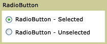

# RadioButton

<xref:System.Windows.Controls.RadioButton> controls are usually grouped together to offer users a single choice among several options; only one button at a time can be selected.

The following illustration shows an example of a <xref:System.Windows.Controls.RadioButton> control.

\
Typical RadioButton

## Styles and templates

You can modify the default <xref:System.Windows.Controls.ControlTemplate> to give the <xref:System.Windows.Controls.RadioButton> control a unique appearance. For more information, see [What are styles and templates?](styles-templates-overview.md) and [How to create a template for a control](how-to-create-apply-template.md).

### Parts

The <xref:System.Windows.Controls.RadioButton> control does not have any named parts.

### Visual states

The following table lists the visual states for the <xref:System.Windows.Controls.RadioButton> control.

|VisualState Name|VisualStateGroup Name|Description|
|----------------------|---------------------------|-----------------|
|Normal|CommonStates|The default state.|
|MouseOver|CommonStates|The mouse pointer is positioned over the control.|
|Pressed|CommonStates|The control is pressed.|
|Disabled|CommonStates|The control is disabled.|
|Focused|FocusStates|The control has focus.|
|Unfocused|FocusStates|The control does not have focus.|
|Checked|CheckStates|<xref:System.Windows.Controls.Primitives.ToggleButton.IsChecked%2A> is `true`.|
|Unchecked|CheckStates|<xref:System.Windows.Controls.Primitives.ToggleButton.IsChecked%2A> is `false`.|
|Indeterminate|CheckStates|<xref:System.Windows.Controls.Primitives.ToggleButton.IsThreeState%2A> is `true`, and <xref:System.Windows.Controls.Primitives.ToggleButton.IsChecked%2A> is `null`.|
|Valid|ValidationStates|The control uses the <xref:System.Windows.Controls.Validation> class and the <xref:System.Windows.Controls.Validation.HasError%2A?displayProperty=nameWithType> attached property is `false`.|
|InvalidFocused|ValidationStates|The <xref:System.Windows.Controls.Validation.HasError%2A?displayProperty=nameWithType> attached property is `true` has the control has focus.|
|InvalidUnfocused|ValidationStates|The <xref:System.Windows.Controls.Validation.HasError%2A?displayProperty=nameWithType> attached property is `true` has the control does not have focus.|

### RadioButton ControlTemplate Example

The following example shows how to define a <xref:System.Windows.Controls.ControlTemplate> for the <xref:System.Windows.Controls.RadioButton> control.

[!code-xaml[ControlTemplateExamples#RadioButton](~/samples/snippets/csharp/VS_Snippets_Wpf/ControlTemplateExamples/CS/resources/radiobutton.xaml#radiobutton)]

The preceding example uses one or more of the following resources.

[!code-xaml[ControlTemplateExamples#Resources](~/samples/snippets/csharp/VS_Snippets_Wpf/ControlTemplateExamples/CS/resources/shared.xaml#resources)]

For the complete sample, see [Styling with ControlTemplates Sample](https://github.com/Microsoft/WPF-Samples/tree/master/Styles%20&%20Templates/IntroToStylingAndTemplating).

## Reference

<xref:System.Windows.Controls.Primitives.ToggleButton>
