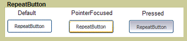

# RepeatButton

The <xref:System.Windows.Controls.Primitives.RepeatButton> is similar to a <xref:System.Windows.Controls.Button>. However, <xref:System.Windows.Controls.Primitives.RepeatButton> elements give you control over when and how the <xref:System.Windows.Controls.Primitives.ButtonBase.Click> event occurs.

The following graphic shows an example of the three states of a repeat button control, Default, PointerFocused, and Pressed. The first button shows the default state of the <xref:System.Windows.Controls.Primitives.RepeatButton>. The second shows how the appearance of the button changes when the mouse pointer hovers over the button, giving it focus. The last button shows the appearance of the <xref:System.Windows.Controls.Primitives.RepeatButton> when the user presses the mouse button over the control.

\
Typical RepeatButton

## Styles and templates

You can modify the default <xref:System.Windows.Controls.ControlTemplate> to give the <xref:System.Windows.Controls.Primitives.RepeatButton> control a unique appearance. For more information, see [What are styles and templates?](styles-templates-overview.md) and [How to create a template for a control](how-to-create-apply-template.md).

### Parts

The <xref:System.Windows.Controls.Primitives.RepeatButton> control does not have any named parts.

### Visual states

The following table lists the visual states for the <xref:System.Windows.Controls.Primitives.RepeatButton> control.

|VisualState Name|VisualStateGroup Name|Description|
|-|-|-|
|Normal|CommonStates|The default state.|
|MouseOver|CommonStates|The mouse pointer is positioned over the control.|
|Pressed|CommonStates|The control is pressed.|
|Disabled|CommonStates|The control is disabled.|
|Focused|FocusStates|The control has focus.|
|Unfocused|FocusStates|The control does not have focus.|
|Valid|ValidationStates|The control uses the <xref:System.Windows.Controls.Validation> class and the <xref:System.Windows.Controls.Validation.HasError%2A?displayProperty=nameWithType> attached property is `false`.|
|InvalidFocused|ValidationStates|The <xref:System.Windows.Controls.Validation.HasError%2A?displayProperty=nameWithType> attached property is `true` has the control has focus.|
|InvalidUnfocused|ValidationStates|The <xref:System.Windows.Controls.Validation.HasError%2A?displayProperty=nameWithType> attached property is `true` has the control does not have focus.|

### ControlTemplate example

The following example shows how to define a <xref:System.Windows.Controls.ControlTemplate> for the <xref:System.Windows.Controls.Primitives.RepeatButton> control.

[!code-xaml[ControlTemplateExamples#RepeatButton](~/samples/snippets/csharp/VS_Snippets_Wpf/ControlTemplateExamples/CS/resources/scrollbar.xaml#repeatbutton)]

The preceding example uses one or more of the following resources.

[!code-xaml[ControlTemplateExamples#Resources](~/samples/snippets/csharp/VS_Snippets_Wpf/ControlTemplateExamples/CS/resources/shared.xaml#resources)]

For the complete sample, see [Styling with ControlTemplates Sample](https://github.com/Microsoft/WPF-Samples/tree/master/Styles%20&%20Templates/IntroToStylingAndTemplating).

## In This Section

## Reference

<xref:System.Windows.Controls.Primitives.RepeatButton>
