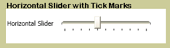

# Slider

The <xref:System.Windows.Controls.Slider> allows you select from a range of values by moving a <xref:System.Windows.Controls.Primitives.Thumb> along a <xref:System.Windows.Controls.Primitives.Track>.

The following illustration shows an example of a horizontal <xref:System.Windows.Controls.Slider> control.

## In This Section

[Customize the Ticks on a Slider](how-to-customize-the-ticks-on-a-slider.md)

## Styles and templates

This section describes the styles and templates for the <xref:System.Windows.Controls.Slider> control. You can modify the default <xref:System.Windows.Controls.ControlTemplate> to give the control a unique appearance. For more information, see [What are styles and templates?](styles-templates-overview.md) and [How to create a template for a control](how-to-create-apply-template.md).

### Parts

The following table lists the named parts for the <xref:System.Windows.Controls.Slider> control.

|Part|Type|Description|
|-|-|-|
|PART_Track|<xref:System.Windows.Controls.Primitives.Track>|The container for the element that indicates the position of the <xref:System.Windows.Controls.Slider>.|
|PART_SelectionRange|<xref:System.Windows.FrameworkElement>|The element that displays a selection range along the <xref:System.Windows.Controls.Slider>.  The selection range is visible only if the <xref:System.Windows.Controls.Slider.IsSelectionRangeEnabled%2A> property is `true`.|

### Visual states

The following table lists the visual states for the <xref:System.Windows.Controls.Slider> control.

|VisualState Name|VisualStateGroup Name|Description|
|----------------------|---------------------------|-----------------|
|Normal|CommonStates|The default state.|
|MouseOver|CommonStates|The mouse pointer is positioned over the control.|
|Disabled|CommonStates|The control is disabled.|
|Focused|FocusStates|The control has focus.|
|Unfocused|FocusStates|The control does not have focus.|
|Valid|ValidationStates|The control uses the <xref:System.Windows.Controls.Validation> class and the <xref:System.Windows.Controls.Validation.HasError%2A?displayProperty=nameWithType> attached property is `false`.|
|InvalidFocused|ValidationStates|The <xref:System.Windows.Controls.Validation.HasError%2A?displayProperty=nameWithType> attached property is `true` has the control has focus.|
|InvalidUnfocused|ValidationStates|The <xref:System.Windows.Controls.Validation.HasError%2A?displayProperty=nameWithType> attached property is `true` has the control does not have focus.|

### Slider ControlTemplate Example

The following example shows how to define a <xref:System.Windows.Controls.ControlTemplate> for the <xref:System.Windows.Controls.Slider> control.

[!code-xaml[ControlTemplateExamples#Slider](~/samples/snippets/csharp/VS_Snippets_Wpf/ControlTemplateExamples/CS/resources/slider.xaml#slider)]

The preceding example uses one or more of the following resources.

[!code-xaml[ControlTemplateExamples#Resources](~/samples/snippets/csharp/VS_Snippets_Wpf/ControlTemplateExamples/CS/resources/shared.xaml#resources)]

For the complete sample, see [Styling with ControlTemplates Sample](https://github.com/Microsoft/WPF-Samples/tree/master/Styles%20&%20Templates/IntroToStylingAndTemplating).

## Reference

<xref:System.Windows.Controls.Slider>
  <xref:System.Windows.Controls.Primitives.Track>
  <xref:System.Windows.Controls.Primitives.Thumb>
