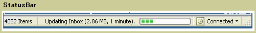

# StatusBar

A <xref:System.Windows.Controls.Primitives.StatusBar> is a horizontal area at the bottom of a window where an application can display status information.

The following illustration shows an example of a <xref:System.Windows.Controls.Primitives.StatusBar>.

## In This Section

## Styles and templates

This section describes the styles and templates for the <xref:System.Windows.Controls.Primitives.StatusBar> control. You can modify the default <xref:System.Windows.Controls.ControlTemplate> to give the control a unique appearance. For more information, see [What are styles and templates?](styles-templates-overview.md) and [How to create a template for a control](how-to-create-apply-template.md).

### Parts

The <xref:System.Windows.Controls.Primitives.StatusBar> control does not have any named parts.

### Visual states

The following table lists the visual states for the <xref:System.Windows.Controls.Primitives.StatusBar> control.

|VisualState Name|VisualStateGroup Name|Description|
|-|-|-|
|Valid|ValidationStates|The control uses the <xref:System.Windows.Controls.Validation> class and the <xref:System.Windows.Controls.Validation.HasError%2A?displayProperty=nameWithType> attached property is `false`.|
|InvalidFocused|ValidationStates|The <xref:System.Windows.Controls.Validation.HasError%2A?displayProperty=nameWithType> attached property is `true` has the control has focus.|
|InvalidUnfocused|ValidationStates|The <xref:System.Windows.Controls.Validation.HasError%2A?displayProperty=nameWithType> attached property is `true` has the control does not have focus.|

#### StatusBarItem Parts

The <xref:System.Windows.Controls.Primitives.StatusBarItem> control does not have any named parts.

#### StatusBarItem States

The following table lists the visual states for the <xref:System.Windows.Controls.Primitives.StatusBarItem> control.

|VisualState Name|VisualStateGroup Name|Description|
|-|-|-|
|Valid|ValidationStates|The control uses the <xref:System.Windows.Controls.Validation> class and the <xref:System.Windows.Controls.Validation.HasError%2A?displayProperty=nameWithType> attached property is `false`.|
|InvalidFocused|ValidationStates|The <xref:System.Windows.Controls.Validation.HasError%2A?displayProperty=nameWithType> attached property is `true` has the control has focus.|
|InvalidUnfocused|ValidationStates|The <xref:System.Windows.Controls.Validation.HasError%2A?displayProperty=nameWithType> attached property is `true` has the control does not have focus.|

### StatusBar ControlTemplate Example

The following example shows how to define a <xref:System.Windows.Controls.ControlTemplate> for the <xref:System.Windows.Controls.Primitives.StatusBar> control.

[!code-xaml[ControlTemplateExamples#StatusBar](~/samples/snippets/csharp/VS_Snippets_Wpf/ControlTemplateExamples/CS/resources/statusbar.xaml#statusbar)]

The <xref:System.Windows.Controls.ControlTemplate> uses one or more of the following resources.

[!code-xaml[ControlTemplateExamples#Resources](~/samples/snippets/csharp/VS_Snippets_Wpf/ControlTemplateExamples/CS/resources/shared.xaml#resources)]

For the complete sample, see [Styling with ControlTemplates Sample](https://github.com/Microsoft/WPF-Samples/tree/master/Styles%20&%20Templates/IntroToStylingAndTemplating).

## Reference

<xref:System.Windows.Controls.Primitives.StatusBar>
  <xref:System.Windows.Controls.Primitives.StatusBarItem>
