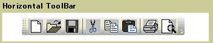
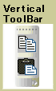

# ToolBar

The <xref:System.Windows.Controls.ToolBar> control is a container for a group of commands or controls that are typically related in their function.

The following illustrations show horizontal and vertical <xref:System.Windows.Controls.ToolBar> controls.

\
Horizontal Toolbar

\
Vertical Toolbar

## In This Section

[ToolBar Overview](toolbar-overview.md)
  [Style Controls on a ToolBar](how-to-style-controls-on-a-toolbar.md)

## Styles and templates

This section describes the styles and templates for the <xref:System.Windows.Controls.ToolBar> control. You can modify the default <xref:System.Windows.Controls.ControlTemplate> to give the control a unique appearance. For more information, see [What are styles and templates?](styles-templates-overview.md) and [How to create a template for a control](how-to-create-apply-template.md).

### Parts

The following table lists the named parts for the <xref:System.Windows.Controls.ToolBar> control.

|Part|Type|Description|
|-|-|-|
|PART_ToolBarPanel|<xref:System.Windows.Controls.Primitives.ToolBarPanel>|The object that contains the controls on the <xref:System.Windows.Controls.ToolBar>.|
|PART_ToolBarOverflowPanel|<xref:System.Windows.Controls.Primitives.ToolBarOverflowPanel>|The object that contains the controls that are in the overflow area of the <xref:System.Windows.Controls.ToolBar>.|

When you create a <xref:System.Windows.Controls.ControlTemplate> for a <xref:System.Windows.Controls.ToolBar>, your template might contain an <xref:System.Windows.Controls.ItemsPresenter> within a <xref:System.Windows.Controls.ScrollViewer>. (The <xref:System.Windows.Controls.ItemsPresenter> displays each item in the <xref:System.Windows.Controls.ToolBar>; the <xref:System.Windows.Controls.ScrollViewer> enables scrolling within the control).  If the <xref:System.Windows.Controls.ItemsPresenter> is not the direct child of the <xref:System.Windows.Controls.ScrollViewer>, you must give the <xref:System.Windows.Controls.ItemsPresenter> the name, `ItemsPresenter`.

### Visual states

The following table lists the visual states for the <xref:System.Windows.Controls.ToolBar> control.

|VisualState Name|VisualStateGroup Name|Description|
|-|-|-|
|Valid|ValidationStates|The control uses the <xref:System.Windows.Controls.Validation> class and the <xref:System.Windows.Controls.Validation.HasError%2A?displayProperty=nameWithType> attached property is `false`.|
|InvalidFocused|ValidationStates|The <xref:System.Windows.Controls.Validation.HasError%2A?displayProperty=nameWithType> attached property is `true` has the control has focus.|
|InvalidUnfocused|ValidationStates|The <xref:System.Windows.Controls.Validation.HasError%2A?displayProperty=nameWithType> attached property is `true` has the control does not have focus.|

### ToolBar ControlTemplate Example

The following example shows how to define a <xref:System.Windows.Controls.ControlTemplate> for the <xref:System.Windows.Controls.ToolBar> control.

[!code-xaml[ControlTemplateExamples#ToolBar](~/samples/snippets/csharp/VS_Snippets_Wpf/ControlTemplateExamples/CS/resources/toolbar.xaml#toolbar)]

The preceding example uses one or more of the following resources.

[!code-xaml[ControlTemplateExamples#Resources](~/samples/snippets/csharp/VS_Snippets_Wpf/ControlTemplateExamples/CS/resources/shared.xaml#resources)]

For the complete sample, see [Styling with ControlTemplates Sample](https://github.com/Microsoft/WPF-Samples/tree/master/Styles%20&%20Templates/IntroToStylingAndTemplating).

## Reference

<xref:System.Windows.Controls.ToolBar>
  <xref:System.Windows.Controls.ToolBarTray>
