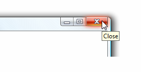

# ToolTip

A tooltip is a small pop-up window that appears when a user pauses the mouse pointer over an element, such as over a <xref:System.Windows.Controls.Button>.

The following illustration shows a mouse pointer that points to the **Close**<xref:System.Windows.Controls.Button>, which then displays its identifying <xref:System.Windows.Controls.ToolTip>.

Close button with its tooltip displayed

## In This Section

[ToolTip Overview](tooltip-overview.md)
  [How-to Topics](tooltip-how-to-topics.md)

## Styles and templates

You can modify the default <xref:System.Windows.Controls.ControlTemplate> to give the <xref:System.Windows.Controls.ToolTip> control a unique appearance. For more information, see [What are styles and templates?](styles-templates-overview.md) and [How to create a template for a control](how-to-create-apply-template.md).

### Parts

The <xref:System.Windows.Controls.ToolTip> control doesn't have any named parts.

### Visual states

The following table lists the visual states for the <xref:System.Windows.Controls.ToolTip> control.

|VisualState Name|VisualStateGroup Name|Description|
|-|-|-|
|Closed|OpenStates|The default state.|
|Open|OpenStates|The <xref:System.Windows.Controls.ToolTip> is visible.|
|Valid|ValidationStates|The control uses the <xref:System.Windows.Controls.Validation> class and the <xref:System.Windows.Controls.Validation.HasError%2A?displayProperty=nameWithType> attached property is `false`.|
|InvalidFocused|ValidationStates|The <xref:System.Windows.Controls.Validation.HasError%2A?displayProperty=nameWithType> attached property is `true` has the control has focus.|
|InvalidUnfocused|ValidationStates|The <xref:System.Windows.Controls.Validation.HasError%2A?displayProperty=nameWithType> attached property is `true` has the control doesn't have focus.|

### ControlTemplate Example

The following example shows how to define a <xref:System.Windows.Controls.ControlTemplate> for the <xref:System.Windows.Controls.ToolTip> control.

[!code-xaml[ControlTemplateExamples#ToolTip](~/samples/snippets/csharp/VS_Snippets_Wpf/ControlTemplateExamples/CS/resources/tooltip.xaml#tooltip)]

The preceding example uses one or more of the following resources.

[!code-xaml[ControlTemplateExamples#Resources](~/samples/snippets/csharp/VS_Snippets_Wpf/ControlTemplateExamples/CS/resources/shared.xaml#resources)]

For the complete sample, see [Styling with ControlTemplates Sample](https://github.com/Microsoft/WPF-Samples/tree/master/Styles%20&%20Templates/IntroToStylingAndTemplating).

## Reference

<xref:System.Windows.Controls.ToolTip>
  <xref:System.Windows.Controls.ToolTipService>
  <xref:System.Windows.Controls.Primitives.Popup>

## Related Sections

[Popup Overview](popup-overview.md)
  [How-to Topics](popup-how-to-topics.md)
