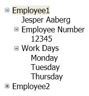

# TreeView

The <xref:System.Windows.Controls.TreeView> control displays information in a hierarchical structure by using collapsible nodes.

The following illustration is an example of a <xref:System.Windows.Controls.TreeView> control that has nested <xref:System.Windows.Controls.TreeViewItem> controls:

## In This Section

[TreeView Overview](treeview-overview.md)
[How-to Topics](treeview-how-to-topics.md)

## Reference

<xref:System.Windows.Controls.TreeView>
  <xref:System.Windows.Controls.TreeViewItem>

## Styles and templates

You can modify the default <xref:System.Windows.Controls.ControlTemplate> to give the <xref:System.Windows.Controls.TreeView> control a unique appearance. For more information, see [What are styles and templates?](styles-templates-overview.md) and [How to create a template for a control](how-to-create-apply-template.md).

### Parts

The <xref:System.Windows.Controls.TreeView> control does not have any named parts.

When you create a <xref:System.Windows.Controls.ControlTemplate> for an <xref:System.Windows.Controls.TreeView>, your template might contain a <xref:System.Windows.Controls.ItemsPresenter> within a <xref:System.Windows.Controls.ScrollViewer>. (The <xref:System.Windows.Controls.ItemsPresenter> displays each item in the <xref:System.Windows.Controls.TreeView>; the <xref:System.Windows.Controls.ScrollViewer> enables scrolling within the control).  If the <xref:System.Windows.Controls.ItemsPresenter> is not the direct child of the <xref:System.Windows.Controls.ScrollViewer>, you must give the <xref:System.Windows.Controls.ItemsPresenter> the name, `ItemsPresenter`.

### Visual states

The following table lists the visual states for the <xref:System.Windows.Controls.TreeView> control.

|VisualState Name|VisualStateGroup Name|Description|
|-|-|-|
|Valid|ValidationStates|The control uses the <xref:System.Windows.Controls.Validation> class and the <xref:System.Windows.Controls.Validation.HasError%2A?displayProperty=nameWithType> attached property is `false`.|
|InvalidFocused|ValidationStates|The <xref:System.Windows.Controls.Validation.HasError%2A?displayProperty=nameWithType> attached property is `true` and the control has focus.|
|InvalidUnfocused|ValidationStates|The <xref:System.Windows.Controls.Validation.HasError%2A?displayProperty=nameWithType> attached property is `true` and the control does not have focus.|

#### TreeViewItem Parts

The following table lists the named parts for the <xref:System.Windows.Controls.TreeViewItem> control.

|Part|Type|Description|
|----------|----------|-----------------|
|PART_Header|<xref:System.Windows.FrameworkElement>|A visual element that contains the header content of the <xref:System.Windows.Controls.TreeView> control.|

#### TreeViewItem States

The following table lists the visual states for <xref:System.Windows.Controls.TreeViewItem> control.

|VisualState Name|VisualStateGroup Name|Description|
|----------------------|---------------------------|-----------------|
|Normal|CommonStates|The default state.|
|MouseOver|CommonStates|The mouse pointer is positioned over the <xref:System.Windows.Controls.TreeViewItem>.|
|Disabled|CommonStates|The <xref:System.Windows.Controls.TreeViewItem> is disabled.|
|Focused|FocusStates|The <xref:System.Windows.Controls.TreeViewItem> has focus.|
|Unfocused|FocusStates|The <xref:System.Windows.Controls.TreeViewItem> does not have focus.|
|Expanded|ExpansionStates|The <xref:System.Windows.Controls.TreeViewItem> control is expanded.|
|Collapsed|ExpansionStates|The <xref:System.Windows.Controls.TreeViewItem> control is collapsed.|
|HasItems|HasItemsStates|The <xref:System.Windows.Controls.TreeViewItem> has items.|
|NoItems|HasItemsStates|The <xref:System.Windows.Controls.TreeViewItem> does not have items.|
|Selected|SelectionStates|The <xref:System.Windows.Controls.TreeViewItem> is selected.|
|SelectedInactive|SelectionStates|The <xref:System.Windows.Controls.TreeViewItem> is selected but not active.|
|Unselected|SelectionStates|The <xref:System.Windows.Controls.TreeViewItem> is not selected.|
|Valid|ValidationStates|The control uses the <xref:System.Windows.Controls.Validation> class and the <xref:System.Windows.Controls.Validation.HasError%2A?displayProperty=nameWithType> attached property is `false`.|
|InvalidFocused|ValidationStates|The <xref:System.Windows.Controls.Validation.HasError%2A?displayProperty=nameWithType> attached property is `true` has the control has focus.|
|InvalidUnfocused|ValidationStates|The <xref:System.Windows.Controls.Validation.HasError%2A?displayProperty=nameWithType> attached property is `true` has the control does not have focus.|

### TreeView ControlTemplate Example

The following example shows how to define a <xref:System.Windows.Controls.ControlTemplate> for the <xref:System.Windows.Controls.TreeView> control and its associated types.

[!code-xaml[ControlTemplateExamples#TreeView](~/samples/snippets/csharp/VS_Snippets_Wpf/ControlTemplateExamples/CS/resources/treeview.xaml#treeview)]

The preceding example uses one or more of the following resources.

[!code-xaml[ControlTemplateExamples#Resources](~/samples/snippets/csharp/VS_Snippets_Wpf/ControlTemplateExamples/CS/resources/shared.xaml#resources)]

For the complete sample, see [Styling with ControlTemplates Sample](https://github.com/Microsoft/WPF-Samples/tree/master/Styles%20&%20Templates/IntroToStylingAndTemplating).

## Related Sections

[Data Binding Overview](../data/index.md)
  [Data Templating Overview](../data/data-templating-overview.md)
