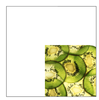
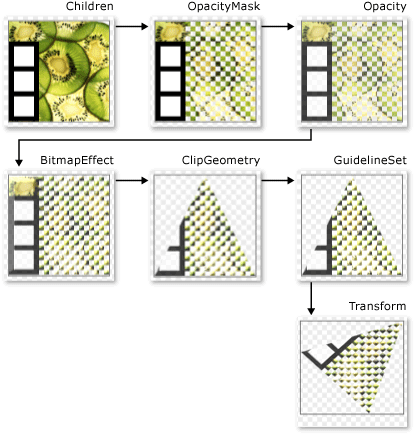
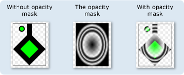
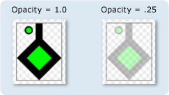
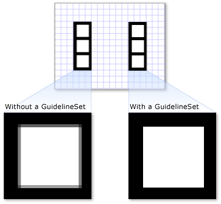
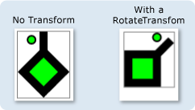
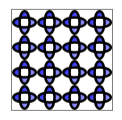

# Drawing Objects Overview

This topic introduces <xref:System.Windows.Media.Drawing> objects and describes how to use them to efficiently draw shapes, bitmaps, text, and media. Use <xref:System.Windows.Media.Drawing> objects when you create clip art, paint with a <xref:System.Windows.Media.DrawingBrush>, or use <xref:System.Windows.Media.Visual> objects.

## What Is a Drawing Object

A <xref:System.Windows.Media.Drawing> object describes visible content, such as a shape, bitmap, video, or a line of text. Different types of drawings describe different types of content. The following is a list of the different types of drawing objects.

- <xref:System.Windows.Media.GeometryDrawing> – Draws a shape.

- <xref:System.Windows.Media.ImageDrawing> – Draws an image.

- <xref:System.Windows.Media.GlyphRunDrawing> – Draws text.

- <xref:System.Windows.Media.VideoDrawing> – Plays an audio or video file.

- <xref:System.Windows.Media.DrawingGroup> – Draws other drawings. Use a drawing group to combine other drawings into a single composite drawing.

<xref:System.Windows.Media.Drawing> objects are versatile; there are many ways you can use a <xref:System.Windows.Media.Drawing> object.

- You can display it as an image by using a <xref:System.Windows.Media.DrawingImage> and an <xref:System.Windows.Controls.Image> control.

- You can use it with a <xref:System.Windows.Media.DrawingBrush> to paint an object, such as the <xref:System.Windows.Controls.Page.Background%2A> of a <xref:System.Windows.Controls.Page>.

- You can use it to describe the appearance of a <xref:System.Windows.Media.DrawingVisual>.

- You can use it to enumerate the contents of a <xref:System.Windows.Media.Visual>.

WPF provides other types of objects that are capable of drawing shapes, bitmaps, text, and media. For example, you can also use <xref:System.Windows.Shapes.Shape> objects to draw shapes, and the <xref:System.Windows.Controls.MediaElement> control provides another way to add video to your application. So when should you use <xref:System.Windows.Media.Drawing> objects? When you can sacrifice framework level features to gain performance benefits or when you need <xref:System.Windows.Freezable> features. Because <xref:System.Windows.Media.Drawing> objects lack support for [Layout](../advanced/layout.md), input, and focus, they provide performance benefits that make them ideal for describing backgrounds, clip art, and for low-level drawing with <xref:System.Windows.Media.Visual> objects.

Because they are a type <xref:System.Windows.Freezable> object, <xref:System.Windows.Media.Drawing> objects gain several special features, which include the following: they can be declared as [resources](../systems/xaml-resources-overview.md), shared among multiple objects, made read-only to improve performance, cloned, and made thread-safe. For more information about the different features provided by <xref:System.Windows.Freezable> objects, see the [Freezable Objects Overview](../advanced/freezable-objects-overview.md).

## Draw a Shape

To draw a shape, you use a <xref:System.Windows.Media.GeometryDrawing>. A geometry drawing's <xref:System.Windows.Media.GeometryDrawing.Geometry%2A> property describes the shape to draw, its <xref:System.Windows.Media.GeometryDrawing.Brush%2A> property describes how the interior of the shape should be painted, and its <xref:System.Windows.Media.GeometryDrawing.Pen%2A> property describes how its outline should be drawn.

The following example uses a <xref:System.Windows.Media.GeometryDrawing> to draw a shape. The shape is described by a <xref:System.Windows.Media.GeometryGroup> and two <xref:System.Windows.Media.EllipseGeometry> objects. The shape's interior is painted with a <xref:System.Windows.Media.LinearGradientBrush> and its outline is drawn with a <xref:System.Windows.Media.Brushes.Black%2A> <xref:System.Windows.Media.Pen>.

This example creates the following <xref:System.Windows.Media.GeometryDrawing>.

\
A GeometryDrawing

[!code-csharp[DrawingMiscSnippets_snip#GeometryDrawingExampleInline](~/samples/snippets/csharp/VS_Snippets_Wpf/DrawingMiscSnippets_snip/CSharp/GeometryDrawingExample.cs#geometrydrawingexampleinline)]
[!code-xaml[DrawingMiscSnippets_snip#GeometryDrawingExampleInline](~/samples/snippets/xaml/VS_Snippets_Wpf/DrawingMiscSnippets_snip/XAML/GeometryDrawingExample.xaml#geometrydrawingexampleinline)]

For the complete example, see [Create a GeometryDrawing](how-to-create-a-geometrydrawing.md).

Other <xref:System.Windows.Media.Geometry> classes, such as <xref:System.Windows.Media.PathGeometry> enable you to create more complex shapes by creating curves and arcs. For more information about <xref:System.Windows.Media.Geometry> objects, see the [Geometry Overview](geometry-overview.md).

For more information about other ways to draw shapes that don't use <xref:System.Windows.Media.Drawing> objects, see [Shapes and Basic Drawing in WPF Overview](shapes-and-basic-drawing-in-wpf-overview.md).

## Draw an Image

To draw an image, you use an <xref:System.Windows.Media.ImageDrawing>. An <xref:System.Windows.Media.ImageDrawing> object's  <xref:System.Windows.Media.ImageDrawing.ImageSource%2A> property describes the image to draw, and its <xref:System.Windows.Media.ImageDrawing.Rect%2A> property defines the region where the image is drawn.

The following example draws an image into a rectangle located at (75,75) that is 100 by 100 pixel. The following illustration shows the <xref:System.Windows.Media.ImageDrawing> created by the example. A gray border was added to show the bounds of the <xref:System.Windows.Media.ImageDrawing>.

\
A 100 by 100 ImageDrawing

[!code-csharp[DrawingMiscSnippets_snip#ImageDrawing100by100Inline](~/samples/snippets/csharp/VS_Snippets_Wpf/DrawingMiscSnippets_snip/CSharp/ImageDrawingExample.cs#imagedrawing100by100inline)]
[!code-xaml[DrawingMiscSnippets_snip#ImageDrawing100by100Inline](~/samples/snippets/xaml/VS_Snippets_Wpf/DrawingMiscSnippets_snip/XAML/ImageDrawingExample.xaml#imagedrawing100by100inline)]

For more information about images, see the [Imaging Overview](imaging-overview.md).

## Play Media (Code Only)

> [!NOTE]
> Although you can declare a <xref:System.Windows.Media.VideoDrawing> in Extensible Application Markup Language (XAML), you can only load and play its media using code. To play video in Extensible Application Markup Language (XAML), use a <xref:System.Windows.Controls.MediaElement> instead.

To play an audio or video file, you use a <xref:System.Windows.Media.VideoDrawing> and a <xref:System.Windows.Media.MediaPlayer>. There are two ways to load and play media. The first is to use a <xref:System.Windows.Media.MediaPlayer> and a <xref:System.Windows.Media.VideoDrawing> by themselves, and the second way is to create your own <xref:System.Windows.Media.MediaTimeline> to use with the <xref:System.Windows.Media.MediaPlayer> and <xref:System.Windows.Media.VideoDrawing>.

> [!NOTE]
> When distributing media with your application, you cannot use a media file as a project resource, like you would an image. In your project file, you must instead set the media type to `Content` and set `CopyToOutputDirectory` to `PreserveNewest` or `Always`.

To play media without creating your own <xref:System.Windows.Media.MediaTimeline>, you perform the following steps.

1. Create a <xref:System.Windows.Media.MediaPlayer> object.

     [!code-csharp[DrawingMiscSnippets_snip#VideoDrawingExampleInline1](~/samples/snippets/csharp/VS_Snippets_Wpf/DrawingMiscSnippets_snip/CSharp/VideoDrawingExample.cs#videodrawingexampleinline1)]

2. Use the <xref:System.Windows.Media.MediaPlayer.Open%2A> method to load the media file.

     [!code-csharp[DrawingMiscSnippets_snip#VideoDrawingExampleInline2](~/samples/snippets/csharp/VS_Snippets_Wpf/DrawingMiscSnippets_snip/CSharp/VideoDrawingExample.cs#videodrawingexampleinline2)]

3. Create a <xref:System.Windows.Media.VideoDrawing>.

     [!code-csharp[DrawingMiscSnippets_snip#VideoDrawingExampleInline3](~/samples/snippets/csharp/VS_Snippets_Wpf/DrawingMiscSnippets_snip/CSharp/VideoDrawingExample.cs#videodrawingexampleinline3)]

4. Specify the size and location to draw the media by setting the <xref:System.Windows.Media.VideoDrawing.Rect%2A> property of the <xref:System.Windows.Media.VideoDrawing>.

     [!code-csharp[DrawingMiscSnippets_snip#VideoDrawingExampleInline4](~/samples/snippets/csharp/VS_Snippets_Wpf/DrawingMiscSnippets_snip/CSharp/VideoDrawingExample.cs#videodrawingexampleinline4)]

5. Set the <xref:System.Windows.Media.VideoDrawing.Player%2A> property of the <xref:System.Windows.Media.VideoDrawing> with the <xref:System.Windows.Media.MediaPlayer> you created.

     [!code-csharp[DrawingMiscSnippets_snip#VideoDrawingExampleInline5](~/samples/snippets/csharp/VS_Snippets_Wpf/DrawingMiscSnippets_snip/CSharp/VideoDrawingExample.cs#videodrawingexampleinline5)]

6. Use the <xref:System.Windows.Media.MediaPlayer.Play%2A> method of the <xref:System.Windows.Media.MediaPlayer> to start playing the media.

     [!code-csharp[DrawingMiscSnippets_snip#VideoDrawingExampleInline6](~/samples/snippets/csharp/VS_Snippets_Wpf/DrawingMiscSnippets_snip/CSharp/VideoDrawingExample.cs#videodrawingexampleinline6)]

The following example uses a <xref:System.Windows.Media.VideoDrawing> and a <xref:System.Windows.Media.MediaPlayer> to play a video file once.

[!code-csharp[DrawingMiscSnippets_snip#VideoDrawingExampleInline](~/samples/snippets/csharp/VS_Snippets_Wpf/DrawingMiscSnippets_snip/CSharp/VideoDrawingExample.cs#videodrawingexampleinline)]

To gain additional timing control over the media, use a <xref:System.Windows.Media.MediaTimeline> with the <xref:System.Windows.Media.MediaPlayer> and <xref:System.Windows.Media.VideoDrawing> objects. The <xref:System.Windows.Media.MediaTimeline> enables you to specify whether the video should repeat. To use a <xref:System.Windows.Media.MediaTimeline> with a <xref:System.Windows.Media.VideoDrawing>, you perform the following steps:

1. Declare the <xref:System.Windows.Media.MediaTimeline> and set its timing behaviors.

     [!code-csharp[DrawingMiscSnippets_snip#RepeatingVideoDrawingExampleInline1](~/samples/snippets/csharp/VS_Snippets_Wpf/DrawingMiscSnippets_snip/CSharp/VideoDrawingExample.cs#repeatingvideodrawingexampleinline1)]

2. Create a <xref:System.Windows.Media.MediaClock> from the <xref:System.Windows.Media.MediaTimeline>.

     [!code-csharp[DrawingMiscSnippets_snip#RepeatingVideoDrawingExampleInline2](~/samples/snippets/csharp/VS_Snippets_Wpf/DrawingMiscSnippets_snip/CSharp/VideoDrawingExample.cs#repeatingvideodrawingexampleinline2)]

3. Create a <xref:System.Windows.Media.MediaPlayer> and use the <xref:System.Windows.Media.MediaClock> to set its <xref:System.Windows.Media.MediaPlayer.Clock%2A> property.

     [!code-csharp[DrawingMiscSnippets_snip#RepeatingVideoDrawingExampleInline3](~/samples/snippets/csharp/VS_Snippets_Wpf/DrawingMiscSnippets_snip/CSharp/VideoDrawingExample.cs#repeatingvideodrawingexampleinline3)]

4. Create a <xref:System.Windows.Media.VideoDrawing> and assign the <xref:System.Windows.Media.MediaPlayer> to the <xref:System.Windows.Media.VideoDrawing.Player%2A> property of the <xref:System.Windows.Media.VideoDrawing>.

     [!code-csharp[DrawingMiscSnippets_snip#RepeatingVideoDrawingExampleInline4](~/samples/snippets/csharp/VS_Snippets_Wpf/DrawingMiscSnippets_snip/CSharp/VideoDrawingExample.cs#repeatingvideodrawingexampleinline4)]

The following example uses a <xref:System.Windows.Media.MediaTimeline> with a <xref:System.Windows.Media.MediaPlayer> and a <xref:System.Windows.Media.VideoDrawing> to play a video repeatedly.

[!code-csharp[DrawingMiscSnippets_snip#RepeatingVideoDrawingExampleInline](~/samples/snippets/csharp/VS_Snippets_Wpf/DrawingMiscSnippets_snip/CSharp/VideoDrawingExample.cs#repeatingvideodrawingexampleinline)]

Note that, when you use a <xref:System.Windows.Media.MediaTimeline>, you use the interactive <xref:System.Windows.Media.Animation.ClockController> returned from the <xref:System.Windows.Media.Animation.Clock.Controller%2A> property of the <xref:System.Windows.Media.MediaClock> to control media playback instead of the interactive methods of <xref:System.Windows.Media.MediaPlayer>.

## Draw Text

To draw text, you use a <xref:System.Windows.Media.GlyphRunDrawing> and a <xref:System.Windows.Media.GlyphRun>. The following example uses a <xref:System.Windows.Media.GlyphRunDrawing> to draw the text "Hello World".

[!code-csharp[DrawingMiscSnippets_snip#GlyphRunDrawingExampleInline](~/samples/snippets/csharp/VS_Snippets_Wpf/DrawingMiscSnippets_snip/CSharp/GlyphRunDrawingExample.cs#glyphrundrawingexampleinline)]
[!code-xaml[DrawingMiscSnippets_snip#GlyphRunDrawingExampleInline](~/samples/snippets/xaml/VS_Snippets_Wpf/DrawingMiscSnippets_snip/XAML/GlyphRunExample.xaml#glyphrundrawingexampleinline)]

A <xref:System.Windows.Media.GlyphRun> is a low-level object intended for use with fixed-format document presentation and print scenarios. A simpler way to draw text to the screen is to use a <xref:System.Windows.Controls.Label> or a <xref:System.Windows.Controls.TextBlock>. For more information about <xref:System.Windows.Media.GlyphRun>, see the [Introduction to the GlyphRun Object and Glyphs Element](../advanced/introduction-to-the-glyphrun-object-and-glyphs-element.md) overview.

## Composite Drawings

A <xref:System.Windows.Media.DrawingGroup> enables you to combine multiple drawings into a single composite drawing. By using a <xref:System.Windows.Media.DrawingGroup>, you can combine shapes, images, and text into a single <xref:System.Windows.Media.Drawing> object.

The following example uses a <xref:System.Windows.Media.DrawingGroup> to combine two <xref:System.Windows.Media.GeometryDrawing> objects and an <xref:System.Windows.Media.ImageDrawing> object. This example produces the following output.

\
A composite drawing

[!code-csharp[DrawingMiscSnippets_snip#GraphicsMMSimpleDrawingGroupExample](~/samples/snippets/csharp/VS_Snippets_Wpf/DrawingMiscSnippets_snip/CSharp/DrawingGroupExample.cs#graphicsmmsimpledrawinggroupexample)]
[!code-xaml[DrawingMiscSnippets_snip#GraphicsMMSimpleDrawingGroupExample](~/samples/snippets/xaml/VS_Snippets_Wpf/DrawingMiscSnippets_snip/XAML/DrawingGroupExample.xaml#graphicsmmsimpledrawinggroupexample)]

A <xref:System.Windows.Media.DrawingGroup> also enables you to apply opacity masks, transforms, bitmap effects, and other operations to its contents. <xref:System.Windows.Media.DrawingGroup> operations are applied in the following order: <xref:System.Windows.Media.DrawingGroup.OpacityMask%2A>, <xref:System.Windows.Media.DrawingGroup.Opacity%2A>, <xref:System.Windows.Media.DrawingGroup.BitmapEffect%2A>, <xref:System.Windows.Media.DrawingGroup.ClipGeometry%2A>, <xref:System.Windows.Media.DrawingGroup.GuidelineSet%2A>, and then <xref:System.Windows.Media.DrawingGroup.Transform%2A>.

The following illustration shows the order in which <xref:System.Windows.Media.DrawingGroup> operations are applied.

\
Order of DrawingGroup operations

The following table describes the properties you can use to manipulate a <xref:System.Windows.Media.DrawingGroup> object's contents.

|Property|Description|Illustration|
|--------------|-----------------|------------------|
|<xref:System.Windows.Media.DrawingGroup.OpacityMask%2A>|Alters the opacity of selected portions of the <xref:System.Windows.Media.DrawingGroup> contents. For an example, see [How to: Control the Opacity of a Drawing](/previous-versions/dotnet/netframework-3.5/ms748242(v=vs.90)).||
|<xref:System.Windows.Media.DrawingGroup.Opacity%2A>|Uniformly changes the opacity of the <xref:System.Windows.Media.DrawingGroup> contents. Use this property to make a <xref:System.Windows.Media.Drawing> transparent or partially transparent. For an example, see [How to: Apply an Opacity Mask to a Drawing](/previous-versions/dotnet/netframework-3.5/ms753195(v=vs.90)).||
|<xref:System.Windows.Media.DrawingGroup.BitmapEffect%2A>|Applies a <xref:System.Windows.Media.Effects.BitmapEffect> to the <xref:System.Windows.Media.DrawingGroup> contents. For an example, see [How to: Apply a BitmapEffect to a Drawing](/previous-versions/dotnet/netframework-3.5/ms752341(v=vs.90)).||
|<xref:System.Windows.Media.DrawingGroup.ClipGeometry%2A>|Clips the <xref:System.Windows.Media.DrawingGroup> contents to a region you describe using a <xref:System.Windows.Media.Geometry>. For an example, see [How to: Clip a Drawing](/previous-versions/dotnet/netframework-3.5/ms743068(v=vs.90)) .||
|<xref:System.Windows.Media.DrawingGroup.GuidelineSet%2A>|Snaps device independent pixels to device pixels along the specified guidelines. This property is useful for ensuring that finely detailed graphics render sharply on low-DPI displays. For an example, see [Apply a GuidelineSet to a Drawing](how-to-apply-a-guidelineset-to-a-drawing.md).||
|<xref:System.Windows.Media.DrawingGroup.Transform%2A>|Transforms the <xref:System.Windows.Media.DrawingGroup> contents. For an example, see [How to: Apply a Transform to a Drawing](/previous-versions/dotnet/netframework-3.5/ms742304(v=vs.90)).||

## Display a Drawing as an Image

To display a <xref:System.Windows.Media.Drawing> with an <xref:System.Windows.Controls.Image> control, use a <xref:System.Windows.Media.DrawingImage> as the <xref:System.Windows.Controls.Image> control's <xref:System.Windows.Controls.Image.Source%2A> and set the <xref:System.Windows.Media.DrawingImage> object's <xref:System.Windows.Media.DrawingImage.Drawing%2A?displayProperty=nameWithType> property to the drawing you want to display.

The following example uses a <xref:System.Windows.Media.DrawingImage> and an <xref:System.Windows.Controls.Image> control to display a <xref:System.Windows.Media.GeometryDrawing>. This example produces the following output.

\
A DrawingImage

[!code-csharp[DrawingMiscSnippets_snip#DrawingImageExampleWholePage](~/samples/snippets/csharp/VS_Snippets_Wpf/DrawingMiscSnippets_snip/CSharp/DrawingImageExample.cs#drawingimageexamplewholepage)]
[!code-xaml[DrawingMiscSnippets_snip#DrawingImageExampleWholePage](~/samples/snippets/xaml/VS_Snippets_Wpf/DrawingMiscSnippets_snip/XAML/DrawingImageExample.xaml#drawingimageexamplewholepage)]

## Paint an Object with a Drawing

A <xref:System.Windows.Media.DrawingBrush> is a type of brush that paints an area with a drawing object. You can use it to paint just about any graphical object with a drawing. The <xref:System.Windows.Media.Drawing> property of a <xref:System.Windows.Media.DrawingBrush> describes its <xref:System.Windows.Media.DrawingBrush.Drawing%2A>. To render a <xref:System.Windows.Media.Drawing> with a <xref:System.Windows.Media.DrawingBrush>, add it to the brush using the brush's <xref:System.Windows.Media.Drawing> property and use the brush to paint a graphical object, such as a control or panel.

The following examples uses a <xref:System.Windows.Media.DrawingBrush> to paint the <xref:System.Windows.Shapes.Shape.Fill%2A> of a <xref:System.Windows.Shapes.Rectangle> with a pattern created from a <xref:System.Windows.Media.GeometryDrawing>. This example produces the following output.

\
A GeometryDrawing used with a DrawingBrush

[!code-csharp[DrawingMiscSnippets_snip#DrawingBrushExampleWholePage](~/samples/snippets/csharp/VS_Snippets_Wpf/DrawingMiscSnippets_snip/CSharp/DrawingBrushExample.cs#drawingbrushexamplewholepage)]
[!code-xaml[DrawingMiscSnippets_snip#DrawingBrushExampleWholePage](~/samples/snippets/xaml/VS_Snippets_Wpf/DrawingMiscSnippets_snip/XAML/DrawingBrushExample.xaml#drawingbrushexamplewholepage)]

The <xref:System.Windows.Media.DrawingBrush> class provides a variety of options for stretching and tiling its content. For more information about <xref:System.Windows.Media.DrawingBrush>, see the [Painting with Images, Drawings, and Visuals](painting-with-images-drawings-and-visuals.md) overview.

## Render a Drawing with a Visual

A <xref:System.Windows.Media.DrawingVisual> is a type of visual object designed to render a drawing. Working directly at the visual layer is an option for developers who want to build a highly customized graphical environment, and is not described in this overview. For more information, see the [Using DrawingVisual Objects](using-drawingvisual-objects.md) overview.

## DrawingContext Objects

The <xref:System.Windows.Media.DrawingContext> class enables you to populate a <xref:System.Windows.Media.Visual> or a <xref:System.Windows.Media.Drawing> with visual content. Many such lower-level graphics objects use a <xref:System.Windows.Media.DrawingContext> because it describes graphical content very efficiently.

Although the <xref:System.Windows.Media.DrawingContext> draw methods appear similar to the draw methods of the <xref:System.Drawing.Graphics?displayProperty=nameWithType> type, they are actually very different. <xref:System.Windows.Media.DrawingContext> is used with a retained mode graphics system, while the <xref:System.Drawing.Graphics?displayProperty=nameWithType> type is used with an immediate mode graphics system. When you use a <xref:System.Windows.Media.DrawingContext> object's draw commands, you are actually storing a set of rendering instructions (although the exact storage mechanism depends on the type of object that supplies the <xref:System.Windows.Media.DrawingContext>) that will later be used by the graphics system; you are not drawing to the screen in real-time. For more information about how the Windows Presentation Foundation (WPF) graphics system works, see the [WPF Graphics Rendering Overview](wpf-graphics-rendering-overview.md).

You never directly instantiate a <xref:System.Windows.Media.DrawingContext>; you can, however, acquire a drawing context from certain methods, such as <xref:System.Windows.Media.DrawingGroup.Open%2A?displayProperty=nameWithType> and <xref:System.Windows.Media.DrawingVisual.RenderOpen%2A?displayProperty=nameWithType>.

## Enumerate the Contents of a Visual

In addition to their other uses, <xref:System.Windows.Media.Drawing> objects also provide an object model for enumerating the contents of a <xref:System.Windows.Media.Visual>.

The following example uses the <xref:System.Windows.Media.VisualTreeHelper.GetDrawing%2A> method to retrieve the <xref:System.Windows.Media.DrawingGroup> value of a <xref:System.Windows.Media.Visual> and enumerate it.

[!code-csharp[DrawingMiscSnippets_snip#GraphicsMMRetrieveDrawings](~/samples/snippets/csharp/VS_Snippets_Wpf/DrawingMiscSnippets_snip/CSharp/EnumerateDrawingsExample.xaml.cs#graphicsmmretrievedrawings)]

## See also

- <xref:System.Windows.Media.Drawing>
- <xref:System.Windows.Media.DrawingGroup>
- [2D Graphics and Imaging](../advanced/optimizing-performance-2d-graphics-and-imaging.md)
- [Painting with Images, Drawings, and Visuals](painting-with-images-drawings-and-visuals.md)
- [Geometry Overview](geometry-overview.md)
- [Shapes and Basic Drawing in WPF Overview](shapes-and-basic-drawing-in-wpf-overview.md)
- [WPF Graphics Rendering Overview](wpf-graphics-rendering-overview.md)
- [Freezable Objects Overview](../advanced/freezable-objects-overview.md)
- [How-to Topics](drawings-how-to-topics.md)
