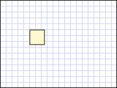

# How to: Define a Rectangle Using a RectangleGeometry

This example describes how to use the <xref:System.Windows.Media.RectangleGeometry> class to describe a rectangle.  
  
## Example  

The following example shows how to create and render a <xref:System.Windows.Media.RectangleGeometry>.  The relative position and the dimensions of the rectangle are defined by a <xref:System.Windows.Rect> structure. The relative position is `50,50` and the height and the width are both `25` creating a square. The rectangle's interior is painted with a <xref:System.Windows.Media.Brushes.LemonChiffon%2A> brush and its outline is painted with a <xref:System.Windows.Media.Brushes.Black%2A> stroke with a thickness of `1`.  
  
[!code-xaml[GeometryOverviewSamples_snip#GraphicsMMRectangleGeometryExample](~/samples/snippets/csharp/VS_Snippets_Wpf/GeometryOverviewSamples_snip/CS/GeometryExamples.xaml#graphicsmmrectanglegeometryexample)]  
  
[!code-csharp[GeometryOverviewSamples_procedural_snip#GraphicsMMRectangleGeometryExample](~/samples/snippets/csharp/VS_Snippets_Wpf/GeometryOverviewSamples_procedural_snip/CSharp/GeometryExamples.cs#graphicsmmrectanglegeometryexample)]
[!code-vb[GeometryOverviewSamples_procedural_snip#GraphicsMMRectangleGeometryExample](~/samples/snippets/visualbasic/VS_Snippets_Wpf/GeometryOverviewSamples_procedural_snip/visualbasic/geometryexamples.vb#graphicsmmrectanglegeometryexample)]  
  
  
RectangleGeometry  
  
Although this example used a <xref:System.Windows.Shapes.Path> element to render the <xref:System.Windows.Media.RectangleGeometry>, there are many other ways to use <xref:System.Windows.Media.RectangleGeometry> objects. For example, a <xref:System.Windows.Media.RectangleGeometry> can be used to specify the <xref:System.Windows.UIElement.Clip%2A> of a <xref:System.Windows.UIElement> or the <xref:System.Windows.Media.GeometryDrawing.Geometry%2A> of a <xref:System.Windows.Media.GeometryDrawing>.  
  
Other simple geometry classes include <xref:System.Windows.Media.LineGeometry> and <xref:System.Windows.Media.EllipseGeometry>. These geometries, as well as more complex ones, can also be created using a <xref:System.Windows.Media.PathGeometry> or <xref:System.Windows.Media.StreamGeometry>.  
  
## See also

- [Geometry Overview](geometry-overview.md)
- [Create a Composite Shape](how-to-create-a-composite-shape.md)
- [Create a Shape by Using a PathGeometry](how-to-create-a-shape-by-using-a-pathgeometry.md)
