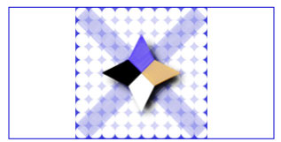
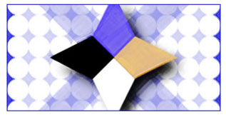

# How to: Preserve the Aspect Ratio of an Image Used as a Background

This example shows how to use the <xref:System.Windows.Media.TileBrush.Stretch%2A> property of an <xref:System.Windows.Media.ImageBrush> in order to preserve the aspect ratio of the image.

By default, when you use an <xref:System.Windows.Media.ImageBrush> to paint an area, its content stretches to completely fill the output area. When the output area and the image have different aspect ratios, the image is distorted by this stretching.

To make an <xref:System.Windows.Media.ImageBrush> preserve the aspect ratio of its image, set the <xref:System.Windows.Media.TileBrush.Stretch%2A> property to <xref:System.Windows.Media.Stretch.Uniform> or <xref:System.Windows.Media.Stretch.UniformToFill>.

## Example

The following example uses two <xref:System.Windows.Media.ImageBrush> objects to paint two rectangles. Each rectangle is 300 by 150 pixels and each contains a 300 by 300 pixel image. The <xref:System.Windows.Media.TileBrush.Stretch%2A> property of the first brush is set to <xref:System.Windows.Media.Stretch.Uniform>, and the <xref:System.Windows.Media.TileBrush.Stretch%2A> property of the second brush is set to <xref:System.Windows.Media.Stretch.UniformToFill>.

[!code-csharp[UsingImageBrush_snip#ImageBrushStretchModesExampleWholePage](~/samples/snippets/csharp/VS_Snippets_Wpf/UsingImageBrush_snip/CSharp/StretchModes.cs#imagebrushstretchmodesexamplewholepage)]

The following illustration shows the output of the first brush, which has a <xref:System.Windows.Media.TileBrush.Stretch%2A> setting of <xref:System.Windows.Media.Stretch.Uniform>.

The next illustration shows the output of the second brush, which has a <xref:System.Windows.Media.TileBrush.Stretch%2A> setting of <xref:System.Windows.Media.Stretch.UniformToFill>.

Note that the <xref:System.Windows.Media.TileBrush.Stretch%2A> property behaves identically for the other <xref:System.Windows.Media.TileBrush> objects, that is, for <xref:System.Windows.Media.DrawingBrush> and <xref:System.Windows.Media.VisualBrush>. For more information about <xref:System.Windows.Media.ImageBrush> and the other <xref:System.Windows.Media.TileBrush> objects, see [Painting with Images, Drawings, and Visuals](painting-with-images-drawings-and-visuals.md).

Note also that, although the <xref:System.Windows.Media.TileBrush.Stretch%2A> property appears to specify how the <xref:System.Windows.Media.TileBrush> content stretches to fit its output area, it actually specifies how the <xref:System.Windows.Media.TileBrush> content stretches to fill its base tile. For more information, see <xref:System.Windows.Media.TileBrush>.

This code example is part of a larger example that is provided for the <xref:System.Windows.Media.ImageBrush> class. For the complete sample, see [ImageBrush Sample](https://github.com/Microsoft/WPF-Samples/tree/master/Graphics/ImageBrush).

## See also

- <xref:System.Windows.Media.TileBrush>
- [Painting with Images, Drawings, and Visuals](painting-with-images-drawings-and-visuals.md)
