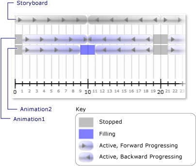

# How to: Receive Notification When a Clock's State Changes

A clock's <xref:System.Windows.Media.Animation.Clock.CurrentStateInvalidated> event occurs when its <xref:System.Windows.Media.Animation.Clock.CurrentState%2A> becomes invalid, such as when the clock starts or stops. You can register for this event with directly using a <xref:System.Windows.Media.Animation.Clock>, or you can register using a <xref:System.Windows.Media.Animation.Timeline>.

In the following example, a <xref:System.Windows.Media.Animation.Storyboard> and two <xref:System.Windows.Media.Animation.DoubleAnimation> objects are used to animate the width of two rectangles. The <xref:System.Windows.Media.Animation.Timeline.CurrentStateInvalidated> event is used to listen for clock state changes.

## Example

[!code-xaml[timingbehaviors_snip#_graphicsmm_StateExampleMarkupWholePage](~/samples/snippets/csharp/VS_Snippets_Wpf/timingbehaviors_snip/CSharp/StateExample.xaml#_graphicsmm_stateexamplemarkupwholepage)]

[!code-csharp[timingbehaviors_snip#_graphicsmm_StateEventHandlers](~/samples/snippets/csharp/VS_Snippets_Wpf/timingbehaviors_snip/CSharp/StateExample.xaml.cs#_graphicsmm_stateeventhandlers)]
[!code-vb[timingbehaviors_snip#_graphicsmm_StateEventHandlers](~/samples/snippets/visualbasic/VS_Snippets_Wpf/timingbehaviors_snip/visualbasic/stateexample.xaml.vb#_graphicsmm_stateeventhandlers)]

The following illustration shows the different states the animations enter as the parent timeline (*Storyboard*) progresses.

The following table shows the times at which *Animation1*'s <xref:System.Windows.Media.Animation.Timeline.CurrentStateInvalidated> event fires:

| Time (Seconds) | State |
|----------------|-------|
|1|Active|
|10|Active|
|19|Stopped|
|21|Active|
|30|Active|
|39|Stopped|

The following table shows the times at which *Animation2*'s <xref:System.Windows.Media.Animation.Timeline.CurrentStateInvalidated> event fires:

| Time (Seconds) | State |
|----------------|-------|
|1|Active|
|9|Filling|
|11|Active|
|19|Stopped|
|21|Active|
|29|Filling|
|31|Active|
|39|Stopped|

Notice that *Animation1*'s  <xref:System.Windows.Media.Animation.Timeline.CurrentStateInvalidated> event fires at 10 seconds, even though its state remains <xref:System.Windows.Media.Animation.ClockState.Active>. That's because its state changed at 10 seconds, but it changed from <xref:System.Windows.Media.Animation.ClockState.Active> to <xref:System.Windows.Media.Animation.ClockState.Filling> and then back to <xref:System.Windows.Media.Animation.ClockState.Active> in the same tick.
