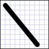
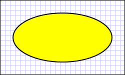
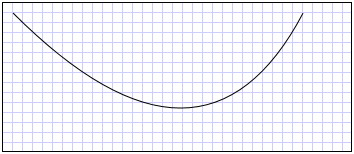
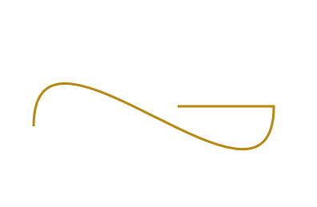
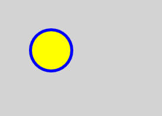
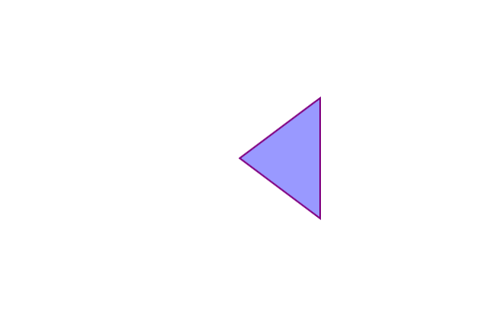
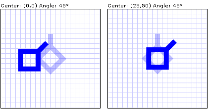

# Shapes and Basic Drawing in WPF Overview

This topic gives an overview of how to draw with <xref:System.Windows.Shapes.Shape> objects. A <xref:System.Windows.Shapes.Shape> is a type of <xref:System.Windows.UIElement> that enables you to draw a shape to the screen. Because they are UI elements, <xref:System.Windows.Shapes.Shape> objects can be used inside <xref:System.Windows.Controls.Panel> elements and most controls.

Windows Presentation Foundation (WPF) offers several layers of access to graphics and rendering services. At the top layer, <xref:System.Windows.Shapes.Shape> objects are easy to use and provide many useful features, such as layout and participation in the Windows Presentation Foundation (WPF) event system.

Shape-related types are in the `Windows.Shapes` namespace. Geometry-related types are in the `System.Windows.Media` namespace.

<a name="shapes"></a>

## Shape Objects

WPF provides a number of ready-to-use <xref:System.Windows.Shapes.Shape> objects.  All shape objects inherit from the <xref:System.Windows.Shapes.Shape> class. Available shape objects include <xref:System.Windows.Shapes.Ellipse>, <xref:System.Windows.Shapes.Line>, <xref:System.Windows.Shapes.Path>, <xref:System.Windows.Shapes.Polygon>, <xref:System.Windows.Shapes.Polyline>, and <xref:System.Windows.Shapes.Rectangle>. <xref:System.Windows.Shapes.Shape> objects share the following common properties.

- <xref:System.Windows.Shapes.Shape.Stroke%2A>: Describes how the shape's outline is painted.

- <xref:System.Windows.Shapes.Shape.StrokeThickness%2A>: Describes the thickness of the shape's outline.

- <xref:System.Windows.Shapes.Shape.Fill%2A>: Describes how the interior of the shape is painted.

- Data properties to specify coordinates and vertices, measured in device-independent pixels.

Because they derive from <xref:System.Windows.UIElement>, shape objects can be used inside panels and most controls. The <xref:System.Windows.Controls.Canvas> panel is a particularly good choice for creating complex drawings because it supports absolute positioning of its child objects.

The <xref:System.Windows.Shapes.Line> class enables you to draw a line between two points. The following example shows several ways to specify line coordinates and stroke properties.

[!code-xaml[drawingwithshapeelements#LineExample1](~/samples/snippets/csharp/VS_Snippets_Wpf/DrawingWithShapeElements/CS/lineexample.xaml#lineexample1)]

[!code-cpp[shapesprocedural#ShapesProceduralLine](~/samples/snippets/cpp/VS_Snippets_Wpf/ShapesProcedural/CPP/ShapesProcedural.cpp#shapesproceduralline)]
[!code-csharp[shapesprocedural#ShapesProceduralLine](~/samples/snippets/csharp/VS_Snippets_Wpf/ShapesProcedural/Csharp/ShapesProcedural.cs#shapesproceduralline)]
[!code-vb[shapesprocedural#ShapesProceduralLine](~/samples/snippets/visualbasic/VS_Snippets_Wpf/ShapesProcedural/VisualBasic/ShapesProceduralVB.vb#shapesproceduralline)]

The following image shows the rendered <xref:System.Windows.Shapes.Line>.



Although the <xref:System.Windows.Shapes.Line> class does provide a <xref:System.Windows.Shapes.Shape.Fill%2A> property, setting it has no effect because a <xref:System.Windows.Shapes.Line> has no area.

Another common shape is the <xref:System.Windows.Shapes.Ellipse>.  Create an <xref:System.Windows.Shapes.Ellipse> by defining the shape's <xref:System.Windows.FrameworkElement.Width%2A> and <xref:System.Windows.FrameworkElement.Height%2A> properties. To draw a circle, specify an <xref:System.Windows.Shapes.Ellipse> whose <xref:System.Windows.FrameworkElement.Width%2A> and <xref:System.Windows.FrameworkElement.Height%2A> values are equal.

[!code-xaml[ShapeOverviews#ShapesOVW1](~/samples/snippets/csharp/VS_Snippets_Wpf/ShapeOverviews/CS/Window1.xaml#shapesovw1)]

[!code-csharp[brushesmiscsnippets_procedural_snip#SetBackgroundColorOfShapeCodeExampleWholePage](~/samples/snippets/csharp/VS_Snippets_Wpf/BrushesMiscSnippets_procedural_snip/CSharp/SetBackgroundColorOfShapeExample.cs#setbackgroundcolorofshapecodeexamplewholepage)]
[!code-vb[brushesmiscsnippets_procedural_snip#SetBackgroundColorOfShapeCodeExampleWholePage](~/samples/snippets/visualbasic/VS_Snippets_Wpf/BrushesMiscSnippets_procedural_snip/visualbasic/setbackgroundcolorofshapeexample.vb#setbackgroundcolorofshapecodeexamplewholepage)]

The following image shows an example of a rendered <xref:System.Windows.Shapes.Ellipse>.



<a name="paths"></a>

## Using Paths and Geometries

The <xref:System.Windows.Shapes.Path> class enables you to draw curves and complex shapes. These curves and shapes are described using <xref:System.Windows.Media.Geometry> objects. To use a <xref:System.Windows.Shapes.Path>, you create a <xref:System.Windows.Media.Geometry> and use it to set the <xref:System.Windows.Shapes.Path> object's <xref:System.Windows.Shapes.Path.Data%2A> property.

There are a variety of <xref:System.Windows.Media.Geometry> objects to choose from. The <xref:System.Windows.Media.LineGeometry>, <xref:System.Windows.Media.RectangleGeometry>, and <xref:System.Windows.Media.EllipseGeometry> classes describe relatively simple shapes. To create more complex shapes or create curves, use a <xref:System.Windows.Media.PathGeometry>.

<a name="pathgeometry"></a>

### PathGeometry and PathSegments

<xref:System.Windows.Media.PathGeometry> objects are comprised of one or more <xref:System.Windows.Media.PathFigure> objects; each <xref:System.Windows.Media.PathFigure> represents a different "figure" or shape. Each <xref:System.Windows.Media.PathFigure> is itself comprised of one or more <xref:System.Windows.Media.PathSegment> objects, each representing a connected portion of the figure or shape. Segment types include the following: <xref:System.Windows.Media.LineSegment>, <xref:System.Windows.Media.BezierSegment>, and <xref:System.Windows.Media.ArcSegment>.

In the following example, a <xref:System.Windows.Shapes.Path> is used to draw a quadratic Bezier curve.

[!code-xaml[geometrysample#34](~/samples/snippets/csharp/VS_Snippets_Wpf/GeometrySample/CS/pathgeometryexample.xaml#34)]

The following image shows the rendered shape.



For more information about <xref:System.Windows.Media.PathGeometry> and the other <xref:System.Windows.Media.Geometry> classes, see the [Geometry Overview](geometry-overview.md).

<a name="pathdatastring"></a>

### XAML Abbreviated Syntax

In Extensible Application Markup Language (XAML), you may also use a special abbreviated syntax to describe a <xref:System.Windows.Shapes.Path>. In the following example, abbreviated syntax is used to draw a complex shape.

```xaml
      <Path Stroke="DarkGoldenRod" StrokeThickness="3"
Data="M 100,200 C 100,25 400,350 400,175 H 280" />
```

The following image shows a rendered <xref:System.Windows.Shapes.Path>.



The <xref:System.Windows.Shapes.Path.Data%2A> attribute string begins with the "moveto" command, indicated by M, which establishes a start point for the path in the coordinate system of the <xref:System.Windows.Controls.Canvas>. <xref:System.Windows.Shapes.Path> data parameters are case-sensitive. The capital M indicates an absolute location for the new current point. A lowercase m would indicate relative coordinates. The first segment is a cubic Bezier curve beginning at (100,200) and ending at (400,175), drawn using the two control points (100,25) and (400,350). This segment is indicated by the C command in the <xref:System.Windows.Shapes.Path.Data%2A> attribute string. Again, the capital C indicates an absolute path; the lowercase c would indicate a relative path.

The second segment begins with an absolute horizontal "lineto" command H, which specifies a line drawn from the preceding subpath's endpoint (400,175) to a new endpoint (280,175). Because it is a horizontal "lineto" command, the value specified is an *x*-coordinate.

For the complete path syntax, see the <xref:System.Windows.Shapes.Path.Data%2A> reference and [Create a Shape by Using a PathGeometry](how-to-create-a-shape-by-using-a-pathgeometry.md).

<a name="fillpaint"></a>

## Painting Shapes

<xref:System.Windows.Media.Brush> objects are used to paint a shape's <xref:System.Windows.Shapes.Shape.Stroke%2A> and <xref:System.Windows.Shapes.Shape.Fill%2A>. In the following example, the stroke and fill of an <xref:System.Windows.Shapes.Ellipse> are specified. Note that valid input for brush properties can be either a keyword or hexadecimal color value. For more information about available color keywords, see properties of the <xref:System.Windows.Media.Colors> class in the <xref:System.Windows.Media> namespace.

```xaml
<Canvas Background="LightGray">
   <Ellipse
      Canvas.Top="50"
      Canvas.Left="50"
      Fill="#FFFFFF00"
      Height="75"
      Width="75"
      StrokeThickness="5"
      Stroke="#FF0000FF"/>
</Canvas>
```

The following image shows the rendered <xref:System.Windows.Shapes.Ellipse>.



Alternatively, you can use property element syntax to explicitly create a <xref:System.Windows.Media.SolidColorBrush> object to paint the shape with a solid color.

```xaml
<!-- This polygon shape uses pre-defined color values for its Stroke and
     Fill properties.
     The SolidColorBrush's Opacity property affects the fill color in
     this case by making it slightly transparent (opacity of 0.4) so
     that it blends with any underlying color. -->

<Polygon
    Points="300,200 400,125 400,275 300,200"
    Stroke="Purple"
    StrokeThickness="2">
    <Polygon.Fill>
       <SolidColorBrush Color="Blue" Opacity="0.4"/>
    </Polygon.Fill>
</Polygon>
```

The following illustration shows the rendered shape.



You can also paint a shape's stroke or fill with gradients, images, patterns, and more. For more information, see the [Painting with Solid Colors and Gradients Overview](painting-with-solid-colors-and-gradients-overview.md).

<a name="stretchableshapessection"></a>

## Stretchable Shapes

The <xref:System.Windows.Shapes.Line>, <xref:System.Windows.Shapes.Path>, <xref:System.Windows.Shapes.Polygon>, <xref:System.Windows.Shapes.Polyline>, and <xref:System.Windows.Shapes.Rectangle> classes all have a <xref:System.Windows.Shapes.Shape.Stretch%2A> property. This property determines how a <xref:System.Windows.Shapes.Shape> object's contents (the shape to be drawn) is stretched to fill the <xref:System.Windows.Shapes.Shape> object's layout space. A <xref:System.Windows.Shapes.Shape> object's layout space is the amount of space the <xref:System.Windows.Shapes.Shape> is allocated by the layout system, because of either an explicit <xref:System.Windows.FrameworkElement.Width%2A> and <xref:System.Windows.FrameworkElement.Height%2A> setting or because of its <xref:System.Windows.FrameworkElement.HorizontalAlignment%2A> and <xref:System.Windows.FrameworkElement.VerticalAlignment%2A> settings. For additional information on layout in Windows Presentation Foundation, see [Layout](../advanced/layout.md) overview.

The Stretch property takes one of the following values:

- <xref:System.Windows.Media.Stretch.None>: The <xref:System.Windows.Shapes.Shape> object's contents are not stretched.

- <xref:System.Windows.Media.Stretch.Fill>: The <xref:System.Windows.Shapes.Shape> object's contents are stretched to fill its layout space.  Aspect ratio is not preserved.

- <xref:System.Windows.Media.Stretch.Uniform>: The <xref:System.Windows.Shapes.Shape> object's contents are stretched as much as possible to fill its layout space while preserving its original aspect ratio.

- <xref:System.Windows.Media.Stretch.UniformToFill>: The <xref:System.Windows.Shapes.Shape> object's contents are stretched to completely fill its layout space while preserving its original aspect ratio.

Note that, when a <xref:System.Windows.Shapes.Shape> object's contents are stretched, the <xref:System.Windows.Shapes.Shape> object's outline is painted after the stretching.

In the following example, a <xref:System.Windows.Shapes.Polygon> is used to draw a very small triangle from (0,0) to (0,1) to (1,1). The <xref:System.Windows.Shapes.Polygon> object's <xref:System.Windows.FrameworkElement.Width%2A> and <xref:System.Windows.FrameworkElement.Height%2A> are set to 100, and its stretch property is set to Fill. As a result, the <xref:System.Windows.Shapes.Polygon> object's contents (the triangle) are stretched to fill the larger space.

```xaml
<Polygon
  Points="0,0 0,1 1,1"
  Fill="Blue"
  Width="100"
  Height="100"
  Stretch="Fill"
  Stroke="Black"
  StrokeThickness="2" />
```

```csharp
PointCollection myPointCollection = new PointCollection();
myPointCollection.Add(new Point(0,0));
myPointCollection.Add(new Point(0,1));
myPointCollection.Add(new Point(1,1));

Polygon myPolygon = new Polygon();
myPolygon.Points = myPointCollection;
myPolygon.Fill = Brushes.Blue;
myPolygon.Width = 100;
myPolygon.Height = 100;
myPolygon.Stretch = Stretch.Fill;
myPolygon.Stroke = Brushes.Black;
myPolygon.StrokeThickness = 2;
```

<a name="transforms"></a>

## Transforming Shapes

The <xref:System.Windows.Media.Transform> class provides the means to transform shapes in a two-dimensional plane.  The different types of transformation include rotation (<xref:System.Windows.Media.RotateTransform>), scale (<xref:System.Windows.Media.ScaleTransform>), skew (<xref:System.Windows.Media.SkewTransform>), and translation (<xref:System.Windows.Media.TranslateTransform>).

A common transform to apply to a shape is a rotation.  To rotate a shape, create a <xref:System.Windows.Media.RotateTransform> and specify its <xref:System.Windows.Media.RotateTransform.Angle%2A>. An <xref:System.Windows.Media.RotateTransform.Angle%2A> of 45 rotates the element 45 degrees clockwise; an angle of 90 rotates the element 90 degrees clockwise; and so on. Set the <xref:System.Windows.Media.RotateTransform.CenterX%2A> and <xref:System.Windows.Media.RotateTransform.CenterY%2A> properties if you want to control the point about which the element is rotated. These property values are expressed in the coordinate space of the element being transformed. <xref:System.Windows.Media.RotateTransform.CenterX%2A> and <xref:System.Windows.Media.RotateTransform.CenterY%2A> have default values of zero. Finally, apply the <xref:System.Windows.Media.RotateTransform> to the element. If you don't want the transform to affect layout, set the shape's <xref:System.Windows.UIElement.RenderTransform%2A> property.

In the following example, a <xref:System.Windows.Media.RotateTransform> is used to rotate a shape 45 degrees about the shape's top left corner (0,0).

[!code-xaml[transformssample#14](~/samples/snippets/csharp/VS_Snippets_Wpf/transformsSample/CS/RotateTransformExample.xaml#14)]

In the next example, another shape is rotated 45 degrees, but this time it's rotated about the point (25,50).

[!code-xaml[transformssample#15](~/samples/snippets/csharp/VS_Snippets_Wpf/transformsSample/CS/RotateTransformExample.xaml#15)]

The following illustration shows the results of applying the two transforms.



In the previous examples, a single transform was applied to each shape object. To apply multiple transforms to a shape (or any other UI element), use a <xref:System.Windows.Media.TransformGroup>.

## See also

- [2D Graphics and Imaging](../advanced/optimizing-performance-2d-graphics-and-imaging.md)
- [Painting with Solid Colors and Gradients Overview](painting-with-solid-colors-and-gradients-overview.md)
- [Geometry Overview](geometry-overview.md)
- [Walkthrough: My first WPF desktop application](../get-started/walkthrough-my-first-wpf-desktop-application.md)
- [Animation Overview](animation-overview.md)
