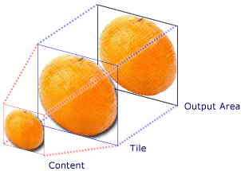
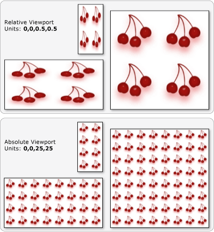

# TileBrush Overview

<xref:System.Windows.Media.TileBrush> objects provide you with a great deal of control over how an area is painted with an image, <xref:System.Windows.Media.Drawing>, or <xref:System.Windows.Media.Visual>. This topic describes how to use <xref:System.Windows.Media.TileBrush> features to gain more control over how an <xref:System.Windows.Media.ImageBrush>, <xref:System.Windows.Media.DrawingBrush>, or <xref:System.Windows.Media.VisualBrush> paints an area.  

## Prerequisites  

 To understand this topic, it's helpful to understand how to use the basic features of the <xref:System.Windows.Media.ImageBrush>, <xref:System.Windows.Media.DrawingBrush>, or <xref:System.Windows.Media.VisualBrush> class. For an introduction to these types, see the [Painting with Images, Drawings, and Visuals](painting-with-images-drawings-and-visuals.md).  
  

## Painting an Area with Tiles  

 <xref:System.Windows.Media.ImageBrush>, <xref:System.Windows.Media.DrawingBrush>, are <xref:System.Windows.Media.VisualBrush> are types of <xref:System.Windows.Media.TileBrush> objects. Tile brushes provide you with a great deal of control over how an area is painted with an image, drawing, or visual. For example, instead of just painting an area with a single stretched image, you can paint an area with a series of image tiles that create a pattern.  
  
 Painting an area with a tile brush involves three components: content, the base tile, and the output area.  
  
   
Components of a TileBrush with a single tile  
  
   
Components of a TileBrush with a TileMode of Tile  
  
 The output area is the area being painted, such as the <xref:System.Windows.Shapes.Shape.Fill%2A> of an <xref:System.Windows.Shapes.Ellipse> or the <xref:System.Windows.Controls.Control.Background%2A> of a <xref:System.Windows.Controls.Button>. The next sections describe the other two components of a <xref:System.Windows.Media.TileBrush>.  
  

## Brush Content  

 There are three different types of <xref:System.Windows.Media.TileBrush> and each paints with a different type of content.  
  
- If the brush is an <xref:System.Windows.Media.ImageBrush>, this content is an image The <xref:System.Windows.Media.ImageBrush.ImageSource%2A> property specifies the contents of the <xref:System.Windows.Media.ImageBrush>.  
  
- If the brush is a <xref:System.Windows.Media.DrawingBrush>, this content is a drawing. The <xref:System.Windows.Media.DrawingBrush.Drawing%2A> property specifies the contents of the <xref:System.Windows.Media.DrawingBrush>.  
  
- If the brush is a <xref:System.Windows.Media.VisualBrush>, this content is a visual. The <xref:System.Windows.Media.VisualBrush.Visual%2A> property specifies the content of the <xref:System.Windows.Media.VisualBrush>.  
  
 You can specify the position and dimensions of <xref:System.Windows.Media.TileBrush> content by using the <xref:System.Windows.Media.TileBrush.Viewbox%2A> property, although it is common to leave the <xref:System.Windows.Media.TileBrush.Viewbox%2A> set to its default value. By default, the <xref:System.Windows.Media.TileBrush.Viewbox%2A> is configured to completely contain the brush's contents. For more information about configuring the <xref:System.Windows.Controls.Viewbox>, see the <xref:System.Windows.Controls.Viewbox> property page.  
  

## The Base Tile  

 A <xref:System.Windows.Media.TileBrush> projects its content onto a base tile. The <xref:System.Windows.Media.TileBrush.Stretch%2A> property controls how <xref:System.Windows.Media.TileBrush> content is stretched to fill the base tile. The <xref:System.Windows.Media.TileBrush.Stretch%2A> property accepts the following values, defined by the <xref:System.Windows.Media.Stretch> enumeration:  
  
- <xref:System.Windows.Media.Stretch.None>: The brush's content is not stretched to fill the tile.  
  
- <xref:System.Windows.Media.Stretch.Fill>: The brush's content is scaled to fit the tile. Because the content's height and width are scaled independently, the original aspect ratio of the content might not be preserved. That is, the brush's content might be warped in order to completely fill the output tile.  
  
- <xref:System.Windows.Media.Stretch.Uniform>: The brush's content is scaled so that it fits completely within the tile. The content's aspect ratio is preserved.  
  
- <xref:System.Windows.Media.Stretch.UniformToFill>: The brush's content is scaled so that it completely fills the output area while preserving the content's original aspect ratio.  
  
 The following image illustrates the different <xref:System.Windows.Media.TileBrush.Stretch%2A> settings.  
  
   
  
 In the following example, the content of an <xref:System.Windows.Media.ImageBrush> is set so that it does not stretch to fill the output area.  
  
 [!code-xaml[BrushOverviewExamples_snip#GraphicsMMNoStretchExample](~/samples/snippets/xaml/VS_Snippets_Wpf/BrushOverviewExamples_snip/XAML/StretchExample.xaml#graphicsmmnostretchexample)]  
  
 [!code-csharp[BrushOverviewExamples_procedural_snip#GraphicsMMNoStretchExample](~/samples/snippets/csharp/VS_Snippets_Wpf/BrushOverviewExamples_procedural_snip/CSharp/StretchExample.cs#graphicsmmnostretchexample)]
 [!code-vb[BrushOverviewExamples_procedural_snip#GraphicsMMNoStretchExample](~/samples/snippets/visualbasic/VS_Snippets_Wpf/BrushOverviewExamples_procedural_snip/visualbasic/stretchexample.vb#graphicsmmnostretchexample)]  
  
 By default, a <xref:System.Windows.Media.TileBrush> generates a single tile (the base tile) and stretches that tile to completely fill the output area. You can change the size and position of the base tile by setting the <xref:System.Windows.Media.TileBrush.Viewport%2A> and <xref:System.Windows.Media.TileBrush.ViewportUnits%2A> properties.  
  

### Base Tile Size  

 The <xref:System.Windows.Media.TileBrush.Viewport%2A> property determines the size and position of the base tile, and the <xref:System.Windows.Media.TileBrush.ViewportUnits%2A> property determines whether the <xref:System.Windows.Media.TileBrush.Viewport%2A> is specified using absolute or relative coordinates. If the coordinates are relative, they are relative to the size of the output area. The point (0,0) represents the top left corner of the output area, and (1,1) represents the bottom right corner of the output area. To specify that the <xref:System.Windows.Media.TileBrush.Viewport%2A> property uses absolute coordinates, set the <xref:System.Windows.Media.TileBrush.ViewportUnits%2A> property to <xref:System.Windows.Media.BrushMappingMode.Absolute>.  
  
 The following illustration shows the difference in output between a <xref:System.Windows.Media.TileBrush> with relative versus absolute <xref:System.Windows.Media.TileBrush.ViewportUnits%2A>. Notice that the illustrations each show a tiled pattern; the next section describes how to specify tile pattern.  
  
   
  
 In the following example, an image is used to create a tile that has a width and height of 50%. The base tile is located at (0,0) of the output area.  
  
 [!code-xaml[BrushOverviewExamples_snip#GraphicsMMRelativeViewportUnitsExample1](~/samples/snippets/xaml/VS_Snippets_Wpf/BrushOverviewExamples_snip/XAML/TileSizeExample.xaml#graphicsmmrelativeviewportunitsexample1)]  
  
 [!code-csharp[BrushOverviewExamples_procedural_snip#GraphicsMMRelativeViewportUnitsExample1](~/samples/snippets/csharp/VS_Snippets_Wpf/BrushOverviewExamples_procedural_snip/CSharp/TileSizeExample.cs#graphicsmmrelativeviewportunitsexample1)]
 [!code-vb[BrushOverviewExamples_procedural_snip#GraphicsMMRelativeViewportUnitsExample1](~/samples/snippets/visualbasic/VS_Snippets_Wpf/BrushOverviewExamples_procedural_snip/visualbasic/tilesizeexample.vb#graphicsmmrelativeviewportunitsexample1)]  
  
 The next example sets the tiles of an <xref:System.Windows.Media.ImageBrush> to 25 by 25 device independent pixels. Because the <xref:System.Windows.Media.TileBrush.ViewportUnits%2A> are absolute, the <xref:System.Windows.Media.ImageBrush> tiles are always 25 by 25 pixels, regardless of the size of the area being painted.  
  
 [!code-xaml[BrushOverviewExamples_snip#GraphicsMMAbsoluteViewportUnitsExample1](~/samples/snippets/xaml/VS_Snippets_Wpf/BrushOverviewExamples_snip/XAML/TileSizeExample.xaml#graphicsmmabsoluteviewportunitsexample1)]  
  
 [!code-csharp[BrushOverviewExamples_procedural_snip#GraphicsMMAbsoluteViewportUnitsExample1](~/samples/snippets/csharp/VS_Snippets_Wpf/BrushOverviewExamples_procedural_snip/CSharp/TileSizeExample.cs#graphicsmmabsoluteviewportunitsexample1)]
 [!code-vb[BrushOverviewExamples_procedural_snip#GraphicsMMAbsoluteViewportUnitsExample1](~/samples/snippets/visualbasic/VS_Snippets_Wpf/BrushOverviewExamples_procedural_snip/visualbasic/tilesizeexample.vb#graphicsmmabsoluteviewportunitsexample1)]  
  

### Tiling Behavior  

 A <xref:System.Windows.Media.TileBrush> produces a tiled pattern when its base tile does not completely fill the output area and a tiling mode other then <xref:System.Windows.Media.TileMode.None> is specified. When a tile brush's tile does not completely fill the output area, its <xref:System.Windows.Media.TileBrush.TileMode%2A> property specifies whether the base tile should be duplicated to fill the output area and, if so, how the base tile should be duplicated. The <xref:System.Windows.Media.TileBrush.TileMode%2A> property accepts the following values, defined by the <xref:System.Windows.Media.TileMode> enumeration:  
  
- <xref:System.Windows.Media.TileMode.None>: Only the base tile is drawn.  
  
- <xref:System.Windows.Media.TileMode.Tile>: The base tile is drawn and the remaining area is filled by repeating the base tile such that the right edge of one tile is adjacent to the left edge of the next, and similarly for bottom and top.  
  
- <xref:System.Windows.Media.TileMode.FlipX>: The same as <xref:System.Windows.Media.TileMode.Tile>, but alternate columns of tiles are flipped horizontally.  
  
- <xref:System.Windows.Media.TileMode.FlipY>: The same as <xref:System.Windows.Media.TileMode.Tile>, but alternate rows of tiles are flipped vertically.  
  
- <xref:System.Windows.Media.TileMode.FlipXY>: A combination of <xref:System.Windows.Media.TileMode.FlipX> and <xref:System.Windows.Media.TileMode.FlipY>.  
  
 The following image illustrates the different tiling modes.  
  
   
  
 In the following example, an image is used to paint a rectangle that is 100 pixels wide and 100 pixels tall. By setting the brush's <xref:System.Windows.Media.TileBrush.Viewport%2A> has been set to 0,0,0.25,0.25, the brush's base tile is made to be 1/4 of the output area. The brush's <xref:System.Windows.Media.TileBrush.TileMode%2A> is set to <xref:System.Windows.Media.TileMode.FlipXY>. so that it fills the rectangle with rows of tiles.  
  
 [!code-xaml[BrushOverviewExamples_snip#GraphicsMMFlipXYExample](~/samples/snippets/xaml/VS_Snippets_Wpf/BrushOverviewExamples_snip/XAML/TilingExample.xaml#graphicsmmflipxyexample)]  
  
 [!code-csharp[BrushOverviewExamples_procedural_snip#GraphicsMMFlipXYExample](~/samples/snippets/csharp/VS_Snippets_Wpf/BrushOverviewExamples_procedural_snip/CSharp/TilingExample.cs#graphicsmmflipxyexample)]
 [!code-vb[BrushOverviewExamples_procedural_snip#GraphicsMMFlipXYExample](~/samples/snippets/visualbasic/VS_Snippets_Wpf/BrushOverviewExamples_procedural_snip/visualbasic/tilingexample.vb#graphicsmmflipxyexample)]  
  
## See also

- <xref:System.Windows.Media.ImageBrush>
- <xref:System.Windows.Media.DrawingBrush>
- <xref:System.Windows.Media.VisualBrush>
- <xref:System.Windows.Media.TileBrush>
- [Painting with Images, Drawings, and Visuals](painting-with-images-drawings-and-visuals.md)
- [How-to Topics](brushes-how-to-topics.md)
- [Freezable Objects Overview](../advanced/freezable-objects-overview.md)
- [ImageBrush Sample](https://github.com/Microsoft/WPF-Samples/tree/master/Graphics/ImageBrush)
- [VisualBrush Sample](https://github.com/Microsoft/WPF-Samples/tree/master/Graphics/VisualBrush)
